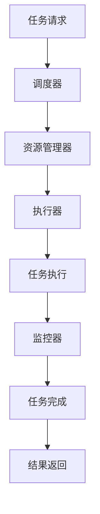

# 分布式调度系统

## 介绍

分布式调度系统是分布式计算中的一个关键组件，用于管理和协调多个计算节点上的任务执行。它的主要目标是在分布式环境中高效地分配任务，确保资源的合理利用，并提高系统的整体性能和可靠性。

在分布式系统中，任务通常被分解为多个子任务，这些子任务需要在不同的节点上并行执行。分布式调度系统负责将这些子任务分配给合适的节点，并监控它们的执行状态，以确保任务能够顺利完成。

## 分布式调度系统的基本概念

### 1. 任务调度

任务调度是分布式调度系统的核心功能之一。它涉及将任务分配给系统中的可用节点，并确保这些任务能够按时完成。任务调度算法通常考虑以下因素：

- **节点负载**：选择负载较低的节点来执行任务，以避免资源瓶颈。
- **任务优先级**：高优先级的任务会被优先调度。
- **任务依赖关系**：某些任务可能依赖于其他任务的完成，调度系统需要确保这些依赖关系得到满足。

### 2. 资源管理

资源管理是分布式调度系统的另一个重要功能。它涉及对系统中的计算资源（如CPU、内存、存储等）进行监控和分配，以确保任务能够高效执行。资源管理通常包括以下内容：

- **资源发现**：识别系统中可用的资源。
- **资源分配**：将资源分配给需要它们的任务。
- **资源回收**：在任务完成后，回收资源以供其他任务使用。

### 3. 容错与恢复

在分布式系统中，节点故障是不可避免的。分布式调度系统需要具备容错能力，能够在节点故障时重新调度任务，并确保任务的完成。容错机制通常包括：

- **任务重试**：在任务失败时，重新调度任务。
- **任务检查点**：定期保存任务的执行状态，以便在故障时能够从检查点恢复。

## 分布式调度系统的工作原理

分布式调度系统通常由以下几个组件组成：

1. **调度器（Scheduler）**：负责接收任务请求，并根据调度算法将任务分配给合适的节点。
2. **执行器（Executor）**：在节点上执行任务，并将执行结果返回给调度器。
3. **资源管理器（Resource Manager）**：监控系统中的资源使用情况，并为调度器提供资源分配建议。
4. **监控器（Monitor）**：监控任务的执行状态，并在任务失败时触发容错机制。

以下是一个简单的分布式调度系统的工作流程：



## 实际案例

### 案例1：Hadoop YARN

Hadoop YARN（Yet Another Resource Negotiator）是一个广泛使用的分布式调度系统，用于管理Hadoop集群中的资源。YARN将集群中的资源划分为多个容器（Container），并将这些容器分配给不同的应用程序。YARN的调度器负责根据应用程序的需求和集群的资源状况，动态分配资源。

### 案例2：Kubernetes

Kubernetes是一个开源的容器编排平台，它使用分布式调度系统来管理容器化应用程序的部署和扩展。Kubernetes的调度器负责将Pod（容器组）分配给集群中的节点，并确保Pod能够高效运行。

## 代码示例

以下是一个简单的分布式任务调度系统的Python示例。这个示例展示了如何将任务分配给多个工作节点，并监控任务的执行状态。

```python
from concurrent.futures import ThreadPoolExecutor

def worker(task_id):
    print(f"Task {task_id} is being executed")
    # 模拟任务执行
    import time
    time.sleep(2)
    print(f"Task {task_id} is completed")
    return task_id

def scheduler(tasks, num_workers):
    with ThreadPoolExecutor(max_workers=num_workers) as executor:
        futures = [executor.submit(worker, task) for task in tasks]
        for future in futures:
            print(f"Task {future.result()} has finished")

if __name__ == "__main__":
    tasks = [1, 2, 3, 4, 5]
    scheduler(tasks, num_workers=3)
```

**输出：**
```
Task 1 is being executed
Task 2 is being executed
Task 3 is being executed
Task 1 is completed
Task 2 is completed
Task 3 is completed
Task 1 has finished
Task 2 has finished
Task 3 has finished
Task 4 is being executed
Task 5 is being executed
Task 4 is completed
Task 5 is completed
Task 4 has finished
Task 5 has finished
```

## 总结

分布式调度系统是分布式计算中不可或缺的一部分，它通过高效的任务调度和资源管理，确保分布式系统能够高效、可靠地运行。通过本文的介绍，你应该对分布式调度系统的基本概念、工作原理以及实际应用有了初步的了解。

## 附加资源与练习

- **资源**：
  - [Hadoop YARN 官方文档](https://hadoop.apache.org/docs/current/hadoop-yarn/hadoop-yarn-site/YARN.html)
  - [Kubernetes 调度器文档](https://kubernetes.io/docs/concepts/scheduling-eviction/kube-scheduler/)

- **练习**：
  1. 尝试修改上述Python代码，使其支持任务依赖关系。
  2. 研究Hadoop YARN的调度算法，并尝试实现一个简单的调度器。

:::tip
分布式调度系统的设计和实现是一个复杂的任务，建议从简单的案例入手，逐步深入理解其工作原理。
:::