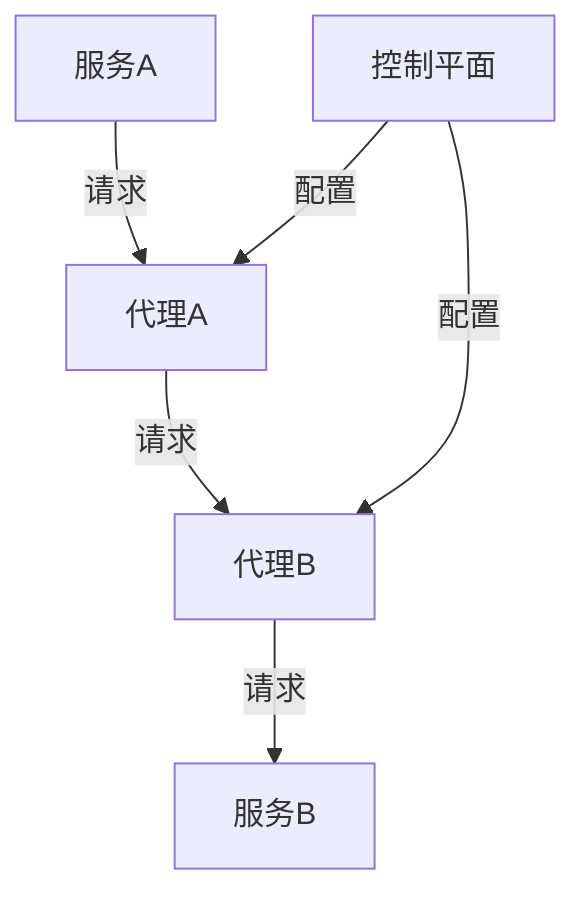

# 服务网格

## 介绍

在现代分布式系统中，微服务架构已经成为一种常见的模式。随着服务数量的增加，服务之间的通信变得复杂且难以管理。**服务网格（Service Mesh）** 是一种专门用于处理服务间通信的基础设施层，它通过提供统一的控制平面和数据平面来简化服务间通信的管理。

服务网格的核心功能包括：
- **服务发现**：自动发现服务实例。
- **负载均衡**：在多个服务实例之间分配请求。
- **故障恢复**：处理服务故障，如重试、超时和熔断。
- **安全**：提供加密和身份验证。
- **监控和追踪**：收集服务间通信的指标和日志。

## 服务网格的工作原理

服务网格通常由两个主要组件组成：
1. **数据平面（Data Plane）**：负责处理服务间的实际通信。每个服务实例都会附带一个代理（如 Envoy），这些代理负责拦截、路由和监控所有进出服务的流量。
2. **控制平面（Control Plane）**：负责管理和配置数据平面中的代理。它提供 API 和 UI 来定义策略、收集指标和管理服务网格。



在上图中，服务A和服务B之间的通信通过代理A和代理B进行。控制平面负责配置这些代理，以确保通信的安全性和可靠性。

## 实际案例

假设我们有一个简单的微服务架构，包含两个服务：`user-service` 和 `order-service`。`user-service` 需要调用 `order-service` 来获取用户的订单信息。

```yaml
# user-service 的配置
apiVersion: networking.istio.io/v1alpha3
kind: VirtualService
metadata:
  name: user-service
spec:
  hosts:
  - user-service
  http:
  - route:
    - destination:
        host: order-service
        subset: v1
```

```yaml
# order-service 的配置
apiVersion: networking.istio.io/v1alpha3
kind: DestinationRule
metadata:
  name: order-service
spec:
  host: order-service
  subsets:
  - name: v1
    labels:
      version: v1
```

在这个例子中，我们使用 Istio 作为服务网格。`user-service` 通过 `VirtualService` 配置路由到 `order-service` 的 `v1` 版本。`DestinationRule` 定义了 `order-service` 的子集。

## 总结

服务网格为分布式系统中的服务间通信提供了强大的管理能力。通过将通信逻辑从应用程序中解耦，服务网格使得开发人员可以专注于业务逻辑，而不必担心复杂的通信问题。

:::tip
如果你对服务网格感兴趣，可以尝试使用 Istio 或 Linkerd 来搭建一个简单的服务网格环境，并观察其在实际应用中的表现。
:::

## 附加资源

- [Istio 官方文档](https://istio.io/latest/docs/)
- [Linkerd 官方文档](https://linkerd.io/docs/)
- 《微服务架构设计模式》 - Chris Richardson

## 练习

1. 使用 Istio 或 Linkerd 搭建一个简单的服务网格环境。
2. 配置两个服务之间的通信，并观察服务网格如何处理请求路由、负载均衡和故障恢复。
3. 尝试在服务网格中启用安全功能，如 mTLS（双向 TLS），并观察其对通信的影响。