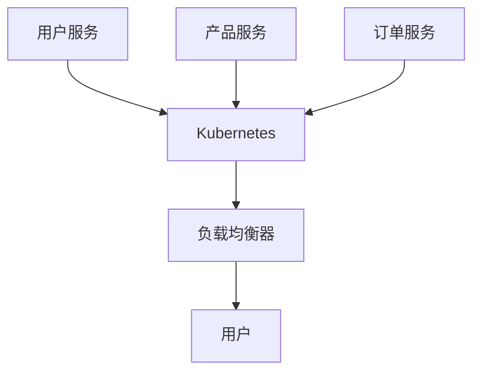

# 容器与容器编排

在现代软件开发中，容器和容器编排技术已经成为构建和部署分布式系统的核心工具。本文将带你了解什么是容器、为什么需要容器编排，以及如何在实际项目中使用这些技术。

## 什么是容器？

容器是一种轻量级的虚拟化技术，它允许你将应用程序及其依赖项打包到一个独立的单元中。与传统的虚拟机不同，容器共享宿主机的操作系统内核，因此更加轻量且启动速度更快。

### 容器的优势

- **一致性**：容器确保应用程序在开发、测试和生产环境中运行一致。
- **隔离性**：每个容器都有自己的文件系统、网络和进程空间，互不干扰。
- **可移植性**：容器可以在任何支持容器技术的平台上运行。

### 容器示例

以下是一个简单的 Docker 容器示例，展示了如何运行一个基于 Ubuntu 的容器并执行命令：

```bash
# 拉取 Ubuntu 镜像
docker pull ubuntu

# 运行容器并执行命令
docker run ubuntu echo "Hello, World!"
```

**输出：**

```
Hello, World!
```

## 什么是容器编排？

容器编排是指自动化容器的部署、管理和扩展。随着应用程序规模的增大，手动管理容器变得不切实际。容器编排工具可以帮助你自动化这些任务，确保应用程序的高可用性和可扩展性。

### 常见的容器编排工具

- **Kubernetes**：最流行的容器编排工具，提供了强大的自动化功能。
- **Docker Swarm**：Docker 自带的编排工具，易于使用但功能相对简单。
- **Apache Mesos**：一个通用的集群管理工具，支持容器编排。

### Kubernetes 示例

以下是一个简单的 Kubernetes 部署示例，展示了如何部署一个 Nginx 服务：

```yaml
apiVersion: apps/v1
kind: Deployment
metadata:
  name: nginx-deployment
spec:
  replicas: 3
  selector:
    matchLabels:
      app: nginx
  template:
    metadata:
      labels:
        app: nginx
    spec:
      containers:
      - name: nginx
        image: nginx:1.14.2
        ports:
        - containerPort: 80
```

**解释：**

- `replicas: 3` 表示我们希望运行 3 个 Nginx 实例。
- `image: nginx:1.14.2` 指定了使用的 Nginx 镜像版本。
- `containerPort: 80` 表示容器内部的端口号。

## 实际案例

### 案例：微服务架构中的容器编排

假设你正在开发一个电子商务网站，该网站由多个微服务组成，包括用户服务、产品服务和订单服务。每个微服务都可以打包为一个容器，并使用 Kubernetes 进行编排。



**解释：**

- 每个微服务（用户服务、产品服务、订单服务）都运行在自己的容器中。
- Kubernetes 负责管理这些容器的部署、扩展和负载均衡。
- 最终用户通过负载均衡器访问这些服务。

## 总结

容器和容器编排技术为现代分布式系统的构建和部署提供了强大的工具。通过使用容器，你可以确保应用程序在不同环境中的一致性；通过使用容器编排工具，你可以自动化管理大规模的容器集群。

## 附加资源

- [Docker 官方文档](https://docs.docker.com/)
- [Kubernetes 官方文档](https://kubernetes.io/docs/home/)
- [Docker Swarm 官方文档](https://docs.docker.com/engine/swarm/)

## 练习

1. 使用 Docker 创建一个简单的 Python Web 应用程序容器。
2. 使用 Kubernetes 部署一个包含多个副本的 Nginx 服务。
3. 尝试在本地环境中使用 Docker Compose 编排多个容器。

:::tip
在学习过程中，建议你动手实践每一个示例代码，这将帮助你更好地理解容器和容器编排的概念。
:::