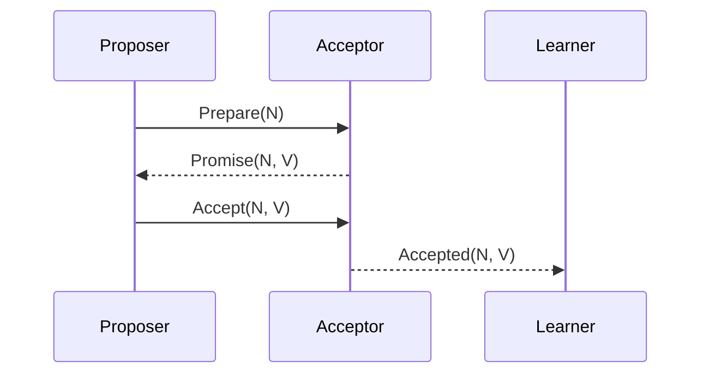

# Paxos算法

Paxos算法是分布式系统中用于达成一致性的经典算法。它由Leslie Lamport在1990年提出，旨在解决分布式系统中多个节点如何在存在故障的情况下达成一致的问题。Paxos算法广泛应用于分布式数据库、分布式存储系统等领域。

## 什么是Paxos算法？

Paxos算法是一种共识算法，用于在分布式系统中确保多个节点能够就某个值达成一致。即使在网络延迟、节点故障等情况下，Paxos也能保证系统的一致性。

:::note
共识算法是分布式系统中的核心问题之一，它确保系统中的多个节点能够在某个值上达成一致。
:::

## Paxos算法的核心概念

Paxos算法涉及三个主要角色：

1. **Proposer（提案者）**：提出一个值，试图让系统接受该值。
2. **Acceptor（接受者）**：决定是否接受Proposer提出的值。
3. **Learner（学习者）**：学习最终被接受的值。

Paxos算法的核心思想是通过多轮投票来达成一致。每一轮投票分为两个阶段：**准备阶段（Prepare Phase）**和**接受阶段（Accept Phase）**。

### 1. 准备阶段（Prepare Phase）

在准备阶段，Proposer向所有Acceptor发送一个带有编号的Prepare请求。Acceptor收到请求后，会检查自己是否已经接受过更高编号的提案。如果没有，Acceptor会承诺不再接受比当前编号更低的提案，并返回自己已经接受的最高编号的提案。

### 2. 接受阶段（Accept Phase）

在准备阶段成功后，Proposer会向Acceptor发送一个带有编号和值的Accept请求。Acceptor会检查自己是否已经承诺不接受比当前编号更低的提案。如果没有，Acceptor会接受该提案，并通知Learner。

## Paxos算法的工作流程

1. **Proposer** 发送Prepare请求给所有Acceptor。
2. **Acceptor** 返回Promise响应，承诺不再接受比当前编号更低的提案。
3. **Proposer** 发送Accept请求给所有Acceptor。
4. **Acceptor** 接受提案并通知Learner。

## Paxos算法的实际应用

Paxos算法在分布式系统中有着广泛的应用。例如，Google的Chubby锁服务就是基于Paxos算法实现的。Chubby使用Paxos来确保在分布式环境中的一致性和高可用性。

:::tip
在实际应用中，Paxos算法通常会被优化和简化，以提高性能和降低复杂性。例如，Multi-Paxos和Raft算法都是基于Paxos的改进版本。
:::

## 总结

Paxos算法是分布式系统中达成一致性的经典算法。它通过多轮投票机制确保在存在故障的情况下，系统仍然能够达成一致。尽管Paxos算法较为复杂，但它在分布式数据库、分布式存储系统等领域有着广泛的应用。

## 附加资源与练习

- **推荐阅读**：Leslie Lamport的论文《Paxos Made Simple》。
- **练习**：尝试实现一个简单的Paxos算法模拟器，模拟Proposer、Acceptor和Learner之间的交互。

:::caution
Paxos算法的实现和理解可能较为复杂，建议在学习过程中结合代码实现和调试，以加深理解。
:::