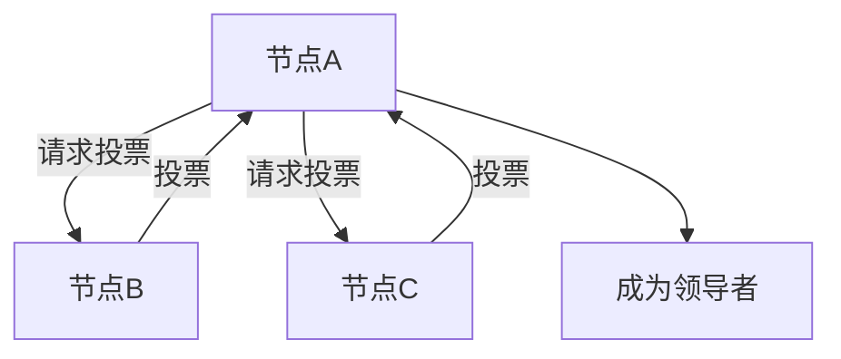
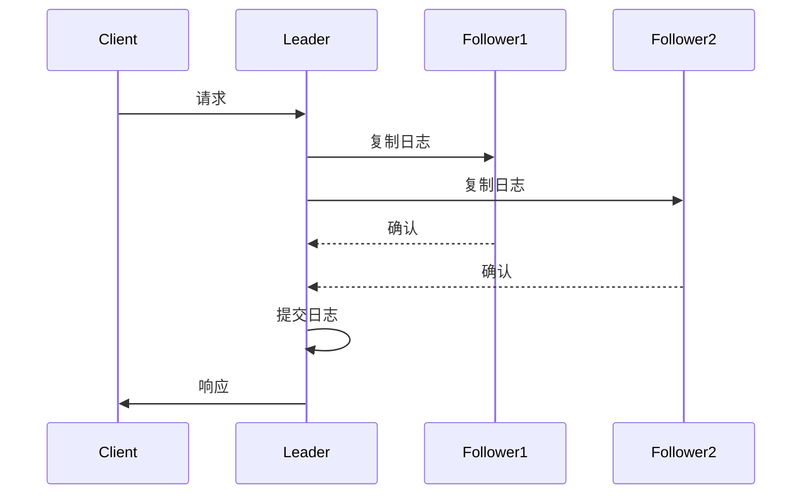

# Raft算法

Raft算法是一种用于分布式系统中一致性问题的共识算法。它的设计目标是易于理解和实现，同时具备强一致性和高可用性。Raft通过将问题分解为领导选举、日志复制和安全性三个子问题，简化了分布式系统的开发。

## 什么是Raft算法？

Raft算法的核心思想是通过选举一个领导者（Leader）来管理日志的复制，从而确保所有节点（服务器）的状态一致。Raft将时间划分为任期（Term），每个任期都有一个领导者负责处理客户端请求和日志复制。

### Raft的核心概念

1. **领导者（Leader）**：负责处理客户端请求和日志复制。
2. **跟随者（Follower）**：被动接收领导者的日志条目。
3. **候选人（Candidate）**：在领导者失效时，参与选举成为新的领导者。
4. **任期（Term）**：Raft将时间划分为任期，每个任期都有一个唯一的编号。
5. **日志条目（Log Entry）**：包含客户端请求和状态机命令的数据结构。

## Raft算法的工作原理

Raft算法的工作原理可以分为以下几个步骤：

### 1. 领导选举

当系统启动或领导者失效时，Raft会触发领导选举。每个节点会随机等待一段时间后成为候选人，并向其他节点发送投票请求。如果候选人获得大多数节点的投票，它将成为新的领导者。

### 2. 日志复制

领导者接收客户端请求后，将请求作为日志条目追加到本地日志中，并将日志条目复制到所有跟随者。当大多数节点成功复制日志条目后，领导者将该日志条目提交（Commit）并应用到状态机中。

### 3. 安全性

Raft通过以下机制确保安全性：

- **选举限制**：只有拥有最新日志的节点才能成为领导者。
- **日志匹配**：领导者确保所有跟随者的日志与自己的日志一致。
- **状态机安全**：只有提交的日志条目才能应用到状态机中。

## 实际应用场景

Raft算法广泛应用于分布式系统中，例如：

- **分布式数据库**：如etcd、CockroachDB等使用Raft来保证数据一致性。
- **分布式存储系统**：如TiKV使用Raft来管理分布式存储的元数据。
- **分布式配置管理**：如Consul使用Raft来管理集群配置。

## 总结

Raft算法通过将分布式一致性问题分解为领导选举、日志复制和安全性三个子问题，简化了分布式系统的开发。它的设计目标是易于理解和实现，同时具备强一致性和高可用性。

## 附加资源

- [Raft论文](https://raft.github.io/raft.pdf)
- [Raft可视化演示](https://raft.github.io/)
- [etcd官方文档](https://etcd.io/docs/)

## 练习

1. 实现一个简单的Raft算法原型，模拟领导选举和日志复制过程。
2. 研究etcd或CockroachDB的源码，了解Raft算法在实际系统中的应用。
3. 设计一个分布式系统，使用Raft算法来保证数据一致性。
