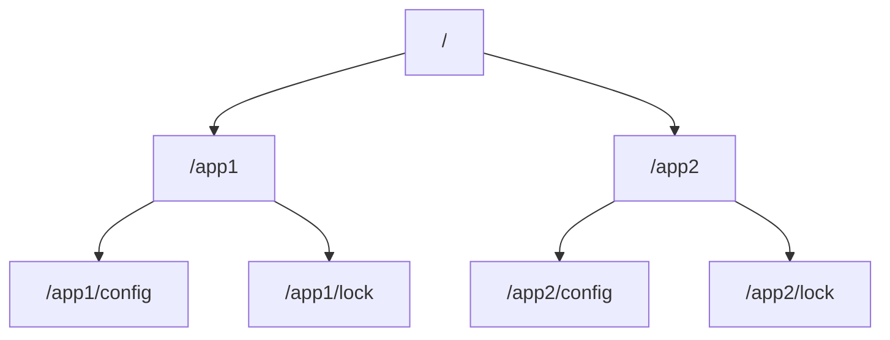

# ZooKeeper原理与应用

## 介绍

ZooKeeper 是一个开源的分布式协调服务，由 Apache 软件基金会维护。它主要用于解决分布式系统中的一致性问题，提供高可用性和高性能的分布式数据管理服务。ZooKeeper 的核心功能包括分布式锁、配置管理、命名服务、集群管理等。

ZooKeeper 的设计目标是简单、高效和可靠。它通过一个树形结构的命名空间（类似于文件系统）来存储数据，并提供了一套简单的 API 供客户端使用。ZooKeeper 的数据模型和 API 设计使得它非常适合用于构建分布式系统。

## ZooKeeper 的核心概念

### 1. 数据模型

ZooKeeper 的数据模型是一个树形结构，类似于文件系统的目录树。每个节点称为 **ZNode**，可以存储数据并拥有子节点。ZNode 分为两种类型：

- **持久节点（Persistent Node）**：一旦创建，除非显式删除，否则会一直存在。
- **临时节点（Ephemeral Node）**：与客户端会话绑定，会话结束时节点自动删除。



### 2. 会话（Session）

客户端与 ZooKeeper 服务器建立连接后，会创建一个会话。会话是有状态的，客户端可以通过会话与 ZooKeeper 进行交互。会话超时后，客户端需要重新连接。

### 3. Watcher 机制

ZooKeeper 提供了 Watcher 机制，允许客户端监听 ZNode 的变化。当 ZNode 发生变化时，ZooKeeper 会通知客户端。Watcher 是一次性的，客户端需要重新注册 Watcher 以继续监听。

### 4. 一致性协议

ZooKeeper 使用 **Zab 协议**（ZooKeeper Atomic Broadcast）来保证数据的一致性。Zab 协议类似于 Paxos 算法，用于在分布式系统中实现原子广播。

## ZooKeeper 的应用场景

### 1. 分布式锁

ZooKeeper 可以用于实现分布式锁。通过创建临时顺序节点，客户端可以竞争锁资源。锁的释放通过删除节点来实现。

```java
// 伪代码示例：使用 ZooKeeper 实现分布式锁
public void acquireLock() {
    String lockPath = "/locks/lock-";
    String myLock = zk.create(lockPath, null, ZooDefs.Ids.OPEN_ACL_UNSAFE, CreateMode.EPHEMERAL_SEQUENTIAL);
    List<String> locks = zk.getChildren("/locks", false);
    Collections.sort(locks);
    if (myLock.equals("/locks/" + locks.get(0))) {
        // 获取锁成功
    } else {
        // 等待锁释放
    }
}
```

### 2. 配置管理

ZooKeeper 可以用于存储和管理分布式系统的配置信息。客户端可以监听配置节点的变化，实时获取最新的配置。

```java
// 伪代码示例：使用 ZooKeeper 进行配置管理
public void watchConfig() {
    String configPath = "/config";
    byte[] data = zk.getData(configPath, new Watcher() {
        public void process(WatchedEvent event) {
            if (event.getType() == EventType.NodeDataChanged) {
                // 配置发生变化，重新获取配置
                watchConfig();
            }
        }
    }, null);
    // 使用配置数据
}
```

### 3. 命名服务

ZooKeeper 可以用于实现分布式系统中的命名服务。通过创建持久节点，客户端可以注册和查找服务。

```java
// 伪代码示例：使用 ZooKeeper 实现命名服务
public void registerService(String serviceName, String serviceAddress) {
    String servicePath = "/services/" + serviceName;
    zk.create(servicePath, serviceAddress.getBytes(), ZooDefs.Ids.OPEN_ACL_UNSAFE, CreateMode.PERSISTENT);
}

public String discoverService(String serviceName) {
    String servicePath = "/services/" + serviceName;
    byte[] data = zk.getData(servicePath, false, null);
    return new String(data);
}
```

## 实际案例

### 案例：Kafka 中的 ZooKeeper 使用

Apache Kafka 是一个分布式流处理平台，它使用 ZooKeeper 来管理集群的元数据和协调 Broker。Kafka 使用 ZooKeeper 来存储以下信息：

- Broker 的注册信息
- Topic 的分区信息
- Consumer 的偏移量信息

通过 ZooKeeper，Kafka 能够实现高可用性和一致性。

## 总结

ZooKeeper 是一个强大的分布式协调服务，广泛应用于分布式系统中。它通过简单的数据模型和 API 提供了分布式锁、配置管理、命名服务等功能。ZooKeeper 的一致性协议和 Watcher 机制使得它非常适合用于构建高可用性和高性能的分布式系统。

## 附加资源与练习

- **官方文档**：[ZooKeeper 官方文档](https://zookeeper.apache.org/doc/current/)
- **练习**：尝试使用 ZooKeeper 实现一个简单的分布式锁系统。
- **进一步学习**：了解 ZAB 协议和 Paxos 算法的原理，深入理解 ZooKeeper 的一致性机制。