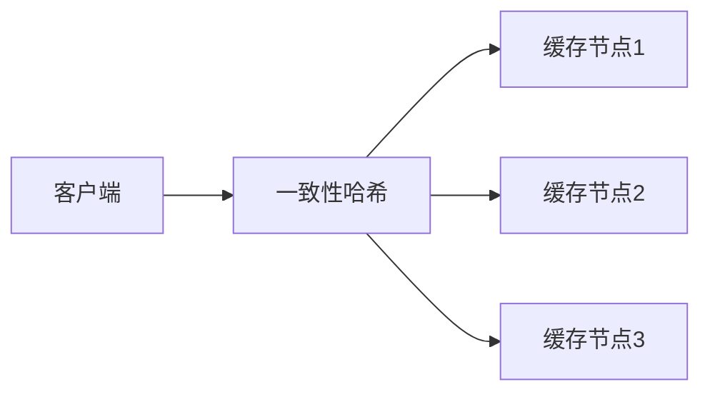

# 分布式缓存

## 介绍

在现代计算环境中，分布式缓存是一种关键技术，用于提高应用程序的性能和可扩展性。缓存是一种临时存储机制，用于存储频繁访问的数据，以减少对后端数据库或其他数据源的访问次数。分布式缓存将缓存数据分布在多个节点上，从而提供更高的可用性和性能。

### 为什么需要分布式缓存？

1. **性能提升**：通过减少对数据库的直接访问，缓存可以显著提高应用程序的响应速度。
2. **可扩展性**：分布式缓存允许系统在多个节点上扩展，从而支持更大的数据量和更高的并发请求。
3. **高可用性**：即使某个节点发生故障，其他节点仍然可以提供服务，确保系统的持续运行。

## 分布式缓存的工作原理

分布式缓存系统通常由多个缓存节点组成，这些节点通过网络连接在一起。每个节点都存储一部分缓存数据，并且可以通过某种一致性哈希算法来确定数据应该存储在哪个节点上。

### 一致性哈希

一致性哈希是一种用于分布式系统的哈希算法，它确保在节点增加或减少时，只有少量数据需要重新分配。这减少了系统在扩展或收缩时的开销。



### 缓存数据的存储与检索

当客户端请求数据时，分布式缓存系统首先检查缓存中是否存在该数据。如果存在（缓存命中），则直接返回数据；如果不存在（缓存未命中），则从后端数据源获取数据，并将其存储在缓存中以供后续请求使用。

## 代码示例

以下是一个简单的 Python 示例，展示了如何使用 Redis 作为分布式缓存。

```python
import redis

# 连接到 Redis 服务器
cache = redis.Redis(host='localhost', port=6379, db=0)

# 设置缓存数据
cache.set('user:1:name', 'Alice')

# 获取缓存数据
name = cache.get('user:1:name')
print(name.decode('utf-8'))  # 输出: Alice
```

### 输入与输出

- **输入**：`cache.set('user:1:name', 'Alice')`
- **输出**：`Alice`

## 实际案例

### 案例 1：电子商务网站

在一个电子商务网站中，商品信息是频繁访问的数据。通过使用分布式缓存，网站可以将热门商品的信息存储在缓存中，从而减少对数据库的访问次数，提高页面加载速度。

### 案例 2：社交媒体平台

社交媒体平台需要处理大量的用户数据和动态内容。通过使用分布式缓存，平台可以缓存用户的个人资料、好友列表和动态消息，从而加快数据的检索速度，提升用户体验。

## 总结

分布式缓存是现代分布式系统中不可或缺的一部分，它通过减少对后端数据源的访问次数，显著提高了系统的性能和可扩展性。通过一致性哈希算法，分布式缓存系统能够在多个节点之间高效地分配数据，确保系统的高可用性。

## 附加资源与练习

- **资源**：
  - [Redis 官方文档](https://redis.io/documentation)
  - [Memcached 官方文档](https://memcached.org/)
  - [分布式系统设计模式](https://www.oreilly.com/library/view/designing-distributed-systems/9781491983638/)

- **练习**：
  1. 使用 Redis 实现一个简单的分布式缓存系统，并测试其性能。
  2. 研究一致性哈希算法，并尝试实现一个简单的版本。
  3. 在一个模拟的电子商务网站中，使用分布式缓存来优化商品信息的检索速度。

:::tip
分布式缓存是提高系统性能的有效手段，但在设计缓存策略时，务必考虑缓存失效和数据一致性问题。
:::