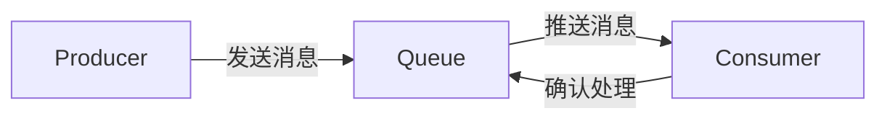

# 分布式消息队列

## 介绍

在分布式系统中，**分布式消息队列**是一种用于在不同服务或组件之间传递消息的机制。它允许系统解耦，提高可扩展性和可靠性。消息队列的核心思想是：生产者将消息发送到队列中，消费者从队列中获取并处理这些消息。这种异步通信方式使得系统能够更高效地处理任务，尤其是在高并发或分布式环境中。

## 消息队列的基本概念

### 生产者与消费者

- **生产者（Producer）**：负责生成消息并将其发送到消息队列中。
- **消费者（Consumer）**：从消息队列中获取消息并进行处理。

### 消息队列的核心功能

1. **消息存储**：消息队列会暂时存储消息，直到消费者处理它们。
2. **消息传递**：确保消息从生产者传递到消费者。
3. **消息确认**：消费者处理完消息后，可以向队列发送确认信号，确保消息不会重复处理。

### 消息队列的优势

- **解耦**：生产者和消费者不需要直接通信，降低了系统复杂性。
- **异步处理**：生产者可以继续生成消息，而消费者可以按自己的节奏处理消息。
- **负载均衡**：多个消费者可以从同一个队列中获取消息，分担处理压力。
- **可靠性**：消息队列通常提供持久化机制，确保消息不会丢失。

## 分布式消息队列的工作原理

在分布式系统中，消息队列通常由多个节点组成，这些节点共同协作来存储和传递消息。以下是其基本工作原理：

1. **生产者发送消息**：生产者将消息发送到消息队列的某个节点。
2. **消息存储**：消息队列将消息存储在分布式存储中，确保消息不会丢失。
3. **消费者订阅**：消费者订阅感兴趣的消息队列。
4. **消息传递**：消息队列将消息推送给消费者，或者消费者主动拉取消息。
5. **消息确认**：消费者处理完消息后，向消息队列发送确认信号。



## 实际应用场景

### 场景 1：订单处理系统

在一个电商平台中，用户下单后，订单信息需要被多个服务处理，例如库存管理、支付处理和物流调度。使用分布式消息队列，订单信息可以被发送到一个消息队列中，各个服务从队列中获取并处理订单，从而实现系统的解耦和高效处理。

### 场景 2：日志收集与分析

在大规模分布式系统中，日志数据通常需要被收集并进行分析。使用消息队列，日志数据可以被发送到队列中，日志分析服务从队列中获取日志并进行处理，确保日志数据不会丢失，并且分析服务可以按需扩展。

## 代码示例

以下是一个简单的 Python 示例，使用 `pika` 库与 RabbitMQ 进行消息队列的交互。

### 生产者代码

```python
import pika

# 连接到 RabbitMQ 服务器
connection = pika.BlockingConnection(pika.ConnectionParameters('localhost'))
channel = connection.channel()

# 创建一个队列
channel.queue_declare(queue='hello')

# 发送消息
channel.basic_publish(exchange='',
                      routing_key='hello',
                      body='Hello, World!')
print(" [x] Sent 'Hello, World!'")

# 关闭连接
connection.close()
```

### 消费者代码

```python
import pika

# 连接到 RabbitMQ 服务器
connection = pika.BlockingConnection(pika.ConnectionParameters('localhost'))
channel = connection.channel()

# 确保队列存在
channel.queue_declare(queue='hello')

# 定义回调函数
def callback(ch, method, properties, body):
    print(f" [x] Received {body}")

# 订阅队列
channel.basic_consume(queue='hello',
                      auto_ack=True,
                      on_message_callback=callback)

print(' [*] Waiting for messages. To exit press CTRL+C')
channel.start_consuming()
```

### 运行结果

1. 运行生产者代码后，消息 `Hello, World!` 会被发送到队列 `hello` 中。
2. 运行消费者代码后，消费者会从队列中获取并打印消息。

## 总结

分布式消息队列是分布式系统中不可或缺的组件，它通过解耦生产者和消费者，提供了异步处理、负载均衡和可靠性等优势。通过消息队列，系统可以更高效地处理任务，并应对高并发场景。

## 附加资源与练习

- **资源**：
  - [RabbitMQ 官方文档](https://www.rabbitmq.com/documentation.html)
  - [Kafka 官方文档](https://kafka.apache.org/documentation/)
- **练习**：
  - 尝试使用 Kafka 或 RabbitMQ 实现一个简单的日志收集系统。
  - 扩展上述代码示例，实现多个消费者从同一个队列中获取消息并进行处理。

:::tip
在实际生产环境中，选择合适的消息队列系统（如 RabbitMQ、Kafka 等）非常重要。不同的系统适用于不同的场景，建议根据具体需求进行选择。
:::