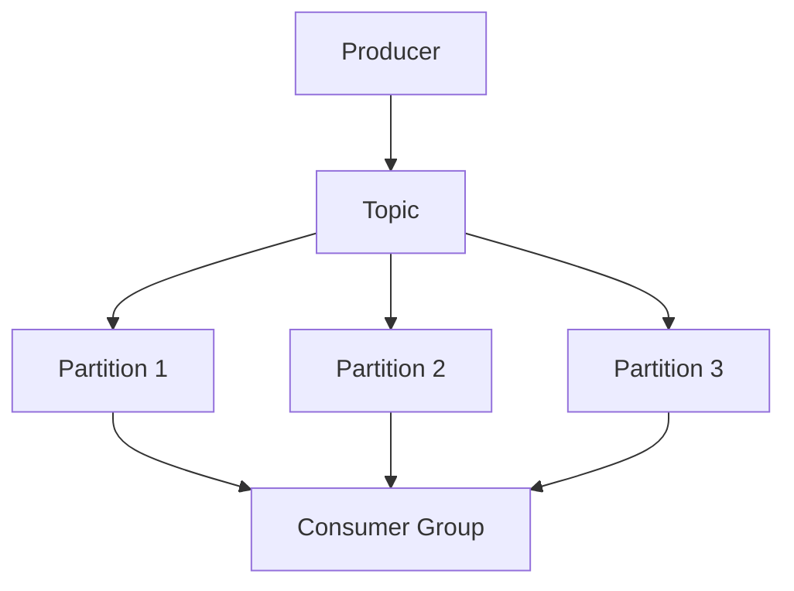
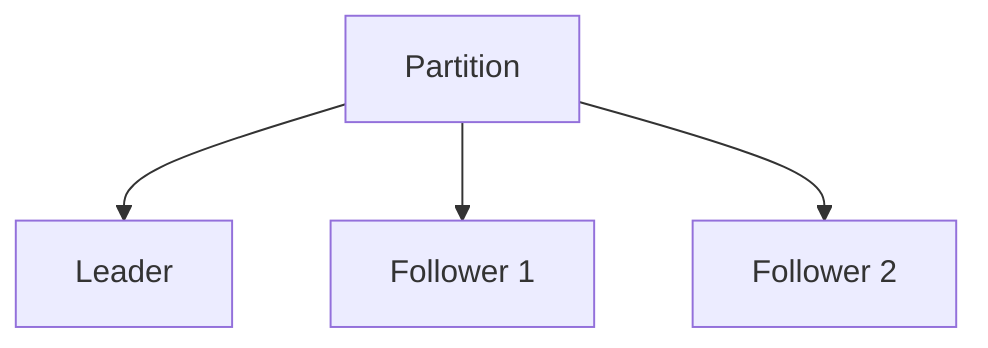

# Kafka架构设计

Kafka 是一个分布式流处理平台，广泛用于构建实时数据管道和流应用程序。它以其高吞吐量、低延迟和可扩展性而闻名。本文将深入探讨 Kafka 的架构设计，帮助初学者理解其核心概念和工作原理。

## 什么是Kafka？

Kafka 最初由 LinkedIn 开发，后来成为 Apache 基金会的顶级项目。它是一个分布式发布-订阅消息系统，能够处理大规模的实时数据流。Kafka 的设计目标是提供高吞吐量、持久性和可扩展性，适用于日志收集、流处理、事件源等场景。

## Kafka的核心组件

Kafka 的架构由以下几个核心组件组成：

1. **Producer（生产者）**：负责将消息发布到 Kafka 的 Topic 中。
2. **Consumer（消费者）**：从 Kafka 的 Topic 中读取消息。
3. **Broker（代理）**：Kafka 集群中的每个节点称为 Broker，负责存储和转发消息。
4. **Topic（主题）**：消息的分类，类似于数据库中的表。
5. **Partition（分区）**：每个 Topic 可以分为多个 Partition，以提高并行处理能力。
6. **Replica（副本）**：每个 Partition 可以有多个副本，用于数据冗余和故障恢复。
7. **Zookeeper**：用于管理 Kafka 集群的元数据和协调。

## Kafka的工作原理

Kafka 的工作流程可以分为以下几个步骤：

1. **消息发布**：Producer 将消息发布到指定的 Topic。
2. **消息存储**：Broker 将消息存储在 Partition 中，并根据配置的副本策略进行复制。
3. **消息消费**：Consumer 从 Partition 中读取消息，并处理这些消息。

### 消息发布与消费示例

以下是一个简单的 Kafka Producer 和 Consumer 的代码示例：

```python
# Producer 示例
from kafka import KafkaProducer

producer = KafkaProducer(bootstrap_servers='localhost:9092')
producer.send('my_topic', b'Hello, Kafka!')
producer.flush()

# Consumer 示例
from kafka import KafkaConsumer

consumer = KafkaConsumer('my_topic', bootstrap_servers='localhost:9092')
for message in consumer:
    print(f"Received message: {message.value.decode('utf-8')}")
```

**输入**：Producer 发送消息 `Hello, Kafka!` 到 `my_topic`。

**输出**：Consumer 接收到消息并打印 `Received message: Hello, Kafka!`。

## Kafka的架构设计

Kafka 的架构设计旨在实现高吞吐量和低延迟。以下是 Kafka 架构的关键设计点：

### 分区与并行处理

Kafka 通过将 Topic 划分为多个 Partition 来实现并行处理。每个 Partition 是一个有序的、不可变的消息序列。Producer 可以将消息发送到不同的 Partition，而 Consumer 可以并行地从多个 Partition 读取消息。



### 副本与容错

Kafka 通过副本机制实现数据的冗余和容错。每个 Partition 可以有多个副本，其中一个副本是 Leader，负责处理读写请求，其他副本是 Follower，用于数据备份。如果 Leader 发生故障，Kafka 会自动选举一个新的 Leader。



### 日志存储

Kafka 使用日志结构存储消息，每个 Partition 对应一个日志文件。消息被追加到日志文件的末尾，消费者通过偏移量（Offset）来读取消息。这种设计使得 Kafka 能够高效地处理大量的消息。

## 实际应用场景

Kafka 在许多实际场景中得到了广泛应用，以下是一些常见的应用场景：

1. **日志收集**：Kafka 可以用于收集和存储应用程序的日志数据，供后续分析和处理。
2. **流处理**：Kafka 可以与流处理框架（如 Apache Flink、Apache Spark Streaming）集成，用于实时数据处理。
3. **事件源**：Kafka 可以用作事件源系统，记录系统中发生的所有事件，用于回放和审计。

## 总结

Kafka 是一个强大的分布式消息系统，其架构设计旨在实现高吞吐量、低延迟和可扩展性。通过分区、副本和日志存储等机制，Kafka 能够高效地处理大规模的实时数据流。希望本文能帮助初学者理解 Kafka 的核心概念和架构设计。

## 附加资源与练习

- **官方文档**：[Apache Kafka Documentation](https://kafka.apache.org/documentation/)
- **练习**：尝试在本地搭建一个 Kafka 集群，并使用 Producer 和 Consumer 进行消息的发布和消费。

:::tip
建议初学者在学习 Kafka 时，先从简单的 Producer 和 Consumer 示例开始，逐步深入理解其架构设计和工作原理。
:::