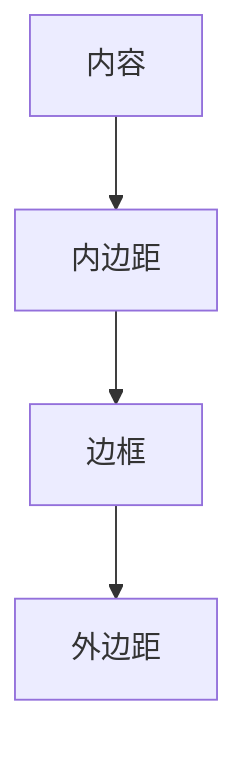

# CSS基础

CSS（层叠样式表，Cascading Style Sheets）是一种用于描述HTML文档外观和格式的语言。通过CSS，我们可以控制网页的颜色、字体、布局等样式，使网页更加美观和易于阅读。本文将带你从零开始学习CSS的基础知识。

## 什么是CSS？

CSS是一种样式表语言，用于描述HTML或XML（包括SVG和XHTML）文档的外观。它允许开发者将内容与样式分离，从而使网页设计更加灵活和可维护。

### CSS的基本结构

CSS规则由两个主要部分组成：**选择器**和**声明块**。声明块包含一个或多个**声明**，每个声明由**属性**和**值**组成。

```css
选择器 {
  属性: 值;
}
```

例如，以下CSS规则将所有 `<p>` 元素的文本颜色设置为红色：

```css
p {
  color: red;
}
```

## CSS选择器

选择器用于指定哪些HTML元素应该应用样式。常见的选择器包括：

- **元素选择器**：选择特定类型的HTML元素，如 `p`、`h1` 等。
- **类选择器**：选择具有特定类名的元素，如 `.my-class`。
- **ID选择器**：选择具有特定ID的元素，如 `#my-id`。
- **后代选择器**：选择某个元素的后代元素，如 `div p`。
- **伪类选择器**：选择元素的特定状态，如 `:hover`、`:first-child` 等。

### 示例：使用类选择器

```html
<p class="highlight">这是一个高亮段落。</p>
```

```css
.highlight {
  background-color: yellow;
}
```

在这个例子中，所有具有 `highlight` 类的 `<p>` 元素都会有一个黄色的背景。

## CSS盒模型

CSS盒模型是网页布局的基础。每个HTML元素都可以看作是一个矩形盒子，包含以下部分：

- **内容（Content）**：显示文本、图像等实际内容。
- **内边距（Padding）**：内容与边框之间的空间。
- **边框（Border）**：围绕内容和内边距的边框。
- **外边距（Margin）**：盒子与其他元素之间的空间。



### 示例：盒模型的应用

```css
.box {
  width: 200px;
  padding: 20px;
  border: 5px solid black;
  margin: 10px;
}
```

在这个例子中，`.box` 元素的宽度为200px，内边距为20px，边框为5px，外边距为10px。

## CSS布局

CSS提供了多种布局方式，包括：

- **浮动（Float）**：使元素向左或向右浮动，常用于创建多列布局。
- **定位（Position）**：通过 `position` 属性控制元素的位置，如 `relative`、`absolute`、`fixed` 等。
- **弹性盒子（Flexbox）**：一种一维布局模型，适合创建灵活的布局。
- **网格布局（Grid）**：一种二维布局模型，适合创建复杂的网格布局。

### 示例：使用Flexbox创建布局

```html
<div class="container">
  <div class="item">1</div>
  <div class="item">2</div>
  <div class="item">3</div>
</div>
```

```css
.container {
  display: flex;
  justify-content: space-between;
}

.item {
  width: 100px;
  height: 100px;
  background-color: lightblue;
}
```

在这个例子中，`.container` 使用Flexbox布局，使 `.item` 元素在容器中均匀分布。

## 实际案例：创建一个简单的网页布局

让我们通过一个实际案例来应用所学的CSS知识。我们将创建一个简单的网页布局，包含头部、导航栏、内容区域和页脚。

```html
<!DOCTYPE html>
<html lang="zh-CN">
<head>
  <meta charset="UTF-8">
  <meta name="viewport" content="width=device-width, initial-scale=1.0">
  <title>简单网页布局</title>
  <style>
    body {
      font-family: Arial, sans-serif;
      margin: 0;
      padding: 0;
    }
    header {
      background-color: #333;
      color: white;
      padding: 10px;
      text-align: center;
    }
    nav {
      background-color: #444;
      padding: 10px;
    }
    nav a {
      color: white;
      text-decoration: none;
      margin: 0 10px;
    }
    .content {
      padding: 20px;
    }
    footer {
      background-color: #333;
      color: white;
      text-align: center;
      padding: 10px;
      position: fixed;
      bottom: 0;
      width: 100%;
    }
  </style>
</head>
<body>
  <header>头部</header>
  <nav>
    <a href="#">首页</a>
    <a href="#">关于</a>
    <a href="#">联系</a>
  </nav>
  <div class="content">
    <h1>欢迎来到我的网站</h1>
    <p>这是一个简单的网页布局示例。</p>
  </div>
  <footer>页脚</footer>
</body>
</html>
```

在这个案例中，我们使用了CSS来控制网页的布局和样式，包括头部、导航栏、内容区域和页脚。

## 总结

通过本文，你已经学习了CSS的基础知识，包括选择器、盒模型、布局和实际应用。CSS是网页设计的重要组成部分，掌握它将帮助你创建更加美观和功能强大的网页。

## 附加资源

- [MDN Web Docs: CSS](https://developer.mozilla.org/zh-CN/docs/Web/CSS)
- [CSS-Tricks](https://css-tricks.com/)
- [W3Schools: CSS Tutorial](https://www.w3schools.com/css/)

## 练习

1. 创建一个包含标题、段落和图片的网页，并使用CSS为其添加样式。
2. 使用Flexbox创建一个三列布局，并使内容在页面中居中显示。
3. 尝试使用CSS Grid创建一个复杂的网格布局。

:::tip
练习是掌握CSS的关键。通过不断实践，你将更加熟练地使用CSS来设计和布局网页。
:::