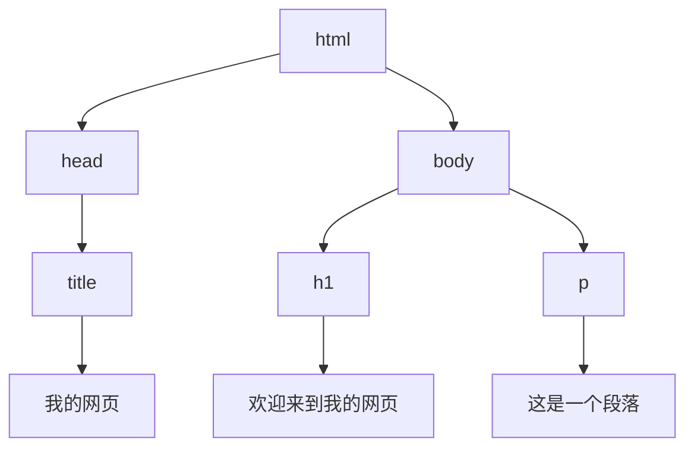
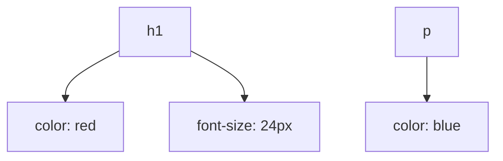
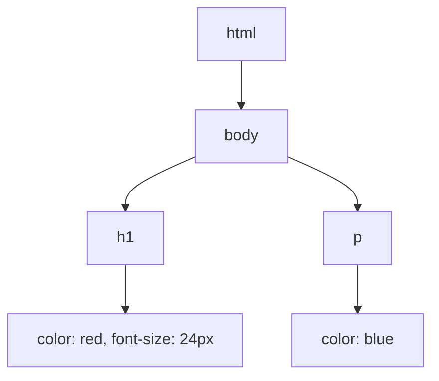

## 介绍

当我们访问一个网页时，浏览器会从服务器获取 HTML、CSS 和 JavaScript 文件，并将它们转换为用户可见的页面。这个过程被称为**浏览器渲染**。理解浏览器渲染原理不仅有助于优化网页性能，还能帮助我们编写更高效的代码。

本文将逐步讲解浏览器渲染的核心流程，并通过实际案例展示其应用场景。

---

## 浏览器渲染的核心流程

浏览器渲染的过程可以分为以下几个主要步骤：

1. **解析 HTML 并构建 DOM 树**
2. **解析 CSS 并构建 CSSOM 树**
3. **将 DOM 树和 CSSOM 树合并为渲染树（Render Tree）**
4. **布局（Layout）**
5. **绘制（Paint）**

接下来，我们将逐一讲解这些步骤。

---

### 1. 解析 HTML 并构建 DOM 树

当浏览器接收到 HTML 文件时，它会逐行解析 HTML 代码，并将其转换为**文档对象模型（DOM）**。DOM 是一个树状结构，表示 HTML 文档的层次结构。

例如，以下 HTML 代码：

```html
<!DOCTYPE html>
<html>
  <head>
    <title>我的网页</title>
  </head>
  <body>
    <h1>欢迎来到我的网页</h1>
    <p>这是一个段落。</p>
  </body>
</html>
```

会被解析为以下 DOM 树：



:::note
DOM 树是浏览器渲染的基础，它表示网页的结构和内容。
:::

---

### 2. 解析 CSS 并构建 CSSOM 树

在解析 HTML 的同时，浏览器也会解析 CSS 文件，并将其转换为**CSS 对象模型（CSSOM）**。CSSOM 也是一个树状结构，表示 CSS 样式规则。

例如，以下 CSS 代码：

```css
h1 {
  color: red;
  font-size: 24px;
}

p {
  color: blue;
}
```

会被解析为以下 CSSOM 树：



:::tip
CSSOM 树与 DOM 树结合后，才能确定每个元素的最终样式。
:::

---

### 3. 将 DOM 树和 CSSOM 树合并为渲染树

渲染树是 DOM 树和 CSSOM 树的结合体。它只包含需要在页面上显示的元素，并计算每个元素的最终样式。

例如，以下渲染树：



:::caution
渲染树中不包含 `display: none` 的元素，因为它们不会在页面上显示。
:::

---

### 4. 布局（Layout）

布局阶段也称为**重排（Reflow）**，浏览器会根据渲染树计算每个元素在页面上的位置和大小。这个过程可能会受到 CSS 布局属性（如 `width`、`height`、`margin` 等）的影响。

例如，以下代码：

```html
<div style="width: 100px; height: 100px; margin: 10px;"></div>
```

浏览器会计算该 `div` 的宽度、高度和边距，并确定其在页面上的位置。

---

### 5. 绘制（Paint）

绘制阶段也称为**重绘（Repaint）**，浏览器会将布局阶段计算出的结果转换为屏幕上的像素。这个过程包括绘制文本、颜色、边框、阴影等。

例如，以下代码：

```html
<h1 style="color: red;">欢迎来到我的网页</h1>
```

浏览器会将红色的 `h1` 标题绘制到屏幕上。

---

## 实际案例

### 案例 1：优化 CSS 选择器

假设我们有以下 CSS 代码：

```css
/* 不推荐的写法 */
div ul li a {
  color: blue;
}

/* 推荐的写法 */
.nav-link {
  color: blue;
}
```

:::warning
复杂的 CSS 选择器会增加浏览器构建 CSSOM 树的时间，从而影响渲染性能。
:::

### 案例 2：避免强制同步布局

以下代码会导致强制同步布局，影响性能：

```javascript
const element = document.getElementById('my-element');
const width = element.offsetWidth; // 触发布局
element.style.width = width + 10 + 'px'; // 再次触发布局
```

:::tip
可以通过批量修改样式或使用 `requestAnimationFrame` 来优化性能。
:::

---

## 总结

浏览器渲染是一个复杂的过程，涉及 HTML 解析、CSS 解析、渲染树构建、布局和绘制等多个步骤。理解这些步骤有助于我们编写更高效的代码，并优化网页性能。

---

## 附加资源

- [MDN Web Docs: 浏览器渲染原理](https://developer.mozilla.org/zh-CN/docs/Web/Performance/How_browsers_work)
- [Google Web Fundamentals: 渲染性能](https://web.dev/rendering-performance/)

---

## 练习

1. 使用浏览器的开发者工具查看一个网页的 DOM 树和 CSSOM 树。
2. 尝试优化一个网页的 CSS 选择器，观察其对渲染性能的影响。
3. 编写一个 JavaScript 函数，避免强制同步布局。