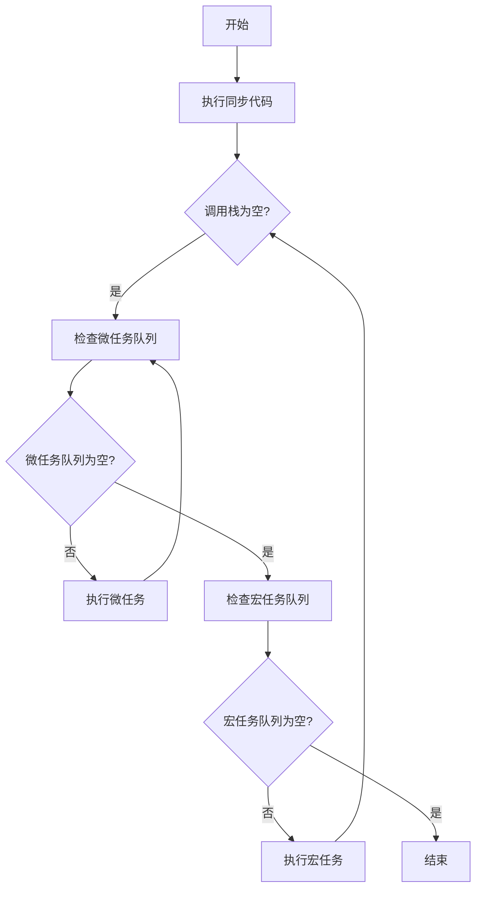

## 介绍

在前端开发中，JavaScript 是一门单线程语言，这意味着它一次只能执行一个任务。然而，现代 Web 应用需要处理大量的异步操作，如网络请求、定时器和用户交互等。为了高效地处理这些任务，JavaScript 引入了**事件循环机制**（Event Loop）。事件循环机制是 JavaScript 异步编程的核心，它使得 JavaScript 能够在单线程环境下处理并发任务。

本文将逐步讲解事件循环机制的工作原理，并通过代码示例和实际案例帮助你深入理解这一概念。

---

## 事件循环的基本概念

事件循环机制的核心思想是：**JavaScript 引擎通过事件循环来处理异步任务，确保主线程不会被阻塞**。为了更好地理解事件循环，我们需要先了解以下几个关键概念：

1. **调用栈（Call Stack）**：用于存储函数的调用信息。每当一个函数被调用时，它会被推入调用栈；当函数执行完毕后，它会从调用栈中弹出。
2. **任务队列（Task Queue）**：用于存储待执行的异步任务。任务队列分为两种：
   - **宏任务队列（MacroTask Queue）**：包含 `setTimeout`、`setInterval`、`I/O` 操作等。
   - **微任务队列（MicroTask Queue）**：包含 `Promise` 的回调、`MutationObserver` 等。
3. **事件循环（Event Loop）**：负责监听调用栈和任务队列。当调用栈为空时，事件循环会从任务队列中取出任务并推入调用栈执行。

---

## 事件循环的工作流程

事件循环的工作流程可以概括为以下几个步骤：

1. 执行同步代码，将所有同步任务推入调用栈并执行。
2. 当遇到异步任务时，将其回调函数放入相应的任务队列中（宏任务队列或微任务队列）。
3. 当调用栈为空时，事件循环会优先检查微任务队列。如果微任务队列中有任务，则依次执行所有微任务。
4. 当微任务队列为空时，事件循环会从宏任务队列中取出一个任务并执行。
5. 重复上述过程，直到所有任务执行完毕。

以下是一个简单的事件循环流程图：



---

## 代码示例

以下是一个简单的代码示例，展示了事件循环的执行顺序：

```javascript
console.log("同步任务 1");

setTimeout(() => {
  console.log("宏任务 1");
}, 0);

Promise.resolve().then(() => {
  console.log("微任务 1");
});

console.log("同步任务 2");
```

**输出结果：**

```
同步任务 1
同步任务 2
微任务 1
宏任务 1
```

**解释：**

1. 首先执行同步任务，输出 `同步任务 1` 和 `同步任务 2`。
2. 接着执行微任务队列中的任务，输出 `微任务 1`。
3. 最后执行宏任务队列中的任务，输出 `宏任务 1`。

---

## 实际应用场景

事件循环机制在前端开发中有广泛的应用场景。以下是一些常见的例子：

1. **处理用户交互**：当用户点击按钮时，事件循环会将点击事件放入任务队列中，等待主线程空闲时执行。
2. **网络请求**：通过 `fetch` 或 `XMLHttpRequest` 发起网络请求时，回调函数会被放入任务队列中，等待请求完成后执行。
3. **定时器**：使用 `setTimeout` 或 `setInterval` 设置定时任务时，回调函数会被放入宏任务队列中，等待指定时间后执行。

---

## 总结

事件循环机制是 JavaScript 异步编程的核心，它通过调用栈、任务队列和事件循环的协同工作，使得 JavaScript 能够在单线程环境下高效处理并发任务。理解事件循环的工作原理对于编写高效、可靠的异步代码至关重要。

---

## 附加资源与练习

### 推荐资源
- [MDN 文档：并发模型与事件循环](https://developer.mozilla.org/zh-CN/docs/Web/JavaScript/EventLoop)
- [JavaScript 可视化工具：Loupe](http://latentflip.com/loupe/)（帮助你直观理解事件循环）

### 练习
1. 修改上面的代码示例，添加更多的 `Promise` 和 `setTimeout`，观察它们的执行顺序。
2. 尝试编写一个包含 `async/await` 的代码，分析其与事件循环的关系。

:::tip
如果你对事件循环机制还有疑问，建议多动手实践，通过调试工具观察代码的执行顺序，这将帮助你更好地理解这一概念。
:::