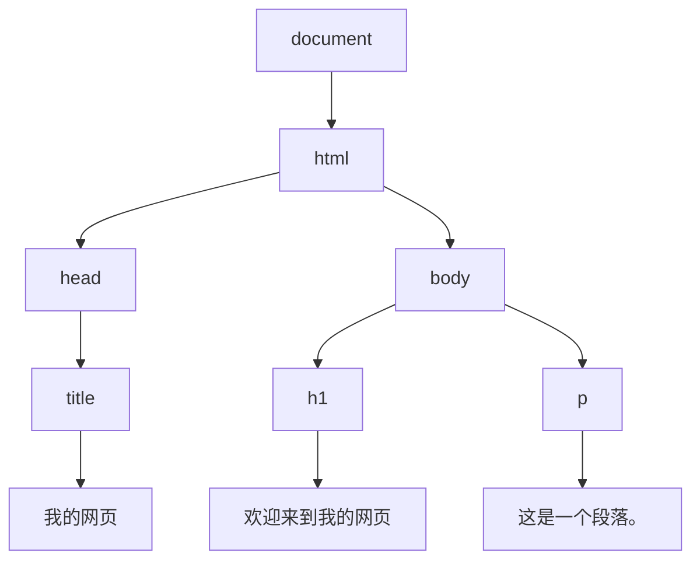

## 什么是DOM？

DOM（Document Object Model，文档对象模型）是HTML和XML文档的编程接口。它将文档解析为一个由节点和对象组成的树形结构，允许开发者通过JavaScript动态地访问和操作网页的内容、结构和样式。

简单来说，DOM是浏览器将HTML文档转换为一个可以被JavaScript操作的对象模型。通过DOM，我们可以动态地修改网页的内容、样式和行为。

## DOM树的结构

DOM将HTML文档表示为一个树形结构，每个HTML元素都是树中的一个节点。例如，以下HTML代码：

```html
<!DOCTYPE html>
<html>
  <head>
    <title>我的网页</title>
  </head>
  <body>
    <h1>欢迎来到我的网页</h1>
    <p>这是一个段落。</p>
  </body>
</html>
```

对应的DOM树结构如下：



在这个树形结构中，`document`是根节点，`html`是它的子节点，`head`和`body`是`html`的子节点，依此类推。

## 如何访问DOM元素

在JavaScript中，我们可以使用多种方法来访问DOM元素。以下是一些常用的方法：

### 1. 通过ID获取元素

使用`document.getElementById()`方法可以通过元素的ID来获取该元素。

```javascript
let header = document.getElementById('header');
```

### 2. 通过类名获取元素

使用`document.getElementsByClassName()`方法可以通过类名获取一组元素。

```javascript
let items = document.getElementsByClassName('item');
```

### 3. 通过标签名获取元素

使用`document.getElementsByTagName()`方法可以通过标签名获取一组元素。

```javascript
let paragraphs = document.getElementsByTagName('p');
```

### 4. 通过选择器获取元素

使用`document.querySelector()`和`document.querySelectorAll()`方法可以通过CSS选择器获取元素。

```javascript
let firstItem = document.querySelector('.item');
let allItems = document.querySelectorAll('.item');
```

:::tip
`querySelector`返回第一个匹配的元素，而`querySelectorAll`返回所有匹配的元素。
:::

## 如何操作DOM元素

一旦我们获取了DOM元素，就可以对其进行各种操作，例如修改内容、样式或属性。

### 1. 修改元素内容

使用`innerHTML`属性可以修改元素的内容。

```javascript
let header = document.getElementById('header');
header.innerHTML = '新的标题';
```

### 2. 修改元素样式

使用`style`属性可以修改元素的样式。

```javascript
let header = document.getElementById('header');
header.style.color = 'red';
header.style.fontSize = '24px';
```

### 3. 修改元素属性

使用`setAttribute()`方法可以修改元素的属性。

```javascript
let image = document.getElementById('myImage');
image.setAttribute('src', 'new-image.jpg');
```

### 4. 添加和删除元素

使用`appendChild()`和`removeChild()`方法可以添加或删除元素。

```javascript
let newParagraph = document.createElement('p');
newParagraph.innerHTML = '这是一个新的段落。';
document.body.appendChild(newParagraph);

let oldParagraph = document.getElementById('oldParagraph');
document.body.removeChild(oldParagraph);
```

## 实际案例：动态添加列表项

假设我们有一个按钮，点击按钮时会在列表中动态添加一个新的列表项。

```html
<ul id="myList">
  <li>第一项</li>
  <li>第二项</li>
</ul>
<button id="addButton">添加项</button>
```

```javascript
let addButton = document.getElementById('addButton');
addButton.addEventListener('click', function() {
  let list = document.getElementById('myList');
  let newItem = document.createElement('li');
  newItem.innerHTML = '新项';
  list.appendChild(newItem);
});
```

在这个例子中，当用户点击按钮时，一个新的列表项会被添加到`<ul>`元素中。

## 总结

DOM操作是前端开发中的核心技能之一。通过DOM，我们可以动态地访问和操作网页的内容、结构和样式。本文介绍了如何访问和操作DOM元素，并通过实际案例展示了DOM操作的应用场景。

:::note
DOM操作是前端开发的基础，掌握这些技能将为你后续学习更高级的前端技术打下坚实的基础。
:::

## 附加资源与练习

- **MDN Web Docs**: [DOM 文档](https://developer.mozilla.org/zh-CN/docs/Web/API/Document_Object_Model)
- **练习**: 尝试创建一个简单的待办事项列表，允许用户添加和删除任务。
- **挑战**: 使用DOM操作实现一个动态的图片轮播器。

通过不断练习和实践，你将更加熟练地掌握DOM操作，并能够在前端开发中灵活运用。