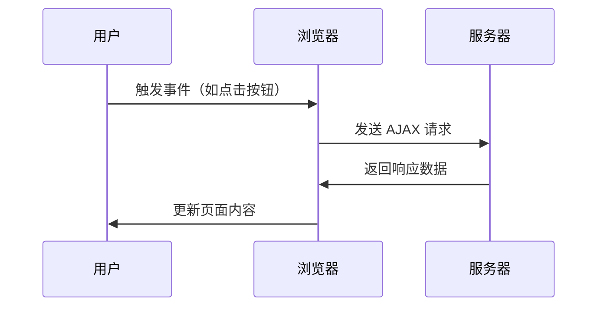

# AJAX技术

AJAX（Asynchronous JavaScript and XML）是一种用于创建快速动态网页的技术。它允许网页在不重新加载整个页面的情况下，与服务器进行异步通信。这意味着用户可以在不中断当前操作的情况下，获取或提交数据，从而提升用户体验。

## 什么是AJAX？

AJAX 并不是一种新的编程语言，而是一种使用现有技术（如 JavaScript、XML、HTML 和 CSS）的组合来实现异步通信的方法。通过 AJAX，网页可以在后台与服务器交换数据，并更新部分页面内容，而无需刷新整个页面。

:::note
AJAX 的核心是 `XMLHttpRequest` 对象，它是浏览器提供的 API，用于在后台与服务器进行数据交换。
:::

## AJAX 的工作原理

AJAX 的工作原理可以概括为以下几个步骤：

1. **用户触发事件**：例如点击按钮或提交表单。
2. **创建 `XMLHttpRequest` 对象**：JavaScript 使用该对象向服务器发送请求。
3. **发送请求**：通过 `XMLHttpRequest` 对象向服务器发送 HTTP 请求。
4. **服务器处理请求**：服务器接收请求并处理数据。
5. **服务器返回响应**：服务器将处理结果返回给浏览器。
6. **更新页面内容**：JavaScript 解析服务器返回的数据，并更新页面的部分内容。



## AJAX 的基本用法

下面是一个简单的 AJAX 示例，展示了如何使用 `XMLHttpRequest` 对象从服务器获取数据并更新页面内容。

```javascript
// 创建 XMLHttpRequest 对象
const xhr = new XMLHttpRequest();

// 定义请求的类型、URL 以及是否异步
xhr.open('GET', 'https://api.example.com/data', true);

// 设置请求完成后的回调函数
xhr.onload = function() {
    if (xhr.status === 200) {
        // 请求成功，处理返回的数据
        const response = JSON.parse(xhr.responseText);
        document.getElementById('content').innerHTML = response.data;
    } else {
        // 请求失败，处理错误
        console.error('请求失败:', xhr.statusText);
    }
};

// 发送请求
xhr.send();
```

:::tip
在实际开发中，通常会使用 `fetch` API 或第三方库（如 Axios）来简化 AJAX 请求的处理。
:::

## AJAX 的实际应用场景

AJAX 技术在现代 Web 开发中应用广泛，以下是一些常见的应用场景：

1. **表单验证**：在用户输入时，实时验证表单数据的有效性。
2. **动态内容加载**：在滚动页面时，动态加载更多内容（如社交媒体中的“无限滚动”）。
3. **自动补全**：在搜索框中输入时，实时显示匹配的搜索建议。
4. **实时聊天**：在不刷新页面的情况下，实时接收和发送消息。

### 示例：动态加载内容

假设我们有一个博客网站，希望在用户点击“加载更多”按钮时，动态加载更多的文章。

```javascript
document.getElementById('load-more').addEventListener('click', function() {
    const xhr = new XMLHttpRequest();
    xhr.open('GET', 'https://api.example.com/posts?page=2', true);
    xhr.onload = function() {
        if (xhr.status === 200) {
            const posts = JSON.parse(xhr.responseText);
            posts.forEach(post => {
                const article = document.createElement('article');
                article.innerHTML = `<h2>${post.title}</h2><p>${post.content}</p>`;
                document.getElementById('posts').appendChild(article);
            });
        } else {
            console.error('加载失败:', xhr.statusText);
        }
    };
    xhr.send();
});
```

## 总结

AJAX 是一种强大的技术，能够显著提升 Web 应用的用户体验。通过异步通信，AJAX 使得网页可以在不刷新整个页面的情况下，与服务器进行数据交换并更新部分内容。掌握 AJAX 的基本用法和实际应用场景，对于前端开发者来说至关重要。

## 附加资源与练习

- **练习**：尝试使用 `fetch` API 重写上面的 AJAX 示例。
- **资源**：
  - [MDN Web Docs: AJAX](https://developer.mozilla.org/zh-CN/docs/Web/Guide/AJAX)
  - [JavaScript.info: Fetch](https://javascript.info/fetch)
  - [Axios 官方文档](https://axios-http.com/)

通过不断练习和探索，你将能够熟练运用 AJAX 技术，构建更加动态和高效的 Web 应用。