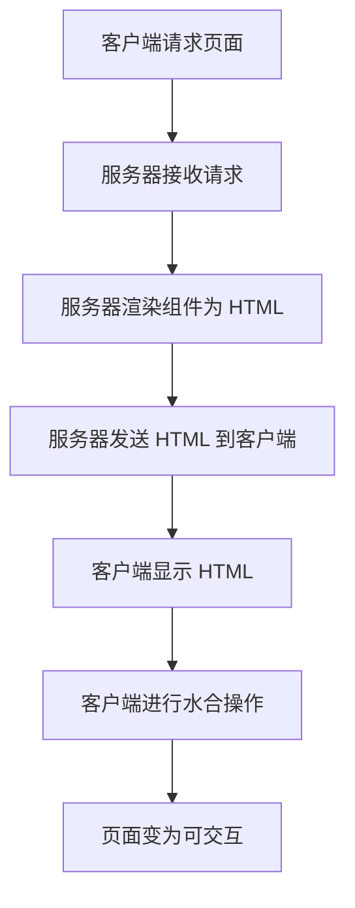

# 服务端渲染

## 什么是服务端渲染？

服务端渲染（Server-Side Rendering，简称 SSR）是一种将网页内容在服务器端生成并发送到客户端的技术。与传统的客户端渲染（Client-Side Rendering，CSR）不同，SSR 在服务器上生成完整的 HTML 页面，然后将其发送到浏览器进行显示。这种方式可以提高页面的加载速度，改善搜索引擎优化（SEO），并提升用户体验。

:::note
**客户端渲染 vs 服务端渲染**
- **客户端渲染（CSR）**：浏览器下载一个空的 HTML 文件，然后通过 JavaScript 动态生成页面内容。
- **服务端渲染（SSR）**：服务器生成完整的 HTML 文件，浏览器直接显示内容。
:::

## 为什么需要服务端渲染？

1. **更快的首屏加载时间**：由于 HTML 已经在服务器端生成，浏览器无需等待 JavaScript 下载和执行即可显示内容。
2. **更好的 SEO**：搜索引擎可以更容易地抓取和索引 SSR 生成的页面内容。
3. **更低的设备性能要求**：对于性能较低的设备，SSR 可以减少客户端的计算负担。

## 服务端渲染的工作原理

服务端渲染的核心思想是将 React、Vue 等前端框架的组件在服务器端渲染成 HTML 字符串，然后将这些字符串发送到客户端。客户端接收到 HTML 后，可以立即显示内容，然后再进行“水合”（Hydration）操作，将静态 HTML 转换为可交互的页面。



## 服务端渲染的实现

以下是一个简单的 React 服务端渲染示例：

### 1. 创建 React 组件

```jsx
// App.js
import React from 'react';

function App() {
  return <h1>Hello, SSR!</h1>;
}

export default App;
```

### 2. 服务器端渲染代码

```jsx
// server.js
import express from 'express';
import React from 'react';
import { renderToString } from 'react-dom/server';
import App from './App';

const app = express();

app.get('/', (req, res) => {
  const html = renderToString(<App />);
  res.send(`
    <!DOCTYPE html>
    <html>
      <head>
        <title>SSR Example</title>
      </head>
      <body>
        <div id="root">${html}</div>
        <script src="/bundle.js"></script>
      </body>
    </html>
  `);
});

app.listen(3000, () => {
  console.log('Server is running on http://localhost:3000');
});
```

### 3. 客户端水合代码

```jsx
// client.js
import React from 'react';
import ReactDOM from 'react-dom';
import App from './App';

ReactDOM.hydrate(<App />, document.getElementById('root'));
```

### 4. 运行项目

1. 使用 Webpack 或类似的工具打包客户端代码。
2. 启动服务器：`node server.js`。
3. 访问 `http://localhost:3000`，你将看到服务端渲染的页面。

:::tip
**水合（Hydration）**：水合是指将静态 HTML 转换为可交互的 React 组件的过程。它确保客户端 JavaScript 能够接管服务器生成的 HTML，并使其具有交互性。
:::

## 实际应用场景

1. **电商网站**：电商网站通常需要快速加载产品页面，以提升用户体验和 SEO 排名。SSR 可以确保页面内容在首次加载时即可显示。
2. **新闻网站**：新闻网站的内容需要被搜索引擎快速索引，SSR 可以帮助实现这一点。
3. **社交媒体平台**：社交媒体平台需要快速加载动态内容，SSR 可以显著提升首屏加载速度。

## 总结

服务端渲染是一种强大的技术，能够显著提升页面的加载速度和 SEO 表现。尽管它增加了服务器的负担，但在许多场景下，这种权衡是值得的。通过本文，你应该对 SSR 的基本概念、工作原理和实现方式有了初步了解。

## 附加资源与练习

- **练习**：尝试在现有的 React 项目中实现 SSR，并观察页面加载速度的变化。
- **资源**：
  - [React 官方文档 - 服务端渲染](https://reactjs.org/docs/react-dom-server.html)
  - [Next.js - 一个支持 SSR 的 React 框架](https://nextjs.org/)
  - [Vue SSR 指南](https://ssr.vuejs.org/)
