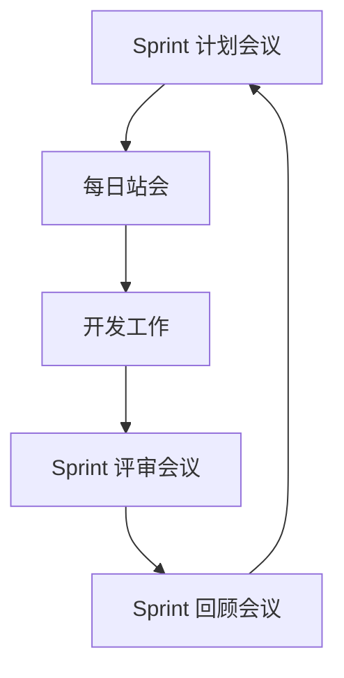
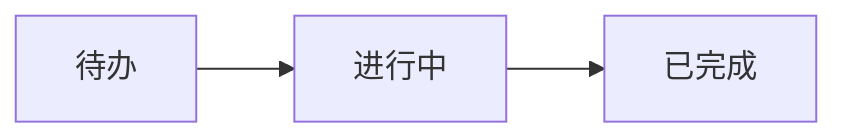

# 敏捷开发流程

敏捷开发（Agile Development）是一种以人为核心、迭代式、增量式的软件开发方法。它强调快速响应变化、持续交付价值，并通过团队协作和客户反馈不断优化产品。敏捷开发的核心目标是提高开发效率、降低风险，并确保交付的产品能够满足客户需求。

## 敏捷开发的核心原则

敏捷开发基于《敏捷宣言》（Agile Manifesto），其核心原则包括：

1. **个体和互动** 高于 流程和工具。
2. **可工作的软件** 高于 详尽的文档。
3. **客户合作** 高于 合同谈判。
4. **响应变化** 高于 遵循计划。

这些原则强调了灵活性、协作和持续改进的重要性。

## 敏捷开发的常见方法

敏捷开发有多种实现方法，以下是几种常见的方法：

1. **Scrum**：一种迭代式开发框架，强调团队协作和持续改进。
2. **Kanban**：一种可视化工作流管理方法，帮助团队优化工作流程。
3. **极限编程（XP）**：一种强调技术卓越和快速反馈的开发方法。

### Scrum 方法简介

Scrum 是敏捷开发中最常用的方法之一。它将开发过程分为多个短周期（称为“Sprint”），每个 Sprint 通常持续 2-4 周。在每个 Sprint 结束时，团队会交付一个可工作的产品增量。

#### Scrum 的关键角色

- **产品负责人（Product Owner）**：负责定义产品需求和优先级。
- **Scrum Master**：负责确保团队遵循 Scrum 流程，并解决障碍。
- **开发团队**：负责实际开发工作。

#### Scrum 的关键活动

- **Sprint 计划会议**：确定 Sprint 目标和任务。
- **每日站会（Daily Standup）**：团队成员每天简短汇报工作进展。
- **Sprint 评审会议**：展示 Sprint 成果并获取反馈。
- **Sprint 回顾会议**：总结 Sprint 经验并改进流程。



### Kanban 方法简介

Kanban 是一种可视化工作流管理方法，通过看板（Kanban Board）帮助团队跟踪任务状态。看板通常分为多个列，例如“待办”、“进行中”和“已完成”。

#### Kanban 的核心实践

1. **可视化工作流**：将任务放在看板上，明确任务状态。
2. **限制在制品（WIP）**：限制同时进行的任务数量，避免过度负载。
3. **持续改进**：通过数据分析优化工作流程。



## 敏捷开发的实际应用

### 案例：使用 Scrum 开发一个任务管理应用

假设我们正在开发一个任务管理应用，以下是使用 Scrum 的步骤：

1. **产品负责人**定义用户故事（User Stories），例如：
   - 作为一个用户，我希望能够创建任务。
   - 作为一个用户，我希望能够标记任务为已完成。

2. **Sprint 计划会议**中，团队选择用户故事并将其分解为具体任务。

3. 在 **每日站会** 中，团队成员汇报进展：
   - 昨天完成了任务创建功能。
   - 今天将开始开发任务标记功能。

4. 在 **Sprint 评审会议** 中，团队展示已完成的功能，例如任务创建和标记功能。

5. 在 **Sprint 回顾会议** 中，团队讨论如何改进下一个 Sprint 的效率。

### 代码示例：任务创建功能

以下是一个简单的任务创建功能的代码示例：

```python
class Task:
    def __init__(self, title, description):
        self.title = title
        self.description = description
        self.completed = False

    def mark_as_completed(self):
        self.completed = True

# 创建一个任务
task = Task("学习敏捷开发", "阅读敏捷开发相关文档")
print(f"任务标题: {task.title}, 状态: {'已完成' if task.completed else '未完成'}")

# 标记任务为已完成
task.mark_as_completed()
print(f"任务标题: {task.title}, 状态: {'已完成' if task.completed else '未完成'}")
```

**输出：**
```
任务标题: 学习敏捷开发, 状态: 未完成
任务标题: 学习敏捷开发, 状态: 已完成
```

:::tip
在实际开发中，任务管理应用通常会使用数据库来存储任务数据，并提供一个用户界面来操作任务。
:::

## 总结

敏捷开发是一种灵活、高效的软件开发方法，特别适合需求变化频繁的项目。通过 Scrum 或 Kanban 等方法，团队可以更好地协作、快速响应变化，并持续交付高质量的产品。

## 附加资源与练习

- **练习**：尝试使用 Scrum 方法规划一个简单的项目，例如开发一个待办事项应用。
- **资源**：
  - [敏捷宣言](https://agilemanifesto.org/)
  - [Scrum 指南](https://www.scrumguides.org/)
  - [Kanban 方法介绍](https://kanbanize.com/kanban-resources)

通过学习和实践，你将能够更好地理解和应用敏捷开发流程，提升团队和项目的效率。