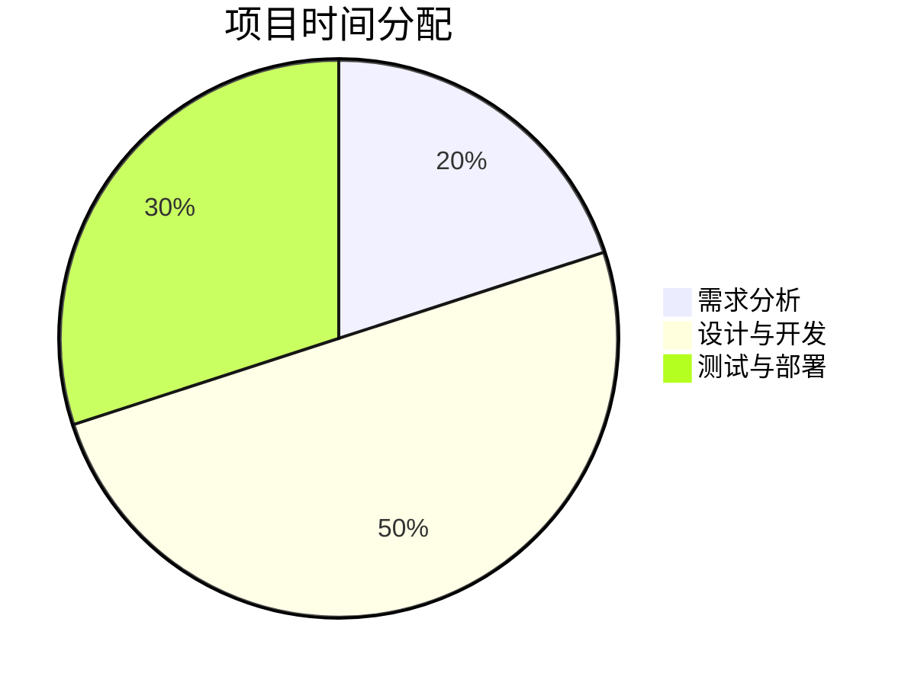

## 介绍

在软件开发中，**项目估算**是项目管理的关键环节之一。它涉及预测完成项目所需的时间、成本和资源。准确的估算可以帮助团队制定合理的计划，避免资源浪费和项目延期。对于初学者来说，掌握基本的估算方法是迈向高效项目管理的第一步。

本文将介绍几种常见的项目估算方法，并通过实际案例帮助你理解如何应用这些方法。

---

## 1. 专家判断法

**专家判断法**是一种依赖经验丰富的团队成员或外部专家的估算方法。专家根据过去的项目经验，结合当前项目的需求，给出估算结果。

### 适用场景
- 项目需求不明确或复杂。
- 团队缺乏历史数据支持。

### 示例
假设你正在开发一个电商网站，团队中的资深开发人员根据以往经验，估算出以下时间：
- 前端开发：3周
- 后端开发：4周
- 测试与部署：2周

:::tip
专家判断法的准确性依赖于专家的经验和项目的相似性。如果项目与专家过去的经验差异较大，估算结果可能会有偏差。
:::

---

## 2. 类比估算法

**类比估算法**是通过比较当前项目与过去类似项目的规模、复杂度和资源需求，来估算当前项目的工作量。

### 适用场景
- 团队有类似项目的历史数据。
- 项目需求相对明确。

### 示例
假设你之前开发过一个博客系统，耗时2个月。现在需要开发一个类似的系统，但功能增加了用户评论和点赞功能。根据类比估算法，你可以估算新项目需要2.5个月。



:::caution
类比估算法的准确性取决于历史项目的相似性。如果项目差异较大，估算结果可能不准确。
:::

---

## 3. 参数估算法

**参数估算法**是通过建立数学模型，将项目的某些参数（如代码行数、功能点）与工作量关联起来，进行估算。

### 适用场景
- 项目需求明确且可量化。
- 团队有足够的历史数据支持。

### 示例
假设你的团队开发一个功能模块的平均速度为100行代码/天。当前项目需要开发一个包含5000行代码的模块，那么估算的开发时间为：

```
开发时间 = 代码行数 / 开发速度
          = 5000 / 100
          = 50天
```

:::note
参数估算法的准确性依赖于模型的合理性和数据的准确性。如果模型参数选择不当，估算结果可能会有较大偏差。
:::

---

## 4. 三点估算法

**三点估算法**是一种基于乐观、悲观和最可能情况的估算方法。它通过加权平均计算出一个更合理的估算值。

### 公式
```
估算值 = (乐观估算 + 4 × 最可能估算 + 悲观估算) / 6
```

### 示例
假设开发一个功能模块的估算如下：
- 乐观估算：10天
- 最可能估算：15天
- 悲观估算：25天

那么，估算的开发时间为：

```
估算值 = (10 + 4 × 15 + 25) / 6
          = (10 + 60 + 25) / 6
          = 95 / 6
          ≈ 15.83天
```

:::warning
三点估算法适用于不确定性较高的项目。如果项目的风险较低，使用其他方法可能更合适。
:::

---

## 5. 实际案例：电商网站开发估算

假设你需要为一个电商网站开发以下功能：
1. 用户注册与登录
2. 商品展示与搜索
3. 购物车与订单管理

### 估算步骤
1. **专家判断法**：团队资深开发人员估算每个功能的时间。
2. **类比估算法**：参考之前开发的类似项目，调整估算值。
3. **参数估算法**：根据代码行数和开发速度，计算开发时间。
4. **三点估算法**：考虑不确定性，计算最终估算值。

### 估算结果
| 功能模块           | 专家判断法 | 类比估算法 | 参数估算法 | 三点估算法 | 最终估算 |
|--------------------|------------|------------|------------|------------|----------|
| 用户注册与登录     | 5天        | 6天        | 5.5天      | 6天        | 6天      |
| 商品展示与搜索     | 10天       | 12天       | 11天       | 12天       | 12天     |
| 购物车与订单管理   | 15天       | 18天       | 16天       | 17天       | 17天     |

---

## 总结

项目估算是软件开发中不可或缺的一部分。通过掌握专家判断法、类比估算法、参数估算法和三点估算法，你可以更准确地预测项目的时间、成本和资源需求。在实际项目中，通常需要结合多种方法，以提高估算的准确性。

---

## 附加资源与练习

### 资源
- 《软件估算：黑匣子揭秘》——Steve McConnell
- 《敏捷估算与规划》——Mike Cohn

### 练习
1. 选择一个简单的项目（如待办事项应用），尝试使用专家判断法和类比估算法进行估算。
2. 为你的项目创建一个参数估算模型，并计算开发时间。
3. 使用三点估算法，估算一个功能模块的开发时间，并分析不确定性对结果的影响。