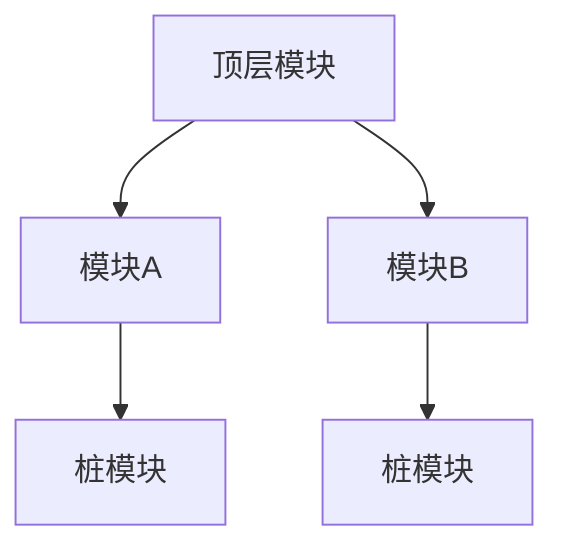
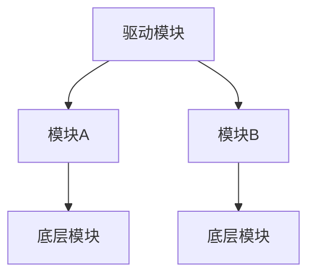
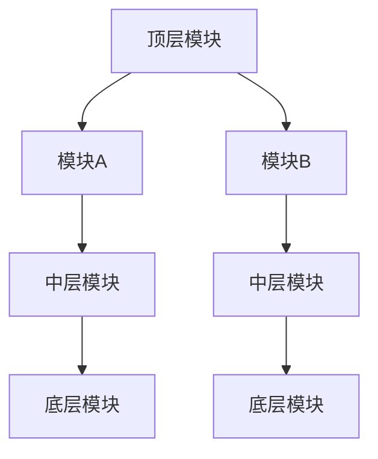

## 什么是集成测试？

集成测试是软件测试的一个重要阶段，旨在验证不同模块或组件在集成后是否能够协同工作。与单元测试不同，单元测试关注单个模块的功能，而集成测试则关注多个模块之间的交互和接口是否正常工作。

:::note
集成测试的目标是发现模块之间的接口问题、数据流问题以及系统整体行为是否符合预期。
:::

## 为什么需要集成测试？

在软件开发中，模块通常是独立开发和测试的。然而，当这些模块集成在一起时，可能会出现以下问题：
- 接口不匹配
- 数据传递错误
- 模块之间的依赖关系未正确处理

集成测试可以帮助我们在早期发现这些问题，从而减少修复成本并提高软件质量。

## 集成测试策略

集成测试有多种策略，以下是几种常见的策略：

### 1. 自顶向下集成测试

自顶向下集成测试从系统的最高层模块开始，逐步向下集成和测试低层模块。在这个过程中，通常会使用**桩模块（Stub）**来模拟尚未集成的低层模块。



**优点**：
- 早期验证主要功能和流程。
- 可以尽早发现高层设计问题。

**缺点**：
- 需要编写大量的桩模块。
- 低层模块的测试可能会延迟。

### 2. 自底向上集成测试

自底向上集成测试从系统的底层模块开始，逐步向上集成和测试高层模块。在这个过程中，通常会使用**驱动模块（Driver）**来模拟尚未集成的高层模块。



**优点**：
- 底层模块可以尽早测试。
- 不需要编写桩模块。

**缺点**：
- 高层模块的测试可能会延迟。
- 主要功能和流程的验证较晚。

### 3. 混合集成测试

混合集成测试结合了自顶向下和自底向上的策略，根据系统的特点选择合适的集成顺序。这种策略通常用于复杂系统，以平衡测试的效率和覆盖范围。



**优点**：
- 灵活性高，可以根据系统特点调整策略。
- 平衡了测试的效率和覆盖范围。

**缺点**：
- 需要更多的计划和协调。
- 可能会增加测试的复杂性。

## 实际案例

假设我们正在开发一个电子商务网站，包含以下模块：
- 用户认证模块
- 购物车模块
- 支付模块

### 自顶向下集成测试案例

1. 首先测试用户认证模块与购物车模块的集成。
2. 使用桩模块模拟支付模块。
3. 验证用户登录后是否可以正确添加商品到购物车。

```python
# 桩模块示例
class PaymentStub:
    def process_payment(self, amount):
        return "Payment processed successfully"

# 测试代码
def test_add_to_cart():
    user = UserAuthentication.authenticate("user", "password")
    cart = ShoppingCart(user)
    cart.add_item("product_id")
    assert cart.get_items() == ["product_id"]
```

### 自底向上集成测试案例

1. 首先测试支付模块的功能。
2. 使用驱动模块模拟购物车模块。
3. 验证支付模块是否可以正确处理购物车中的商品。

```python
# 驱动模块示例
class ShoppingCartDriver:
    def get_items(self):
        return ["product_id"]

# 测试代码
def test_process_payment():
    cart = ShoppingCartDriver()
    payment = PaymentModule()
    result = payment.process_payment(cart.get_items())
    assert result == "Payment processed successfully"
```

## 总结

集成测试是确保软件系统各个模块能够协同工作的重要步骤。通过选择合适的集成测试策略，可以有效地发现和解决模块之间的接口问题和数据流问题。无论是自顶向下、自底向上还是混合策略，都有其适用的场景和优缺点。

:::tip
在实际项目中，建议根据系统的复杂度和开发进度选择合适的集成测试策略，并结合自动化测试工具以提高测试效率。
:::

## 附加资源与练习

### 资源
- [软件测试基础](https://example.com/software-testing-basics)
- [集成测试工具推荐](https://example.com/integration-testing-tools)

### 练习
1. 为一个简单的博客系统设计集成测试策略，并编写测试代码。
2. 比较自顶向下和自底向上集成测试的优缺点，并讨论在什么情况下使用哪种策略更合适。

通过不断实践和学习，你将能够掌握集成测试的精髓，并在实际项目中应用这些策略。