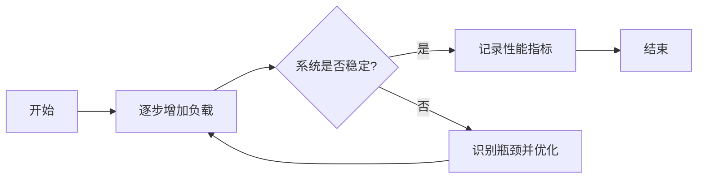
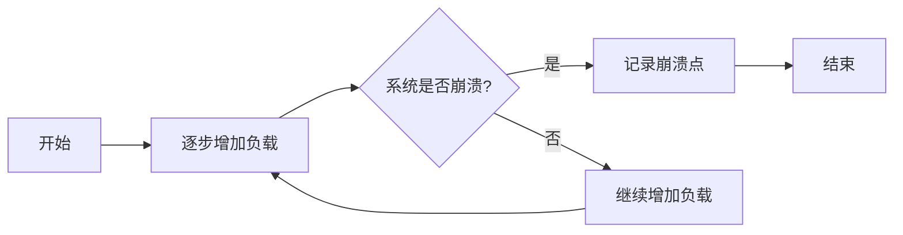

## 介绍

性能测试是软件开发过程中至关重要的一环，它用于评估系统在不同负载条件下的表现。通过性能测试，开发者可以识别系统的瓶颈、优化资源利用率，并确保系统在真实环境中能够稳定运行。本文将逐步介绍性能测试的基本概念、常用方法以及实际应用场景。

## 性能测试的基本概念

性能测试的主要目标是评估系统的响应时间、吞吐量、资源利用率和稳定性。以下是性能测试中常用的几个关键指标：

- **响应时间**：系统处理请求并返回结果所需的时间。
- **吞吐量**：系统在单位时间内能够处理的请求数量。
- **资源利用率**：系统在运行过程中对CPU、内存、磁盘等资源的占用情况。
- **稳定性**：系统在长时间运行或高负载情况下是否能够保持稳定。

## 性能测试的常用方法

性能测试通常包括以下几种方法：

### 1. 负载测试（Load Testing）

负载测试用于评估系统在正常和峰值负载条件下的表现。通过逐步增加负载，开发者可以观察系统的响应时间、吞吐量和资源利用率的变化。



### 2. 压力测试（Stress Testing）

压力测试用于评估系统在超出正常负载条件下的表现。通过不断增加负载，直到系统崩溃或达到极限，开发者可以了解系统的极限容量和崩溃点。



### 3. 并发测试（Concurrency Testing）

并发测试用于评估系统在多个用户同时访问时的表现。通过模拟多个并发用户，开发者可以观察系统的响应时间和资源利用率。

```python
import threading
import requests

def simulate_user():
    response = requests.get('https://example.com')
    print(f'Response Time: {response.elapsed.total_seconds()} seconds')

threads = []
for i in range(100):
    thread = threading.Thread(target=simulate_user)
    threads.append(thread)
    thread.start()

for thread in threads:
    thread.join()
```

:::note
在上面的代码示例中，我们使用Python的`threading`模块模拟了100个并发用户访问一个网站，并记录了每个请求的响应时间。
:::

### 4. 容量测试（Capacity Testing）

容量测试用于评估系统在特定负载条件下的最大容量。通过不断增加负载，直到系统达到预定的性能指标，开发者可以了解系统的最大处理能力。

## 实际应用场景

### 案例1：电商网站的性能测试

假设你正在开发一个电商网站，你需要确保网站在促销活动期间能够处理大量用户的访问。通过负载测试和并发测试，你可以评估网站在高负载条件下的表现，并优化数据库查询、缓存策略等，以提高系统的响应速度和稳定性。

### 案例2：API服务的性能测试

假设你正在开发一个API服务，你需要确保API在高并发请求下能够快速响应。通过压力测试和并发测试，你可以评估API的极限容量，并优化代码逻辑、数据库连接池等，以提高API的吞吐量和响应时间。

## 总结

性能测试是确保软件系统在真实环境中能够稳定运行的重要手段。通过负载测试、压力测试、并发测试和容量测试，开发者可以全面评估系统的性能，并识别和优化系统的瓶颈。希望本文能够帮助你理解性能测试的基本概念和方法，并在实际项目中应用这些知识。

## 附加资源与练习

- **资源**：
  - [Performance Testing Guide](https://www.guru99.com/performance-testing.html)
  - [Load Testing with JMeter](https://jmeter.apache.org/usermanual/index.html)

- **练习**：
  1. 使用Python编写一个简单的并发测试脚本，模拟多个用户同时访问一个API，并记录每个请求的响应时间。
  2. 使用JMeter对一个简单的Web应用进行负载测试，观察系统在不同负载条件下的表现。

:::tip
在进行性能测试时，务必在测试环境中进行，避免对生产环境造成影响。
:::