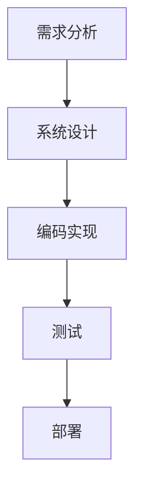

# 项目文档编写

在软件开发中，项目文档是确保团队成员和利益相关者理解项目目标、进展和实现细节的关键工具。无论是小型项目还是大型企业级项目，良好的文档编写都能提高沟通效率、减少误解，并为未来的维护和扩展提供参考。

## 什么是项目文档？

项目文档是记录项目各个方面信息的文件集合。它通常包括项目的目标、需求、设计、实现细节、测试计划、用户手册等。文档的形式可以是文本、图表、代码注释或其他形式。

:::note
**注意**：项目文档不仅仅是开发者的工具，它也是与项目经理、测试人员、客户和其他利益相关者沟通的桥梁。
:::

## 为什么项目文档很重要？

1. **提高沟通效率**：文档可以帮助团队成员快速了解项目的背景和目标，减少沟通成本。
2. **减少误解**：清晰的文档可以避免团队成员对需求或设计的误解。
3. **便于维护**：良好的文档可以为未来的维护和扩展提供参考，减少维护成本。
4. **知识传承**：文档可以帮助新成员快速上手项目，减少学习成本。

## 项目文档的类型

项目文档通常包括以下几种类型：

1. **需求文档**：描述项目的功能需求和非功能需求。
2. **设计文档**：描述系统的架构、模块设计和接口设计。
3. **测试文档**：描述测试计划、测试用例和测试结果。
4. **用户手册**：为用户提供使用系统的指南。
5. **API文档**：为开发者提供API的使用说明。

## 如何编写项目文档？

### 1. 明确目标

在编写文档之前，首先要明确文档的目标和受众。不同的文档类型和受众需要不同的内容和风格。

:::tip
**提示**：需求文档的目标是让开发者和客户达成一致，而用户手册的目标是让用户能够顺利使用系统。
:::

### 2. 结构化内容

文档的内容应该结构清晰，便于阅读和理解。通常可以使用以下结构：

- **标题**：简洁明了，概括文档内容。
- **简介**：简要介绍文档的背景和目标。
- **正文**：详细描述文档的内容，可以使用章节和子章节来组织内容。
- **总结**：总结文档的主要内容和结论。

### 3. 使用图表

图表可以帮助读者更直观地理解复杂的概念。例如，可以使用流程图、架构图、时序图等。



### 4. 提供代码示例

对于技术文档，提供代码示例是非常有帮助的。代码示例应该简洁明了，并附有详细的注释。

```python
# 示例：计算两个数的和
def add(a, b):
    """
    计算两个数的和
    :param a: 第一个数
    :param b: 第二个数
    :return: 两个数的和
    """
    return a + b

# 输入
result = add(3, 5)
# 输出
print(result)  # 输出: 8
```

### 5. 保持更新

项目文档应该随着项目的进展不断更新。过时的文档可能会导致误解和错误。

:::caution
**警告**：不要忽视文档的更新，过时的文档可能比没有文档更糟糕。
:::

## 实际案例

假设我们正在开发一个简单的任务管理系统。以下是一些文档的示例：

### 需求文档

**标题**：任务管理系统需求文档

**简介**：本文档描述了任务管理系统的功能需求和非功能需求。

**正文**：
- **功能需求**：
  - 用户可以创建、编辑和删除任务。
  - 任务可以标记为完成或未完成。
  - 用户可以查看任务列表。
- **非功能需求**：
  - 系统应支持100个并发用户。
  - 系统响应时间应小于2秒。

### 设计文档

**标题**：任务管理系统设计文档

**简介**：本文档描述了任务管理系统的架构和模块设计。

**正文**：
- **系统架构**：
  - 前端：React
  - 后端：Node.js
  - 数据库：MongoDB
- **模块设计**：
  - 任务管理模块：负责任务的创建、编辑、删除和查询。

### 用户手册

**标题**：任务管理系统用户手册

**简介**：本文档为用户提供了使用任务管理系统的指南。

**正文**：
- **创建任务**：
  - 点击“新建任务”按钮，输入任务名称和描述，点击“保存”。
- **编辑任务**：
  - 点击任务列表中的任务，修改任务名称或描述，点击“保存”。
- **删除任务**：
  - 点击任务列表中的任务，点击“删除”按钮。

## 总结

项目文档是软件开发过程中不可或缺的一部分。通过编写清晰、全面的文档，可以提高团队的沟通效率，减少误解，并为未来的维护和扩展提供参考。希望本文能够帮助你更好地理解项目文档的编写方法。

## 附加资源

- [如何编写优秀的技术文档](https://example.com/technical-documentation)
- [项目文档模板](https://example.com/project-documentation-templates)
- [文档编写工具推荐](https://example.com/documentation-tools)

## 练习

1. 为你的下一个项目编写一份需求文档。
2. 尝试使用图表来描述一个复杂系统的架构。
3. 编写一个简单的API文档，并提供代码示例。