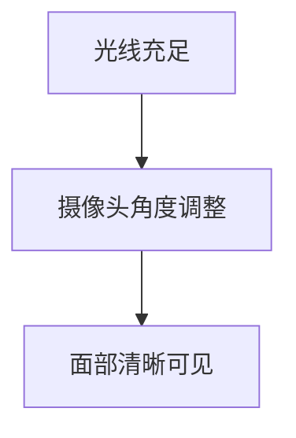

## 介绍

随着远程工作的普及，远程面试已成为求职过程中的重要环节。与传统的面对面面试不同，远程面试需要额外的技术准备和环境设置。本文将详细介绍远程面试的注意事项，帮助你顺利通过面试。

## 技术准备

### 1. 确保设备正常

在面试前，确保你的设备（如电脑、摄像头、麦克风）正常工作。以下是一些常见的检查步骤：

- **摄像头**：测试摄像头是否清晰，确保面试官能清楚看到你。
- **麦克风**：测试麦克风是否正常工作，确保面试官能清楚听到你的声音。
- **网络连接**：确保网络连接稳定，避免面试过程中断。

:::tip
建议在面试前进行一次模拟面试，测试所有设备是否正常工作。
:::

### 2. 安装必要的软件

根据面试要求，提前安装并熟悉所需的软件（如 Zoom、Microsoft Teams、Google Meet 等）。确保你知道如何加入会议、共享屏幕、使用聊天功能等。

```bash
# 示例：安装 Zoom
sudo apt-get install zoom
```

### 3. 备份计划

即使你已经做好了充分的准备，技术问题仍可能发生。因此，准备一个备份计划非常重要。例如：

- 准备一个备用设备（如手机或平板电脑）。
- 确保你有面试官的紧急联系方式，以便在出现问题时及时沟通。

## 环境设置

### 1. 选择合适的面试地点

选择一个安静、光线充足的地方进行面试。确保背景整洁，避免分散面试官的注意力。

:::caution
避免在咖啡厅或公共场所进行面试，因为这些地方通常噪音较大，且网络不稳定。
:::

### 2. 调整光线和摄像头角度

确保光线充足，避免背光或过暗的情况。调整摄像头角度，使你的面部清晰可见，且位于画面中央。



### 3. 关闭干扰源

在面试前，关闭手机通知、电脑弹窗等可能干扰面试的因素。确保你不会被外界打扰。

## 沟通技巧

### 1. 保持眼神交流

在远程面试中，保持眼神交流非常重要。虽然你无法直接看到面试官的眼睛，但你可以通过看摄像头来模拟眼神交流。

:::note
尝试将摄像头放在与眼睛平齐的位置，这样你可以自然地看向摄像头。
:::

### 2. 清晰表达

在远程面试中，语音清晰度尤为重要。确保你说话清晰、语速适中，避免使用过多的填充词（如“嗯”、“啊”）。

### 3. 积极倾听

在面试过程中，积极倾听面试官的问题，并在回答前稍作思考。避免打断面试官，确保你完全理解问题后再作答。

## 实际案例

### 案例 1：技术问题导致面试中断

小明在面试过程中遇到了网络中断的问题，导致面试被迫中断。幸运的是，他提前准备了备用设备和面试官的联系方式，及时恢复了面试。

:::warning
技术问题可能会影响面试结果，因此务必提前做好准备。
:::

### 案例 2：环境干扰影响表现

小红在面试时选择了家中的客厅，结果被家人的活动干扰，导致面试官对她的专注度产生了怀疑。

:::caution
选择一个安静、无干扰的环境进行面试，确保你能专注于面试过程。
:::

## 总结

远程面试虽然与传统的面对面面试有所不同，但通过充分的技术准备、合适的环境设置和良好的沟通技巧，你仍然可以在面试中表现出色。记住，提前准备和模拟面试是成功的关键。

## 附加资源

- [Zoom 官方指南](https://zoom.us/docs)
- [Microsoft Teams 使用教程](https://support.microsoft.com/teams)
- [Google Meet 帮助中心](https://support.google.com/meet)

## 练习

1. 进行一次模拟远程面试，测试你的设备和环境设置。
2. 练习在摄像头前保持眼神交流，并录制视频进行自我评估。
3. 准备一个备份计划，确保在技术问题发生时能及时应对。
