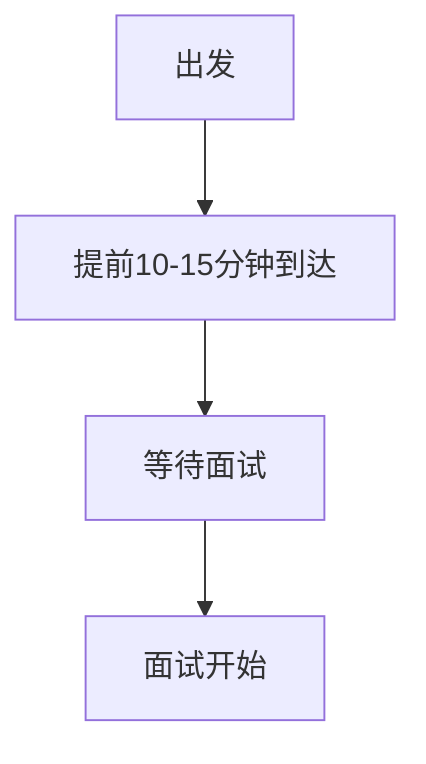

## 介绍

面试礼仪是面试过程中不可忽视的一部分。它不仅体现了你的职业素养，还能给面试官留下良好的第一印象。对于初学者来说，掌握面试礼仪是迈向成功的第一步。本文将详细介绍面试礼仪的各个方面，帮助你从容应对面试。

## 面试前的准备

### 1. 着装得体

面试时的着装是面试官对你的第一印象。以下是一些基本的着装建议：

- **正式场合**：选择西装、衬衫、领带等正式服装。
- **半正式场合**：可以选择商务休闲装，如衬衫搭配休闲裤。
- **避免过于随意**：避免穿短裤、拖鞋等过于休闲的服装。

:::tip
如果你不确定公司的着装要求，可以提前通过公司官网或招聘信息了解。
:::

### 2. 准时到达

准时是面试礼仪中最基本的要求。建议提前10-15分钟到达面试地点，以应对突发情况。



:::caution
如果遇到不可抗力导致迟到，务必提前通知面试官并道歉。
:::

## 面试中的礼仪

### 1. 问候与自我介绍

进入面试房间后，首先向面试官问好并做简短的自我介绍。例如：

```plaintext
"您好，我是张三，很高兴有机会参加这次面试。"
```

### 2. 保持眼神交流

眼神交流是展示自信和尊重的重要方式。在面试过程中，尽量保持与面试官的眼神交流，避免低头或东张西望。

### 3. 注意肢体语言

肢体语言同样重要。以下是一些需要注意的肢体语言：

- **坐姿端正**：保持背部挺直，不要靠在椅背上。
- **手势自然**：避免过多的小动作，如抖腿、玩笔等。
- **微笑**：适当的微笑可以缓解紧张气氛，展现亲和力。

:::note
面试官通常会通过肢体语言来判断你的自信程度和态度。
:::

### 4. 回答问题时的礼仪

在回答问题时，注意以下几点：

- **简洁明了**：避免冗长的回答，突出重点。
- **逻辑清晰**：使用“首先、其次、最后”等词语，使回答更有条理。
- **诚实回答**：如果遇到不会的问题，可以坦诚说明，并表示愿意学习。

```plaintext
面试官：请介绍一下你的项目经验。
候选人：首先，我参与了一个电商网站的开发，主要负责前端页面的设计。其次，我还参与了后端API的调试工作。最后，我协助团队完成了项目的上线部署。
```

## 面试结束时的礼仪

### 1. 表达感谢

面试结束时，记得向面试官表达感谢。例如：

```plaintext
"非常感谢您的时间，期待有机会加入贵公司。"
```

### 2. 询问后续流程

可以礼貌地询问面试的后续流程，例如：

```plaintext
"请问接下来的面试流程是怎样的？"
```

### 3. 握手告别

如果面试官主动伸出手，可以礼貌地握手告别。握手时力度适中，避免过于用力或过于轻浮。

## 实际案例

### 案例1：迟到的影响

小李在面试当天因为堵车迟到了15分钟。尽管他提前通知了面试官，但迟到仍然给面试官留下了不好的印象。面试官认为小李的时间管理能力有待提高。

:::warning
迟到会严重影响面试官对你的第一印象，务必提前规划好路线。
:::

### 案例2：肢体语言的重要性

小王在面试中一直低头看桌子，缺乏眼神交流。尽管他的回答内容不错，但面试官认为他缺乏自信，最终没有通过面试。

:::tip
良好的肢体语言可以大大提升你的面试表现。
:::

## 总结

面试礼仪是面试成功的关键因素之一。通过得体的着装、准时到达、良好的问候与自我介绍、保持眼神交流、注意肢体语言以及礼貌的结束方式，你可以在面试中展现专业形象，给面试官留下深刻印象。

## 附加资源

- [面试礼仪指南](https://www.example.com/interview-etiquette-guide)
- [如何准备面试](https://www.example.com/how-to-prepare-for-interview)
- [面试常见问题及回答技巧](https://www.example.com/interview-questions)

## 练习

1. 模拟一次面试，练习自我介绍和回答常见问题。
2. 录制自己的面试视频，观察自己的肢体语言和眼神交流。
3. 请朋友或家人扮演面试官，进行模拟面试并给予反馈。