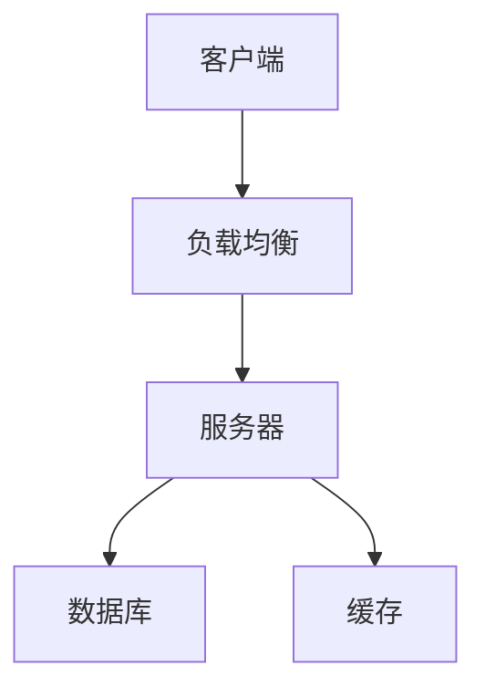

## 介绍

系统设计题是技术面试中的常见题型，尤其是在中高级岗位的面试中。这类题目考察的是你对复杂系统的理解、设计能力以及解决问题的能力。对于初学者来说，系统设计题可能看起来有些复杂，但通过系统的学习和练习，你可以逐步掌握其中的技巧。

在系统设计题中，面试官通常会给出一个开放性的问题，要求你设计一个系统来解决特定的需求。你需要从需求分析、架构设计、数据存储、性能优化等多个方面进行全面的思考。

## 系统设计的基本步骤

### 1. 需求分析

在开始设计之前，首先要明确系统的需求。你需要与面试官沟通，了解系统的功能需求、用户规模、性能要求等。以下是一些常见的问题：

- 系统的主要功能是什么？
- 系统的用户规模有多大？
- 系统的响应时间要求是多少？
- 系统的可用性要求是多少？

:::tip
在需求分析阶段，尽量多问问题，确保你完全理解面试官的需求。
:::

### 2. 定义系统接口

在明确了需求之后，你需要定义系统的接口。接口是系统与外部世界交互的桥梁，通常包括 API、用户界面等。

例如，如果你要设计一个简单的社交媒体系统，你可能需要定义以下接口：

- `POST /posts`：发布新帖子
- `GET /posts/{id}`：获取帖子详情
- `GET /posts`：获取帖子列表

### 3. 高层架构设计

在定义了接口之后，你需要设计系统的高层架构。高层架构通常包括以下几个部分：

- **客户端**：用户与系统交互的界面，可以是 Web 应用、移动应用等。
- **服务器**：处理客户端请求的核心逻辑。
- **数据库**：存储系统的数据。
- **缓存**：提高系统的性能。
- **负载均衡**：分发请求，提高系统的可用性。



### 4. 数据存储设计

数据存储是系统设计中的关键部分。你需要根据系统的需求选择合适的数据库类型（如关系型数据库、NoSQL 数据库等），并设计数据表结构。

例如，如果你要设计一个简单的社交媒体系统，你可能需要以下数据表：

- `users`：存储用户信息
- `posts`：存储帖子信息
- `comments`：存储评论信息

```sql
CREATE TABLE users (
    id INT PRIMARY KEY,
    username VARCHAR(255),
    email VARCHAR(255)
);

CREATE TABLE posts (
    id INT PRIMARY KEY,
    user_id INT,
    content TEXT,
    created_at TIMESTAMP
);

CREATE TABLE comments (
    id INT PRIMARY KEY,
    post_id INT,
    user_id INT,
    content TEXT,
    created_at TIMESTAMP
);
```

### 5. 性能优化

在设计系统时，性能是一个非常重要的考虑因素。你需要考虑如何优化系统的响应时间、吞吐量等。以下是一些常见的性能优化策略：

- **缓存**：使用缓存来减少数据库的访问次数。
- **负载均衡**：使用负载均衡来分发请求，避免单点故障。
- **数据库索引**：为常用的查询字段创建索引，提高查询速度。

### 6. 扩展性和可用性

系统的扩展性和可用性也是系统设计中的重要考虑因素。你需要考虑如何设计系统，使其能够应对未来的增长，并保证系统的高可用性。

- **水平扩展**：通过增加服务器数量来提高系统的处理能力。
- **冗余设计**：通过冗余设计来提高系统的可用性，避免单点故障。

## 实际案例：设计一个简单的 URL 缩短服务

让我们通过一个实际的案例来理解系统设计的流程。假设你需要设计一个 URL 缩短服务，用户可以将长 URL 转换为短 URL。

### 需求分析

- 用户可以通过 API 提交长 URL，并获取短 URL。
- 用户可以通过短 URL 访问原始的长 URL。
- 系统需要支持高并发访问。

### 系统接口

- `POST /shorten`：提交长 URL，返回短 URL。
- `GET /{short_url}`：通过短 URL 访问原始的长 URL。

### 高层架构设计


### 数据存储设计

```sql
CREATE TABLE urls (
    id INT PRIMARY KEY,
    long_url TEXT,
    short_url VARCHAR(255),
    created_at TIMESTAMP
);
```

### 性能优化

- 使用缓存来存储常用的短 URL 和长 URL 的映射关系。
- 使用负载均衡来分发请求，提高系统的并发处理能力。

## 总结

系统设计题是技术面试中的重要部分，通过系统的学习和练习，你可以逐步掌握其中的技巧。在应对系统设计题时，首先要明确需求，然后逐步设计系统的接口、架构、数据存储等部分。最后，考虑系统的性能、扩展性和可用性。

## 附加资源

- [系统设计面试指南](https://www.educative.io/courses/grokking-the-system-design-interview)
- [系统设计基础](https://www.hiredintech.com/classrooms/system-design/lesson/1)
- [系统设计练习](https://leetcode.com/discuss/interview-question/system-design/)

通过不断的学习和实践，你将能够在系统设计面试中游刃有余。祝你面试顺利！