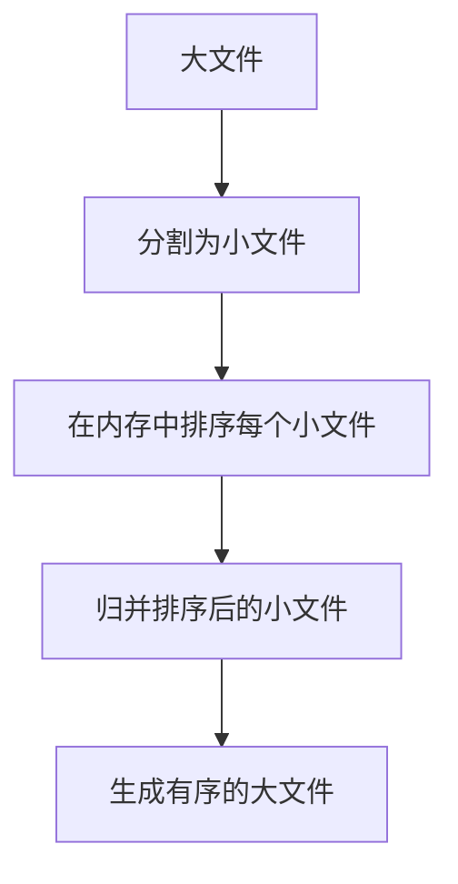

# 内部排序与外部排序

在计算机科学中，排序算法是处理数据的重要工具。根据数据存储的位置和规模，排序算法可以分为**内部排序**和**外部排序**。本文将详细介绍这两种排序方式的概念、区别以及实际应用场景。

---

## 什么是内部排序？

**内部排序**是指所有待排序的数据都存储在计算机的内存（RAM）中，排序过程完全在内存中进行。由于内存的访问速度远快于外部存储设备（如硬盘），内部排序通常效率较高，适用于数据规模较小的情况。

常见的内部排序算法包括：
- 冒泡排序（Bubble Sort）
- 快速排序（Quick Sort）
- 归并排序（Merge Sort）
- 堆排序（Heap Sort）

### 内部排序示例：快速排序

以下是一个使用快速排序对数组进行排序的 Python 示例：

```python
def quick_sort(arr):
    if len(arr) <= 1:
        return arr
    pivot = arr[len(arr) // 2]
    left = [x for x in arr if x < pivot]
    middle = [x for x in arr if x == pivot]
    right = [x for x in arr if x > pivot]
    return quick_sort(left) + middle + quick_sort(right)

# 示例输入
arr = [3, 6, 8, 10, 1, 2, 1]
# 排序后输出
sorted_arr = quick_sort(arr)
print(sorted_arr)  # 输出: [1, 1, 2, 3, 6, 8, 10]
```

:::tip
快速排序是一种高效的内部排序算法，平均时间复杂度为 O(n log n)，但在最坏情况下可能退化为 O(n²)。
:::

---

## 什么是外部排序？

**外部排序**是指待排序的数据量过大，无法全部加载到内存中，因此需要借助外部存储设备（如硬盘）进行排序。外部排序通常用于处理大规模数据集，例如数据库中的排序操作。

外部排序的核心思想是：
1. 将大数据集分割成多个小块，每个小块可以在内存中排序。
2. 对排序后的小块进行归并，最终得到完整的有序数据集。

### 外部排序示例：归并排序

以下是一个简化的外部排序流程：

1. **分割阶段**：将大文件分割成多个小文件，每个小文件在内存中排序。
2. **归并阶段**：将排序后的小文件逐步归并，最终生成一个有序的大文件。



:::note
外部排序的关键在于减少磁盘 I/O 操作，因为磁盘的读写速度远低于内存。
:::

---

## 内部排序与外部排序的区别

| 特性            | 内部排序                     | 外部排序                     |
|-----------------|------------------------------|------------------------------|
| 数据存储位置    | 内存中                       | 外部存储设备（如硬盘）       |
| 适用数据规模    | 小规模数据                   | 大规模数据                   |
| 排序速度        | 较快                         | 较慢（受磁盘 I/O 限制）      |
| 常见算法        | 快速排序、堆排序、冒泡排序等 | 多路归并排序、外部归并排序等 |

---

## 实际应用场景

### 内部排序的应用
- **小型数据集处理**：例如对用户输入的数据进行排序。
- **实时计算**：例如在游戏中对玩家得分进行实时排序。

### 外部排序的应用
- **大数据处理**：例如对数十亿条记录的数据库表进行排序。
- **文件系统排序**：例如对大型日志文件进行排序以方便分析。

---

## 总结

内部排序和外部排序是处理不同规模数据的两种重要方法。内部排序适用于数据量较小且可以完全加载到内存中的场景，而外部排序则用于处理大规模数据集。理解这两种排序方式的区别和应用场景，有助于我们在实际编程中选择合适的算法。

---

## 附加资源与练习

### 推荐资源
- 《算法导论》：深入讲解排序算法及其复杂度分析。
- [GeeksforGeeks](https://www.geeksforgeeks.org)：提供丰富的排序算法教程和代码示例。

### 练习
1. 实现一个内部排序算法（如归并排序），并对一个包含 1000 个随机整数的数组进行排序。
2. 模拟外部排序的过程：编写一个程序，将一个大文件分割成多个小文件，排序后再归并。

:::caution
在实现外部排序时，注意磁盘 I/O 的开销，尽量优化读写操作。
:::