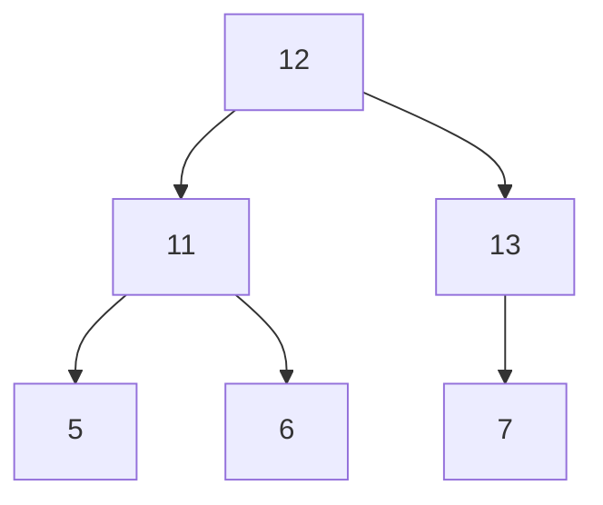

## 介绍

堆排序（Heap Sort）是一种基于二叉堆数据结构的比较排序算法。它通过将待排序的数组构建成一个最大堆（或最小堆），然后逐步将堆顶元素（最大值或最小值）与堆的最后一个元素交换，并调整堆，最终得到一个有序的数组。堆排序的时间复杂度为 O(n log n)，是一种高效的排序算法。

堆排序的核心思想是利用堆的性质：堆是一个完全二叉树，且每个节点的值都大于或等于（最大堆）或小于或等于（最小堆）其子节点的值。

## 堆排序的步骤

堆排序的过程可以分为以下几个步骤：

1. **构建最大堆**：将待排序的数组构建成一个最大堆。
2. **交换堆顶元素**：将堆顶元素（最大值）与堆的最后一个元素交换。
3. **调整堆**：将剩余的元素重新调整为最大堆。
4. **重复步骤2和3**：直到堆中只剩下一个元素，排序完成。

### 代码示例

以下是一个用 Python 实现的堆排序算法：

```python
def heapify(arr, n, i):
    largest = i  # 初始化最大值为根节点
    left = 2 * i + 1  # 左子节点
    right = 2 * i + 2  # 右子节点

    # 如果左子节点存在且大于根节点
    if left < n and arr[left] > arr[largest]:
        largest = left

    # 如果右子节点存在且大于当前最大值
    if right < n and arr[right] > arr[largest]:
        largest = right

    # 如果最大值不是根节点
    if largest != i:
        arr[i], arr[largest] = arr[largest], arr[i]  # 交换
        heapify(arr, n, largest)  # 递归调整子树

def heap_sort(arr):
    n = len(arr)

    # 构建最大堆
    for i in range(n // 2 - 1, -1, -1):
        heapify(arr, n, i)

    # 逐个提取元素
    for i in range(n - 1, 0, -1):
        arr[i], arr[0] = arr[0], arr[i]  # 交换堆顶元素和最后一个元素
        heapify(arr, i, 0)  # 调整堆

# 示例
arr = [12, 11, 13, 5, 6, 7]
heap_sort(arr)
print("排序后的数组:", arr)
```

**输入**: `[12, 11, 13, 5, 6, 7]`  
**输出**: `排序后的数组: [5, 6, 7, 11, 12, 13]`

## 逐步讲解

### 1. 构建最大堆

首先，我们需要将数组构建成一个最大堆。最大堆的性质是每个父节点的值都大于或等于其子节点的值。我们可以从最后一个非叶子节点开始，逐步向上调整堆。



在上面的二叉树中，节点 `12` 是根节点，`11` 和 `13` 是其子节点。我们需要从节点 `11` 开始调整堆。

### 2. 交换堆顶元素

在构建好最大堆后，堆顶元素是数组中的最大值。我们将堆顶元素与数组的最后一个元素交换，然后将剩余的元素重新调整为最大堆。

### 3. 调整堆

交换后，堆顶元素可能不再满足最大堆的性质，因此我们需要对堆进行调整，使其重新成为最大堆。

### 4. 重复步骤2和3

重复上述步骤，直到堆中只剩下一个元素，此时数组已经有序。

## 实际应用场景

堆排序在实际中有广泛的应用，尤其是在需要高效排序的场景中。例如：

- **优先队列**：堆排序可以用于实现优先队列，其中元素的优先级决定了它们的出队顺序。
- **实时系统**：在实时系统中，堆排序可以用于快速处理需要按优先级排序的任务。
- **大数据处理**：在处理大规模数据时，堆排序可以有效地减少排序时间。

## 总结

堆排序是一种高效的排序算法，其时间复杂度为 O(n log n)。它通过构建最大堆并逐步提取堆顶元素来实现排序。堆排序在实际中有广泛的应用，尤其是在需要高效排序的场景中。

## 附加资源与练习

- **练习**：尝试用堆排序对一个包含 10 个元素的数组进行排序，并观察每一步的变化。
- **进一步学习**：了解其他基于堆的数据结构，如优先队列和斐波那契堆。

:::tip
堆排序虽然高效，但在实际应用中，由于其空间复杂度较高，通常用于需要稳定排序的场景。
:::