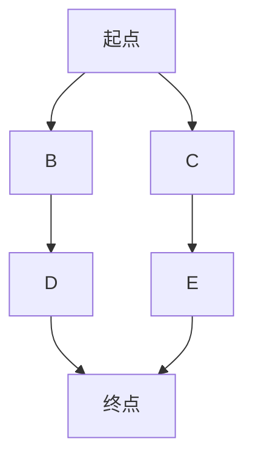

## 介绍

搜索算法是计算机科学中的核心概念之一，用于在数据集中查找特定元素或满足特定条件的元素。搜索算法不仅限于在编程中使用，它们还广泛应用于现实生活中的各种场景，如路径规划、数据库查询、游戏开发等。本文将介绍搜索算法的常见应用场景，并通过代码示例和实际案例帮助你更好地理解其用途。

## 搜索算法的基本概念

搜索算法的主要目标是在一个数据集中找到目标值或满足特定条件的元素。常见的搜索算法包括线性搜索、二分搜索、深度优先搜索（DFS）和广度优先搜索（BFS）等。每种算法都有其独特的应用场景和优势。

### 线性搜索

线性搜索是最简单的搜索算法，它从数据集的开头开始，逐个检查每个元素，直到找到目标值或遍历完整个数据集。

```python
def linear_search(arr, target):
    for i in range(len(arr)):
        if arr[i] == target:
            return i
    return -1

# 示例
arr = [3, 5, 2, 8, 10]
target = 8
result = linear_search(arr, target)
print(f"目标值 {target} 在数组中的索引是: {result}")
```

**输出：**
```
目标值 8 在数组中的索引是: 3
```

### 二分搜索

二分搜索是一种高效的搜索算法，适用于已排序的数据集。它通过将数据集分成两半，逐步缩小搜索范围，直到找到目标值。

```python
def binary_search(arr, target):
    left, right = 0, len(arr) - 1
    while left <= right:
        mid = (left + right) // 2
        if arr[mid] == target:
            return mid
        elif arr[mid] < target:
            left = mid + 1
        else:
            right = mid - 1
    return -1

# 示例
arr = [2, 3, 5, 8, 10]
target = 5
result = binary_search(arr, target)
print(f"目标值 {target} 在数组中的索引是: {result}")
```

**输出：**
```
目标值 5 在数组中的索引是: 2
```

## 搜索算法的应用场景

### 1. 路径规划

在导航系统中，搜索算法用于找到从起点到终点的最短路径。广度优先搜索（BFS）和深度优先搜索（DFS）是常用的路径规划算法。



:::tip
BFS 适用于寻找最短路径，而 DFS 适用于探索所有可能的路径。
:::

### 2. 数据库查询

在数据库中，搜索算法用于快速查找满足特定条件的记录。例如，二分搜索可以用于在已排序的索引中快速查找数据。

```sql
SELECT * FROM users WHERE age = 25;
```

:::note
数据库通常会使用 B+ 树等数据结构来优化搜索性能。
:::

### 3. 游戏开发

在游戏开发中，搜索算法用于实现人工智能（AI）行为，如寻找最短路径、解决谜题等。例如，A* 算法是一种结合了 BFS 和启发式搜索的算法，常用于游戏中的路径规划。

```python
# A* 算法伪代码
def a_star(start, goal):
    open_set = {start}
    came_from = {}
    g_score = {start: 0}
    f_score = {start: heuristic(start, goal)}

    while open_set:
        current = min(open_set, key=lambda x: f_score[x])
        if current == goal:
            return reconstruct_path(came_from, current)
        open_set.remove(current)
        for neighbor in neighbors(current):
            tentative_g_score = g_score[current] + distance(current, neighbor)
            if tentative_g_score < g_score.get(neighbor, float('inf')):
                came_from[neighbor] = current
                g_score[neighbor] = tentative_g_score
                f_score[neighbor] = g_score[neighbor] + heuristic(neighbor, goal)
                if neighbor not in open_set:
                    open_set.add(neighbor)
    return None
```

### 4. 搜索引擎

搜索引擎使用复杂的搜索算法来快速找到与用户查询相关的网页。这些算法通常结合了文本分析、索引技术和排名算法。

:::caution
搜索引擎的搜索算法通常涉及大规模数据处理和分布式计算。
:::

## 总结

搜索算法在计算机科学和现实生活中有着广泛的应用。无论是简单的线性搜索还是复杂的 A* 算法，搜索算法都为我们提供了强大的工具来解决各种问题。通过理解这些算法的基本原理和应用场景，你可以更好地利用它们来解决实际问题。

## 附加资源

- [《算法导论》](https://mitpress.mit.edu/books/introduction-algorithms) - 一本经典的算法教材，深入讲解了各种搜索算法。
- [LeetCode](https://leetcode.com/) - 一个在线编程平台，提供大量搜索算法相关的练习题。

## 练习

1. 实现一个二分搜索算法，并在一个已排序的数组中查找目标值。
2. 使用 BFS 算法解决一个简单的迷宫问题。
3. 研究 A* 算法，并尝试在一个网格地图中找到最短路径。

:::warning
在实现搜索算法时，务必注意边界条件和性能优化。
:::