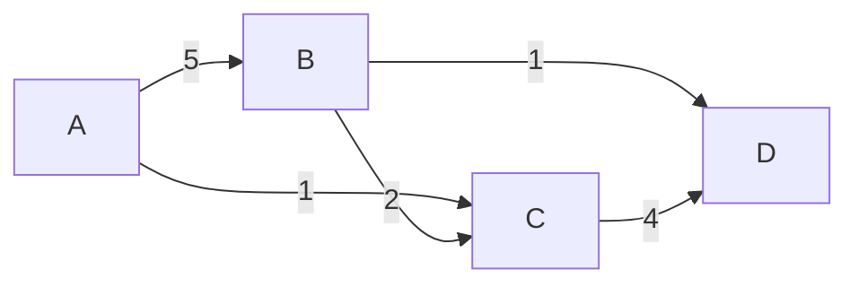

# 最短路径算法

最短路径算法是图论中的一个经典问题，旨在找到图中两个节点之间的最短路径。这种算法在现实生活中有着广泛的应用，例如导航系统中的路线规划、网络中的数据传输路径选择等。本文将介绍几种常见的最短路径算法，并通过代码示例和实际案例帮助你理解其工作原理。

## 什么是图？

在开始学习最短路径算法之前，我们需要先了解什么是图。图是由**节点（顶点）**和**边**组成的数据结构。节点表示实体，边表示节点之间的关系。图可以是有向的（边有方向）或无向的（边没有方向），也可以有权重（边带有数值）或无权。

例如，以下是一个简单的无向图：



在这个图中，节点 A、B、C、D 通过边连接，边上的数字表示权重。

## 最短路径算法的类型

最短路径算法有多种类型，以下是几种常见的算法：

1. **Dijkstra 算法**：适用于带权图，且权重为非负数。
2. **Bellman-Ford 算法**：适用于带权图，且权重可以为负数。
3. **Floyd-Warshall 算法**：适用于所有节点对之间的最短路径计算。
4. **A* 算法**：一种启发式搜索算法，常用于路径规划。

接下来，我们将重点介绍 **Dijkstra 算法** 和 **Bellman-Ford 算法**。

---

## Dijkstra 算法

Dijkstra 算法是一种贪心算法，用于计算单源最短路径。它从起点开始，逐步扩展到其他节点，每次选择当前最短路径的节点进行扩展。

### 算法步骤

1. 初始化：将起点的距离设为 0，其他节点的距离设为无穷大。
2. 选择当前距离最小的节点，标记为已访问。
3. 更新其邻居节点的距离。
4. 重复步骤 2 和 3，直到所有节点都被访问。

### 代码示例

以下是用 Python 实现的 Dijkstra 算法：

```python
import heapq

def dijkstra(graph, start):
    distances = {node: float('inf') for node in graph}
    distances[start] = 0
    queue = [(0, start)]
    
    while queue:
        current_distance, current_node = heapq.heappop(queue)
        
        if current_distance > distances[current_node]:
            continue
        
        for neighbor, weight in graph[current_node].items():
            distance = current_distance + weight
            if distance < distances[neighbor]:
                distances[neighbor] = distance
                heapq.heappush(queue, (distance, neighbor))
    
    return distances

# 示例图
graph = {
    'A': {'B': 5, 'C': 1},
    'B': {'A': 5, 'C': 2, 'D': 1},
    'C': {'A': 1, 'B': 2, 'D': 4},
    'D': {'B': 1, 'C': 4}
}

# 计算从节点 A 到其他节点的最短路径
print(dijkstra(graph, 'A'))
```

**输入：**
```python
graph = {
    'A': {'B': 5, 'C': 1},
    'B': {'A': 5, 'C': 2, 'D': 1},
    'C': {'A': 1, 'B': 2, 'D': 4},
    'D': {'B': 1, 'C': 4}
}
```

**输出：**
```python
{'A': 0, 'B': 3, 'C': 1, 'D': 4}
```

:::note
Dijkstra 算法不能处理负权边。如果图中存在负权边，需要使用 Bellman-Ford 算法。
:::

---

## Bellman-Ford 算法

Bellman-Ford 算法可以处理带有负权边的图，并且能够检测负权环（即权重和为负的环）。

### 算法步骤

1. 初始化：将起点的距离设为 0，其他节点的距离设为无穷大。
2. 对每条边进行松弛操作（更新距离）。
3. 重复步骤 2，共进行 V-1 次（V 为节点数）。
4. 检查是否存在负权环。

### 代码示例

以下是用 Python 实现的 Bellman-Ford 算法：

```python
def bellman_ford(graph, start):
    distances = {node: float('inf') for node in graph}
    distances[start] = 0
    
    for _ in range(len(graph) - 1):
        for node in graph:
            for neighbor, weight in graph[node].items():
                if distances[node] + weight < distances[neighbor]:
                    distances[neighbor] = distances[node] + weight
    
    # 检查负权环
    for node in graph:
        for neighbor, weight in graph[node].items():
            if distances[node] + weight < distances[neighbor]:
                raise ValueError("图中存在负权环")
    
    return distances

# 示例图
graph = {
    'A': {'B': 5, 'C': 1},
    'B': {'C': -2, 'D': 1},
    'C': {'D': 4},
    'D': {}
}

# 计算从节点 A 到其他节点的最短路径
print(bellman_ford(graph, 'A'))
```

**输入：**
```python
graph = {
    'A': {'B': 5, 'C': 1},
    'B': {'C': -2, 'D': 1},
    'C': {'D': 4},
    'D': {}
}
```

**输出：**
```python
{'A': 0, 'B': 5, 'C': 3, 'D': 6}
```

:::caution
如果图中存在负权环，Bellman-Ford 算法会抛出异常。
:::

---

## 实际应用场景

最短路径算法在现实生活中有许多应用，例如：

1. **导航系统**：计算从起点到终点的最短路线。
2. **网络路由**：选择数据传输的最优路径。
3. **物流配送**：规划最短配送路线以节省成本。

---

## 总结

最短路径算法是解决图中节点间最短路径问题的核心工具。本文介绍了两种常见的最短路径算法：Dijkstra 算法和 Bellman-Ford 算法。Dijkstra 算法适用于非负权图，而 Bellman-Ford 算法可以处理负权边并检测负权环。

:::tip
如果你想进一步学习，可以尝试实现 Floyd-Warshall 算法或 A* 算法，并探索它们的应用场景。
:::

---

## 附加资源与练习

1. **练习**：尝试用 Dijkstra 算法和 Bellman-Ford 算法解决以下图的最短路径问题：
   ```mermaid
   graph LR
       A --2--> B
       A --4--> C
       B --1--> C
       B --7--> D
       C --3--> D
   ```
2. **资源**：
   - [Dijkstra 算法维基百科](https://zh.wikipedia.org/wiki/Dijkstra算法)
   - [Bellman-Ford 算法维基百科](https://zh.wikipedia.org/wiki/Bellman-Ford算法)