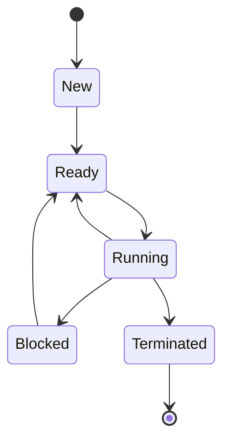

## 介绍

在操作系统中，**进程**是程序执行的实例。每个进程都有其生命周期，并在不同的状态之间转换。理解进程状态及其转换是学习操作系统的基础之一。本文将详细介绍进程的几种主要状态以及它们之间的转换关系。

## 进程的几种主要状态

在大多数操作系统中，进程通常有以下几种主要状态：

1. **新建（New）**：进程刚刚被创建，尚未被操作系统调度执行。
2. **就绪（Ready）**：进程已经准备好运行，等待操作系统分配CPU资源。
3. **运行（Running）**：进程正在CPU上执行。
4. **阻塞（Blocked）**：进程由于等待某些事件（如I/O操作完成）而暂时无法继续执行。
5. **终止（Terminated）**：进程执行完毕或被强制终止。

## 进程状态转换

进程在其生命周期中会在不同的状态之间转换。以下是常见的状态转换过程：

1. **新建 → 就绪**：当进程被创建后，操作系统会将其放入就绪队列，等待调度。
2. **就绪 → 运行**：当CPU空闲时，操作系统会从就绪队列中选择一个进程，分配CPU资源，使其进入运行状态。
3. **运行 → 就绪**：当进程的时间片用完或操作系统决定调度其他进程时，当前运行的进程会被放回就绪队列。
4. **运行 → 阻塞**：当进程需要等待某些事件（如I/O操作）时，它会从运行状态转为阻塞状态。
5. **阻塞 → 就绪**：当进程等待的事件完成后，它会从阻塞状态转为就绪状态，等待再次被调度。
6. **运行 → 终止**：当进程完成其任务或被强制终止时，它会从运行状态转为终止状态。

## 实际案例

假设我们有一个简单的程序，该程序需要从文件中读取数据并进行处理。以下是该程序的进程状态转换过程：

1. **新建**：程序启动，操作系统创建一个新的进程。
2. **就绪**：进程被放入就绪队列，等待CPU资源。
3. **运行**：进程获得CPU资源，开始执行。
4. **阻塞**：进程需要从文件中读取数据，因此进入阻塞状态，等待I/O操作完成。
5. **就绪**：I/O操作完成后，进程重新进入就绪队列。
6. **运行**：进程再次获得CPU资源，继续执行。
7. **终止**：进程完成数据处理任务，进入终止状态。

:::tip
在实际操作系统中，进程状态的转换是由操作系统内核管理的。理解这些状态转换有助于我们编写更高效的程序，尤其是在多任务环境中。
:::

## 总结

进程状态及其转换是操作系统中的核心概念之一。通过理解进程的几种主要状态及其转换过程，我们可以更好地理解操作系统的调度机制，并编写出更高效的程序。

## 附加资源与练习

- **练习**：编写一个简单的多进程程序，观察进程状态的转换过程。
- **资源**：阅读《操作系统概念》一书中的相关章节，深入了解进程管理。

:::caution
在编写多进程程序时，务必注意进程间的同步与通信问题，以避免竞态条件和死锁等问题。
:::