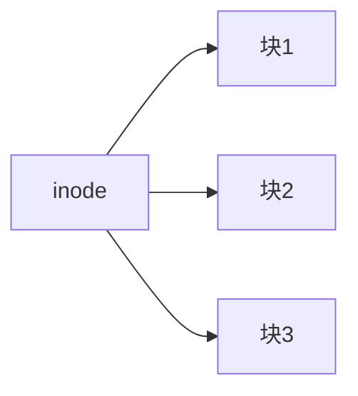

# 文件系统

文件系统是操作系统中用于管理和组织存储在磁盘或其他存储设备上的数据的机制。它为用户和应用程序提供了一种访问和操作文件的统一方式，同时确保数据的安全性和一致性。文件系统的主要功能包括文件的创建、删除、读取、写入以及目录的管理。

## 文件系统的基本概念

### 1. 文件
文件是存储在文件系统中的数据集合。每个文件都有一个唯一的名称，用户可以通过该名称访问文件。文件可以包含文本、图像、音频、视频等各种类型的数据。

### 2. 目录
目录（也称为文件夹）是文件系统中用于组织文件的容器。目录可以包含文件和其他目录，形成一种层次结构。通过目录，用户可以更方便地管理和查找文件。

### 3. 路径
路径是文件或目录在文件系统中的位置。路径可以是绝对路径（从根目录开始的完整路径）或相对路径（相对于当前目录的路径）。例如，`/home/user/documents/report.txt` 是一个绝对路径，而 `documents/report.txt` 是一个相对路径。

### 4. 文件元数据
文件元数据是描述文件属性的信息，如文件大小、创建时间、修改时间、访问权限等。文件系统通过元数据来管理文件的存储和访问。

## 文件系统的工作原理

文件系统通过将磁盘空间划分为固定大小的块（通常称为扇区或簇）来管理数据。每个文件被存储在若干个块中，文件系统通过索引结构（如文件分配表或inode）来记录文件的存储位置。

### 文件分配表（FAT）
FAT 是一种简单的文件系统，广泛应用于早期的操作系统（如 MS-DOS）。FAT 使用一个表格来记录每个文件占用的磁盘块。表格中的每个条目指向下一个块，形成一个链表。


### inode
inode 是 Unix 和 Linux 系统中用于存储文件元数据和数据块指针的数据结构。每个文件都有一个唯一的 inode，inode 中包含了文件的大小、权限、所有者等信息，以及指向文件数据块的指针。



## 文件系统的操作

### 1. 创建文件
在文件系统中创建文件时，系统会分配一个 inode 或 FAT 条目，并更新目录结构以包含新文件的名称和位置。

```bash
$ touch newfile.txt
```

### 2. 读取文件
读取文件时，系统会根据文件的路径查找 inode 或 FAT 条目，然后从磁盘中读取相应的数据块。

```bash
$ cat newfile.txt
```

### 3. 写入文件
写入文件时，系统会更新文件的内容，并可能分配新的磁盘块来存储额外的数据。

```bash
$ echo "Hello, World!" > newfile.txt
```

### 4. 删除文件
删除文件时，系统会释放文件占用的磁盘块，并更新目录结构以移除文件的条目。

```bash
$ rm newfile.txt
```

## 实际案例

### 案例1：文件备份
文件系统的一个重要应用是文件备份。通过定期备份文件系统，用户可以在数据丢失或损坏时恢复文件。例如，Linux 系统中的 `rsync` 命令可以用于备份文件。

```bash
$ rsync -av /home/user/documents /backup/
```

### 案例2：权限管理
文件系统还提供了权限管理功能，允许用户控制文件的访问权限。例如，在 Linux 系统中，可以使用 `chmod` 命令更改文件的权限。

```bash
$ chmod 644 newfile.txt
```

## 总结

文件系统是操作系统中不可或缺的一部分，它为用户和应用程序提供了管理和访问文件的统一接口。通过理解文件系统的基本概念和工作原理，用户可以更好地管理自己的数据，并确保数据的安全性和一致性。

## 附加资源

- [Linux 文件系统指南](https://www.linux.org/docs/)
- [Windows 文件系统概述](https://docs.microsoft.com/en-us/windows/win32/fileio/file-systems)
- [Unix 文件系统详解](https://www.unix.org/whitepapers/fs_design.html)

## 练习

1. 在 Linux 系统中创建一个新文件，并使用 `ls -l` 命令查看文件的元数据。
2. 使用 `chmod` 命令更改文件的权限，并尝试访问文件以验证权限更改是否生效。
3. 使用 `rsync` 命令备份一个目录，并验证备份是否成功。
