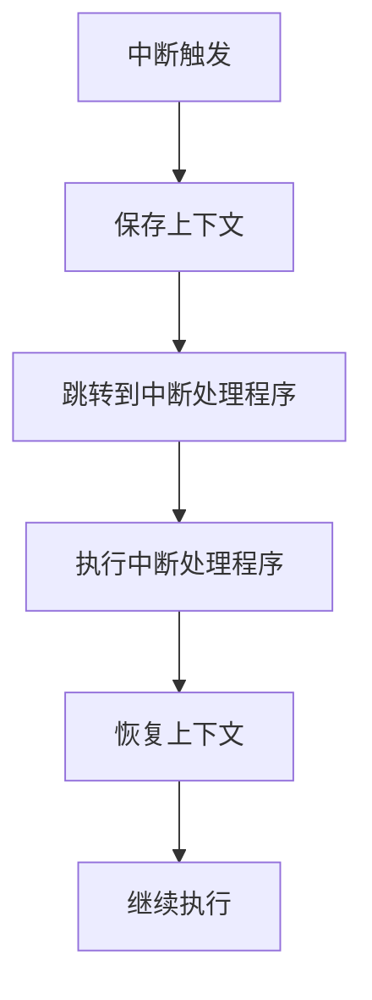

# 中断机制

在操作系统中，**中断机制**是一种重要的硬件和软件协作机制，用于处理异步事件。它允许操作系统在运行过程中暂停当前任务，转而处理更高优先级的任务或事件，然后再恢复原来的任务。中断机制是操作系统实现多任务处理、设备管理和实时响应的核心技术之一。

## 什么是中断？

中断是计算机系统中一种硬件或软件触发的信号，用于通知 CPU 发生了需要立即处理的事件。当 CPU 接收到中断信号时，它会暂停当前正在执行的程序，保存当前状态（如程序计数器、寄存器等），然后跳转到预先定义的中断处理程序（Interrupt Service Routine, ISR）来处理该事件。处理完成后，CPU 会恢复之前的状态并继续执行被中断的程序。

:::tip
中断机制的核心思想是“打断”当前任务，优先处理更紧急的事件。
:::

---

## 中断的类型

中断可以分为以下几类：

1. **硬件中断**：由硬件设备触发，例如键盘输入、鼠标点击、磁盘 I/O 完成等。
2. **软件中断**：由软件指令触发，例如系统调用（System Call）或异常（Exception）。
3. **异常**：由 CPU 在执行指令时检测到的错误或特殊情况触发，例如除零错误、内存访问违规等。

---

## 中断处理流程

以下是中断处理的基本流程：

1. **中断触发**：硬件或软件触发中断信号。
2. **保存上下文**：CPU 保存当前任务的上下文（如程序计数器、寄存器等）。
3. **跳转到中断处理程序**：CPU 根据中断类型跳转到对应的中断处理程序。
4. **执行中断处理程序**：处理中断事件。
5. **恢复上下文**：CPU 恢复之前保存的上下文。
6. **继续执行**：CPU 继续执行被中断的任务。



---

## 中断的实际应用

### 案例 1：键盘输入

当用户按下键盘上的某个键时，键盘控制器会向 CPU 发送一个硬件中断信号。CPU 会暂停当前任务，跳转到键盘中断处理程序，读取按键数据，并将其存储到输入缓冲区中。处理完成后，CPU 恢复之前的任务。

### 案例 2：系统调用

当程序需要访问操作系统提供的服务（如文件读写）时，会通过软件中断（系统调用）触发中断机制。CPU 会切换到内核模式，执行相应的系统调用处理程序，完成请求后返回用户模式。

---

## 代码示例

以下是一个简单的伪代码示例，展示了中断处理的基本逻辑：

```c
// 定义中断处理程序
void interrupt_handler() {
    // 处理中断事件
    printf("Interrupt handled!\n");
}

int main() {
    // 模拟中断触发
    printf("Main program running...\n");
    trigger_interrupt();  // 触发中断
    printf("Main program resumed.\n");
    return 0;
}

// 模拟中断触发函数
void trigger_interrupt() {
    // 保存上下文
    save_context();
    // 跳转到中断处理程序
    interrupt_handler();
    // 恢复上下文
    restore_context();
}
```

**输出：**
```
Main program running...
Interrupt handled!
Main program resumed.
```

---

## 总结

中断机制是操作系统中实现异步事件处理和多任务调度的关键技术。通过中断，操作系统能够及时响应硬件事件、处理异常情况，并提供高效的资源管理。理解中断机制对于学习操作系统的内部工作原理至关重要。

---

## 附加资源与练习

### 推荐资源
- 《操作系统概念》（Operating System Concepts）：详细讲解中断机制及其实现。
- [OSDev Wiki](https://wiki.osdev.org/Interrupts)：关于中断机制的实践指南。

### 练习
1. 编写一个简单的程序，模拟硬件中断的处理流程。
2. 研究 Linux 内核中的中断处理代码，了解其实现细节。
3. 思考中断机制在多任务操作系统中的作用，并举例说明。

:::caution
在实际编程中，中断处理程序需要尽可能高效，以避免影响系统性能。
:::