# 进程调度算法

在操作系统中，**进程调度算法**是决定哪个进程可以访问 CPU 的核心机制。由于 CPU 资源有限，操作系统需要通过调度算法来合理分配 CPU 时间，确保系统的高效运行和公平性。本文将详细介绍常见的进程调度算法，并通过示例和实际应用场景帮助初学者理解其工作原理。

## 什么是进程调度？

进程调度是操作系统在多任务环境下管理进程的一种机制。当一个进程需要等待 I/O 操作完成时，操作系统会将其从 CPU 中移出，并选择另一个进程来运行。这个过程称为**上下文切换**。调度算法的目标是最大化 CPU 利用率、减少等待时间，并确保所有进程都能公平地获得 CPU 时间。

:::note
**进程调度**的核心任务是决定哪个进程在何时获得 CPU 资源。
:::

## 常见的进程调度算法

以下是几种常见的进程调度算法：

### 1. 先来先服务（FCFS, First-Come, First-Served）

**先来先服务**是最简单的调度算法。它按照进程到达的顺序分配 CPU 资源。先到达的进程先执行，直到完成或阻塞。

#### 示例
假设有三个进程 P1、P2 和 P3，它们的到达时间和执行时间如下：

| 进程 | 到达时间 | 执行时间 |
|------|----------|----------|
| P1   | 0        | 5        |
| P2   | 1        | 3        |
| P3   | 2        | 8        |

按照 FCFS 算法，调度顺序为 P1 → P2 → P3。

```mermaid
gantt
    title FCFS 调度示例
    dateFormat  X
    axisFormat %s
    section 进程
    P1 : 0, 5
    P2 : 5, 8
    P3 : 8, 16
```

#### 优缺点
- **优点**：实现简单，公平性高。
- **缺点**：可能导致“饥饿”问题，尤其是长进程会阻塞短进程。

### 2. 最短作业优先（SJF, Shortest Job First）

**最短作业优先**算法优先调度执行时间最短的进程。它可以是**非抢占式**（进程一旦开始执行就不能被中断）或**抢占式**（允许在更短的进程到达时中断当前进程）。

#### 示例
使用与 FCFS 相同的进程数据，SJF 的调度顺序为 P1 → P2 → P3。

#### 优缺点
- **优点**：平均等待时间较短。
- **缺点**：可能导致长进程“饥饿”，且需要预知进程的执行时间。

### 3. 时间片轮转（RR, Round Robin）

**时间片轮转**算法为每个进程分配一个固定的时间片（time slice）。当一个进程的时间片用完后，它会被放到队列的末尾，等待下一次调度。

#### 示例
假设时间片为 2，进程数据如下：

| 进程 | 到达时间 | 执行时间 |
|------|----------|----------|
| P1   | 0        | 5        |
| P2   | 1        | 3        |
| P3   | 2        | 8        |

调度顺序为 P1 → P2 → P3 → P1 → P2 → P3 → P3 → P3。

```mermaid
gantt
    title RR 调度示例（时间片=2）
    dateFormat  X
    axisFormat %s
    section 进程
    P1 : 0, 2
    P2 : 2, 4
    P3 : 4, 6
    P1 : 6, 8
    P2 : 8, 9
    P3 : 9, 11
    P3 : 11, 13
    P3 : 13, 16
```

#### 优缺点
- **优点**：公平性高，适合交互式系统。
- **缺点**：时间片设置不当可能导致频繁上下文切换。

### 4. 优先级调度（Priority Scheduling）

**优先级调度**算法根据进程的优先级分配 CPU 资源。优先级可以是静态的（固定不变）或动态的（根据进程行为调整）。

#### 示例
假设进程优先级如下：

| 进程 | 到达时间 | 执行时间 | 优先级 |
|------|----------|----------|--------|
| P1   | 0        | 5        | 1      |
| P2   | 1        | 3        | 3      |
| P3   | 2        | 8        | 2      |

调度顺序为 P1 → P3 → P2。

```mermaid
gantt
    title 优先级调度示例
    dateFormat  X
    axisFormat %s
    section 进程
    P1 : 0, 5
    P3 : 5, 13
    P2 : 13, 16
```

#### 优缺点
- **优点**：灵活性高，适合实时系统。
- **缺点**：可能导致低优先级进程“饥饿”。

## 实际应用场景

1. **FCFS**：适用于批处理系统，如打印任务队列。
2. **SJF**：适用于已知任务执行时间的场景，如科学计算。
3. **RR**：适用于交互式系统，如操作系统的时间片分配。
4. **优先级调度**：适用于实时系统，如航空控制系统。

## 总结

进程调度算法是操作系统的核心机制之一，直接影响系统的性能和用户体验。通过合理选择调度算法，可以提高 CPU 利用率、减少等待时间，并确保公平性。初学者可以从 FCFS、SJF、RR 和优先级调度等基础算法入手，逐步深入理解更复杂的调度策略。

## 附加资源与练习

- **练习**：尝试编写一个简单的进程调度模拟程序，支持 FCFS、SJF 和 RR 算法。
- **资源**：
  - 《操作系统概念》（Abraham Silberschatz 著）
  - [OSDev Wiki](https://wiki.osdev.org/Main_Page) 中的调度算法部分

:::tip
**提示**：理解调度算法的关键在于实践。尝试用代码实现这些算法，并观察其行为。
:::