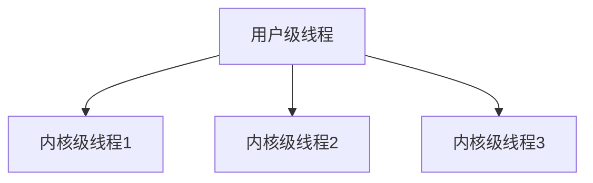

## 介绍

在操作系统中，**线程**是程序执行的最小单元。线程模型是操作系统管理线程的方式，它决定了线程如何创建、调度和通信。理解线程模型对于编写高效、并发的程序至关重要。

### 线程与进程的区别

- **进程**：进程是操作系统分配资源的基本单位。每个进程都有独立的内存空间、文件描述符和其他系统资源。
- **线程**：线程是进程内的执行单元。一个进程可以包含多个线程，这些线程共享进程的资源，但每个线程有自己的栈和程序计数器。

:::tip
线程比进程更轻量级，创建和切换线程的开销比进程小得多。
:::

## 线程模型

### 1. 用户级线程（User-Level Threads）

用户级线程完全由用户空间的线程库管理，操作系统并不知道这些线程的存在。线程的创建、调度和同步都由用户空间的库处理。

#### 优点
- 线程切换速度快，因为不需要切换到内核模式。
- 可以在不支持线程的操作系统上实现多线程。

#### 缺点
- 如果一个线程阻塞（如等待I/O），整个进程都会被阻塞。
- 无法利用多核处理器的优势，因为操作系统只看到一个进程。

```python
# 示例：使用Python的threading库创建用户级线程
import threading

def worker():
    print("Worker thread is running")

thread = threading.Thread(target=worker)
thread.start()
thread.join()
```

### 2. 内核级线程（Kernel-Level Threads）

内核级线程由操作系统内核直接管理。每个线程在内核中都有对应的数据结构，线程的创建、调度和同步都由内核处理。

#### 优点
- 可以充分利用多核处理器的优势。
- 一个线程阻塞不会影响其他线程的执行。

#### 缺点
- 线程切换需要切换到内核模式，开销较大。
- 线程管理复杂，需要内核支持。

```c
// 示例：使用POSIX线程（pthread）创建内核级线程
#include <pthread.h>
#include <stdio.h>

void* worker(void* arg) {
    printf("Worker thread is running\n");
    return NULL;
}

int main() {
    pthread_t thread;
    pthread_create(&thread, NULL, worker, NULL);
    pthread_join(thread, NULL);
    return 0;
}
```

### 3. 混合线程模型（Hybrid Thread Model）

混合线程模型结合了用户级线程和内核级线程的优点。用户级线程由线程库管理，而内核级线程由操作系统管理。用户级线程可以映射到多个内核级线程上。

#### 优点
- 可以充分利用多核处理器的优势。
- 线程切换速度快，因为大部分操作在用户空间完成。

#### 缺点
- 实现复杂，需要线程库和操作系统的紧密配合。



## 实际应用场景

### 1. Web服务器

Web服务器通常需要处理大量并发请求。使用多线程模型可以有效地处理这些请求，每个线程处理一个客户端连接。

```python
# 示例：使用多线程处理HTTP请求
import socket
import threading

def handle_client(client_socket):
    request = client_socket.recv(1024)
    response = b"HTTP/1.1 200 OK\r\nContent-Length: 13\r\n\r\nHello, World!"
    client_socket.send(response)
    client_socket.close()

server = socket.socket(socket.AF_INET, socket.SOCK_STREAM)
server.bind(("0.0.0.0", 8080))
server.listen(5)

while True:
    client, addr = server.accept()
    thread = threading.Thread(target=handle_client, args=(client,))
    thread.start()
```

### 2. 图形用户界面（GUI）应用程序

GUI应用程序通常需要同时处理用户输入和后台任务。使用多线程模型可以确保用户界面保持响应，同时执行后台任务。

```java
// 示例：使用Java Swing创建多线程GUI应用程序
import javax.swing.*;
import java.awt.event.ActionEvent;
import java.awt.event.ActionListener;

public class GUIApp {
    public static void main(String[] args) {
        JFrame frame = new JFrame("Multi-threaded GUI");
        JButton button = new JButton("Start Task");
        frame.add(button);
        frame.setSize(300, 200);
        frame.setDefaultCloseOperation(JFrame.EXIT_ON_CLOSE);
        frame.setVisible(true);

        button.addActionListener(new ActionListener() {
            @Override
            public void actionPerformed(ActionEvent e) {
                new Thread(() -> {
                    // 模拟后台任务
                    try {
                        Thread.sleep(5000);
                    } catch (InterruptedException ex) {
                        ex.printStackTrace();
                    }
                    JOptionPane.showMessageDialog(frame, "Task Completed!");
                }).start();
            }
        });
    }
}
```

## 总结

线程模型是操作系统中的重要概念，它决定了线程如何被创建、调度和通信。用户级线程、内核级线程和混合线程模型各有优缺点，适用于不同的应用场景。理解这些模型有助于编写高效、并发的程序。

## 附加资源

- [POSIX Threads Programming](https://computing.llnl.gov/tutorials/pthreads/)
- [Java Concurrency in Practice](https://www.amazon.com/Java-Concurrency-Practice-Brian-Goetz/dp/0321349601)
- [Python threading documentation](https://docs.python.org/3/library/threading.html)

## 练习

1. 编写一个多线程程序，模拟多个任务同时执行。
2. 比较用户级线程和内核级线程的性能差异。
3. 研究一个开源项目中的线程模型，并分析其优缺点。