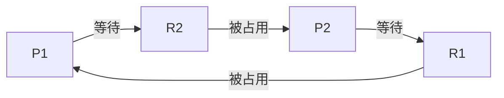

# 死锁概念与处理

死锁（Deadlock）是操作系统中的一个重要概念，指的是多个进程或线程在执行过程中，因为争夺资源而造成的一种互相等待的现象，导致这些进程或线程都无法继续执行下去。死锁是一种严重的系统问题，可能导致系统资源浪费甚至系统崩溃。

## 什么是死锁？

死锁通常发生在多个进程或线程竞争有限的资源时。当每个进程都持有一些资源，并且等待其他进程释放它们所需的资源时，就可能发生死锁。这种情况下，所有涉及的进程都无法继续执行，系统进入一种僵持状态。

### 死锁的四个必要条件

死锁的发生需要满足以下四个必要条件：

1. **互斥条件（Mutual Exclusion）**：资源一次只能被一个进程占用，其他进程必须等待。
2. **占有并等待（Hold and Wait）**：进程已经占有一些资源，同时又在等待其他资源。
3. **非抢占条件（No Preemption）**：进程已获得的资源不能被其他进程强行抢占，必须由进程自行释放。
4. **循环等待（Circular Wait）**：存在一个进程等待的循环链，每个进程都在等待下一个进程所占用的资源。

只有当这四个条件同时满足时，死锁才会发生。

## 死锁的示例

为了更好地理解死锁，我们来看一个简单的例子。假设有两个进程 P1 和 P2，以及两个资源 R1 和 R2。

在这个例子中：

- P1 占用了 R1，同时等待 R2。
- P2 占用了 R2，同时等待 R1。

由于 P1 和 P2 都在等待对方释放资源，因此它们都无法继续执行，导致死锁。

## 死锁的处理方法

操作系统通常采用以下几种方法来处理死锁：

### 1. 死锁预防（Deadlock Prevention）

死锁预防是通过破坏死锁的四个必要条件之一来避免死锁的发生。例如：

- **破坏互斥条件**：允许资源被多个进程共享，但这并不适用于所有资源（如打印机）。
- **破坏占有并等待条件**：要求进程在开始执行前一次性申请所有所需的资源。
- **破坏非抢占条件**：允许系统强制剥夺进程的资源。
- **破坏循环等待条件**：对资源进行排序，要求进程按顺序申请资源。

### 2. 死锁避免（Deadlock Avoidance）

死锁避免是通过动态地检查资源分配状态，确保系统不会进入不安全状态。常用的算法有**银行家算法（Banker's Algorithm）**。

银行家算法通过模拟资源分配过程，判断系统是否处于安全状态。如果分配资源后系统仍然安全，则允许分配；否则，拒绝分配。

### 3. 死锁检测与恢复（Deadlock Detection and Recovery）

如果系统允许死锁发生，那么可以通过定期检测死锁并采取措施恢复。检测死锁的方法包括资源分配图（Resource Allocation Graph）和等待图（Wait-for Graph）。

一旦检测到死锁，系统可以采取以下恢复措施：

- **终止进程**：强制终止一个或多个死锁进程，释放其占用的资源。
- **资源抢占**：从某些进程中抢占资源，分配给其他进程。

### 4. 死锁忽略（Deadlock Ignorance）

某些系统选择忽略死锁问题，认为死锁发生的概率很低，或者处理死锁的代价过高。这种方法适用于一些简单的系统或嵌入式系统。

## 实际案例

死锁在现实生活中的一个常见例子是交通堵塞。假设在一个十字路口，四辆车分别从四个方向驶来，每辆车都需要通过路口，但由于其他车辆的存在，它们都无法前进，导致交通堵塞。这种情况下，四辆车互相等待，形成了一个死锁。

## 总结

死锁是操作系统中一个复杂但重要的问题。理解死锁的成因、必要条件以及处理方法，对于设计和维护高效、稳定的系统至关重要。通过死锁预防、避免、检测与恢复等方法，我们可以有效地减少死锁的发生，提高系统的可靠性。

## 附加资源与练习

- **练习**：尝试编写一个简单的多线程程序，模拟死锁的发生，并使用死锁检测工具（如 `jstack`）分析死锁。
- **资源**：阅读《操作系统概念》（Operating System Concepts）一书，深入了解死锁及其处理方法。

:::tip
死锁问题虽然复杂，但通过系统的学习和实践，你可以掌握处理死锁的技巧，并在实际项目中应用这些知识。
:::