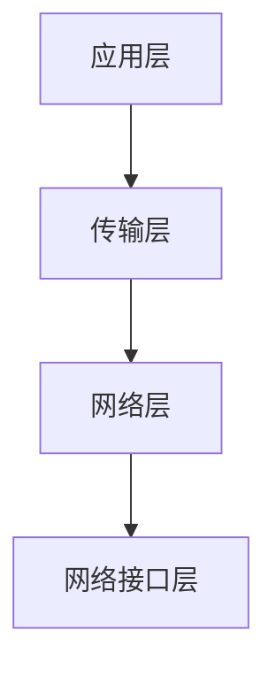

# TCP/IP协议族

## 介绍

TCP/IP协议族是互联网通信的基础。它是一组用于在计算机网络中传输数据的协议集合。TCP/IP代表**传输控制协议/互联网协议**（Transmission Control Protocol/Internet Protocol），它是现代互联网的核心技术之一。无论是浏览网页、发送电子邮件还是进行文件传输，TCP/IP协议族都在背后默默工作。

TCP/IP协议族由多个协议组成，每个协议负责不同的任务。它们共同协作，确保数据能够从源设备传输到目标设备。

## TCP/IP协议族的层次结构

TCP/IP协议族通常分为四层，每一层都有特定的功能：

1. **应用层**：负责处理应用程序之间的通信。常见的协议包括HTTP、FTP、SMTP等。
2. **传输层**：负责端到端的通信，确保数据可靠传输。主要协议有TCP和UDP。
3. **网络层**：负责数据包的路由和转发。主要协议是IP（Internet Protocol）。
4. **网络接口层**：负责处理物理网络连接，如以太网、Wi-Fi等。



## 传输控制协议（TCP）

TCP是一种面向连接的协议，它确保数据在传输过程中不会丢失、损坏或乱序。TCP通过以下机制实现可靠传输：

- **三次握手**：在建立连接时，客户端和服务器之间会进行三次通信，以确保双方都准备好传输数据。
- **确认和重传**：接收方会确认收到的数据包，如果发送方没有收到确认，则会重传数据包。
- **流量控制**：通过滑动窗口机制，TCP可以控制数据的发送速率，避免接收方被淹没。

:::note
**三次握手示例**：
1. 客户端发送SYN（同步）包到服务器。
2. 服务器回复SYN-ACK（同步-确认）包。
3. 客户端发送ACK（确认）包，连接建立。
:::

## 互联网协议（IP）

IP协议负责将数据包从源设备路由到目标设备。它使用IP地址来标识网络中的设备。IP协议是无连接的，这意味着它不保证数据包的顺序或可靠性。

IP地址分为IPv4和IPv6两种格式。IPv4地址由32位组成，通常表示为四个十进制数（如`192.168.1.1`），而IPv6地址由128位组成，通常表示为八组十六进制数（如`2001:0db8:85a3:0000:0000:8a2e:0370:7334`）。

:::tip
**IPv4地址示例**：
```plaintext
192.168.1.1
```

**IPv6地址示例**：
```plaintext
2001:0db8:85a3:0000:0000:8a2e:0370:7334
```
:::

## 实际应用场景

### 1. 网页浏览

当你访问一个网站时，浏览器会使用HTTP协议（应用层）向服务器发送请求。HTTP请求通过TCP协议（传输层）传输，TCP确保数据可靠到达。IP协议（网络层）负责将数据包从你的设备路由到服务器。

### 2. 电子邮件发送

发送电子邮件时，SMTP协议（应用层）用于传输邮件内容。TCP协议确保邮件内容不会丢失或损坏，而IP协议负责将邮件从发件人路由到收件人的邮件服务器。

## 总结

TCP/IP协议族是互联网通信的基石。它通过分层的方式将复杂的通信过程分解为多个简单的任务，每一层都有特定的职责。TCP负责可靠传输，而IP负责路由和寻址。理解TCP/IP协议族的工作原理对于学习计算机网络至关重要。

## 附加资源

- [TCP/IP协议详解](https://example.com/tcp-ip-explained)
- [网络协议入门指南](https://example.com/network-protocols-guide)

## 练习

1. 解释TCP三次握手的过程。
2. 比较IPv4和IPv6地址的格式。
3. 描述TCP/IP协议族中每一层的功能。