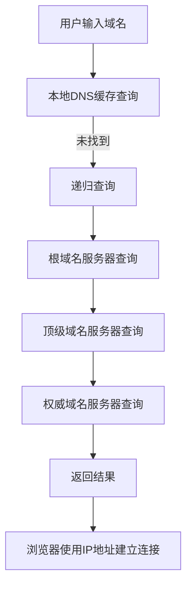

## 介绍

DNS（Domain Name System，域名系统）是互联网中用于将人类可读的域名（如 `www.example.com`）转换为机器可读的IP地址（如 `192.0.2.1`）的系统。DNS解析过程是互联网通信的基础，它使得我们能够通过简单的域名访问复杂的网络资源。

## DNS解析的基本概念

DNS解析过程涉及多个步骤和不同类型的DNS服务器。以下是DNS解析的基本步骤：

1. **用户输入域名**：用户在浏览器中输入一个域名，如 `www.example.com`。
2. **本地DNS缓存查询**：浏览器首先检查本地缓存中是否有该域名的IP地址。
3. **递归查询**：如果本地缓存中没有找到，浏览器会向本地DNS服务器发送递归查询请求。
4. **根域名服务器查询**：本地DNS服务器向根域名服务器查询，获取顶级域名服务器（如 `.com`）的地址。
5. **顶级域名服务器查询**：本地DNS服务器向顶级域名服务器查询，获取权威域名服务器的地址。
6. **权威域名服务器查询**：本地DNS服务器向权威域名服务器查询，获取目标域名的IP地址。
7. **返回结果**：本地DNS服务器将IP地址返回给浏览器，浏览器使用该IP地址与目标服务器建立连接。

## DNS解析过程的详细步骤

### 1. 用户输入域名

当用户在浏览器中输入一个域名时，浏览器首先会检查本地缓存中是否有该域名的IP地址。如果缓存中有，浏览器会直接使用该IP地址进行连接，从而跳过后续的DNS解析步骤。

### 2. 本地DNS缓存查询

如果本地缓存中没有找到该域名的IP地址，浏览器会向本地DNS服务器发送递归查询请求。本地DNS服务器通常是用户ISP（互联网服务提供商）提供的DNS服务器。

### 3. 递归查询

本地DNS服务器接收到递归查询请求后，会尝试从自己的缓存中查找该域名的IP地址。如果缓存中没有，本地DNS服务器会开始向其他DNS服务器进行查询。

### 4. 根域名服务器查询

本地DNS服务器首先向根域名服务器发送查询请求。根域名服务器是DNS系统的最高层级，它知道所有顶级域名服务器（如 `.com`、`.net`、`.org` 等）的地址。

### 5. 顶级域名服务器查询

根域名服务器返回顶级域名服务器的地址后，本地DNS服务器会向顶级域名服务器发送查询请求。顶级域名服务器知道该域名的权威域名服务器的地址。

### 6. 权威域名服务器查询

本地DNS服务器向权威域名服务器发送查询请求，权威域名服务器返回目标域名的IP地址。

### 7. 返回结果

本地DNS服务器将获取到的IP地址返回给浏览器，浏览器使用该IP地址与目标服务器建立连接。

## 实际案例

假设用户访问 `www.example.com`，以下是DNS解析过程的实际步骤：

1. 用户在浏览器中输入 `www.example.com`。
2. 浏览器检查本地缓存，未找到IP地址。
3. 浏览器向本地DNS服务器发送递归查询请求。
4. 本地DNS服务器向根域名服务器查询，获取 `.com` 顶级域名服务器的地址。
5. 本地DNS服务器向 `.com` 顶级域名服务器查询，获取 `example.com` 的权威域名服务器的地址。
6. 本地DNS服务器向 `example.com` 的权威域名服务器查询，获取 `www.example.com` 的IP地址。
7. 本地DNS服务器将IP地址返回给浏览器，浏览器使用该IP地址与 `www.example.com` 建立连接。

## 总结

DNS解析过程是互联网通信的基础，它将人类可读的域名转换为机器可读的IP地址。通过理解DNS解析的基本步骤，初学者可以更好地理解互联网的工作原理。

## 附加资源

- [DNS 维基百科](https://zh.wikipedia.org/wiki/%E5%9F%9F%E5%90%8D%E7%B3%BB%E7%BB%9F)
- [DNS 解析过程详解](https://www.cloudflare.com/learning/dns/what-is-dns/)

## 练习

1. 尝试在命令行中使用 `nslookup` 命令查询一个域名的IP地址。
2. 使用 `dig` 命令查看DNS解析的详细过程。
3. 配置本地DNS缓存，观察DNS解析速度的变化。

:::tip
DNS解析过程可能会受到网络延迟、DNS服务器负载等因素的影响，优化DNS解析可以提高网页加载速度。
:::

:::caution
DNS缓存可能会导致域名解析结果不及时更新，建议定期清理DNS缓存以确保获取最新的解析结果。
:::