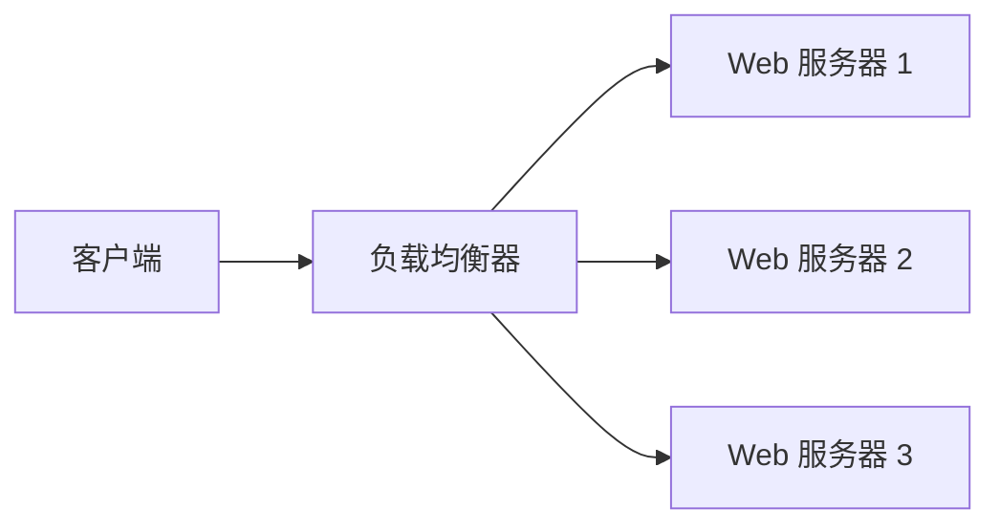
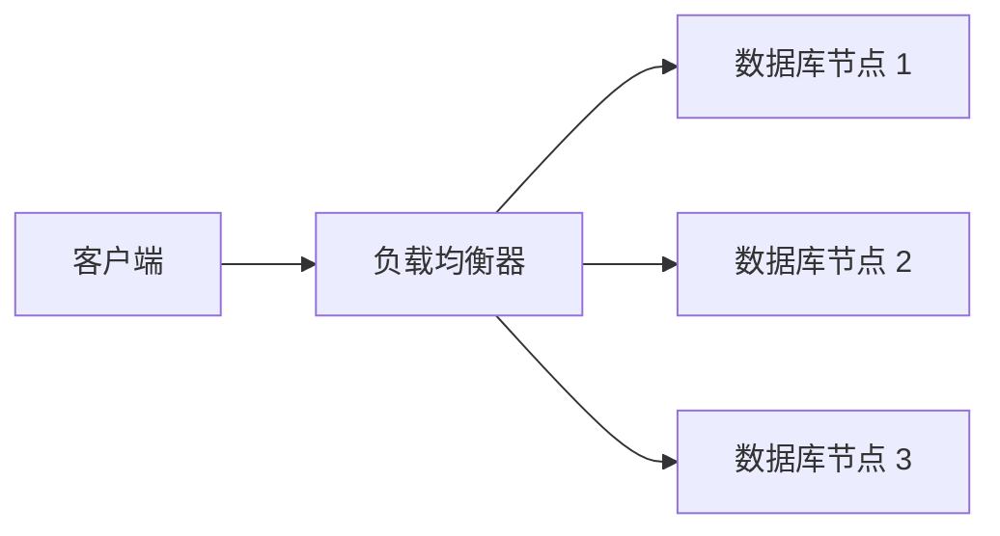

# 负载均衡

## 介绍

负载均衡（Load Balancing）是一种将网络流量或计算任务分配到多个服务器或资源上的技术。它的主要目的是优化资源使用、最大化吞吐量、最小化响应时间，并避免单个服务器过载。负载均衡在现代网络架构中扮演着至关重要的角色，尤其是在高流量网站、云计算和分布式系统中。

## 负载均衡的工作原理

负载均衡的核心思想是将请求分发到多个服务器上，以确保每个服务器都能高效地处理请求。以下是负载均衡的基本工作流程：

1. **请求接收**：负载均衡器接收来自客户端的请求。
2. **请求分发**：负载均衡器根据预定义的算法（如轮询、最少连接等）将请求分发到后端服务器。
3. **服务器处理**：后端服务器处理请求并返回响应。
4. **响应返回**：负载均衡器将响应返回给客户端。

### 负载均衡算法

常见的负载均衡算法包括：

- **轮询（Round Robin）**：按顺序将请求分发到每个服务器。
- **最少连接（Least Connections）**：将请求分发到当前连接数最少的服务器。
- **加权轮询（Weighted Round Robin）**：根据服务器的权重分配请求，权重高的服务器处理更多请求。
- **IP 哈希（IP Hash）**：根据客户端的 IP 地址将请求分发到固定的服务器。

## 实际案例

### 案例 1：Web 服务器负载均衡

假设你有一个高流量的网站，使用三台 Web 服务器来处理用户请求。为了确保每台服务器都能高效地处理请求，你可以使用负载均衡器来分发流量。



### 案例 2：数据库负载均衡

在一个分布式数据库系统中，负载均衡器可以将查询请求分发到多个数据库节点上，以提高查询性能和系统的可用性。



## 代码示例

以下是一个简单的负载均衡器实现示例，使用 Python 和轮询算法：

```python
class LoadBalancer:
    def __init__(self, servers):
        self.servers = servers
        self.current_index = 0

    def get_server(self):
        server = self.servers[self.current_index]
        self.current_index = (self.current_index + 1) % len(self.servers)
        return server

# 示例使用
servers = ["Server1", "Server2", "Server3"]
lb = LoadBalancer(servers)

for i in range(10):
    print(f"Request {i+1} sent to {lb.get_server()}")
```

**输出：**
```
Request 1 sent to Server1
Request 2 sent to Server2
Request 3 sent to Server3
Request 4 sent to Server1
Request 5 sent to Server2
Request 6 sent to Server3
Request 7 sent to Server1
Request 8 sent to Server2
Request 9 sent to Server3
Request 10 sent to Server1
```

:::tip
在实际应用中，负载均衡器通常会结合健康检查机制，确保只将请求分发到健康的服务器上。
:::

## 总结

负载均衡是确保系统高可用性和高性能的关键技术。通过将请求分发到多个服务器上，负载均衡器可以有效地避免单点故障，并提高系统的整体性能。无论是 Web 服务器、数据库还是其他分布式系统，负载均衡都扮演着不可或缺的角色。

## 附加资源

- [负载均衡 - 维基百科](https://zh.wikipedia.org/wiki/负载均衡)
- [Nginx 负载均衡配置指南](https://nginx.org/en/docs/http/load_balancing.html)
- [AWS Elastic Load Balancing](https://aws.amazon.com/elasticloadbalancing/)

## 练习

1. 尝试实现一个基于最少连接算法的负载均衡器。
2. 研究并比较不同负载均衡算法的优缺点。
3. 在本地环境中配置一个简单的负载均衡器，并测试其性能。

:::caution
在配置负载均衡器时，务必确保后端服务器的健康状态，以避免将请求分发到不可用的服务器上。
:::