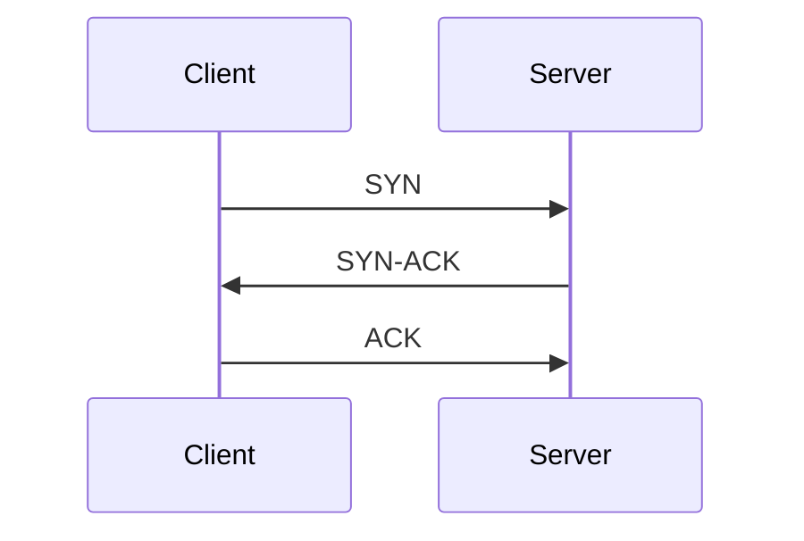

# 网络编程基础

网络编程是计算机网络中的一个重要领域，它涉及如何在网络中实现数据通信。无论是浏览网页、发送电子邮件，还是在线游戏，都离不开网络编程的支持。本文将带你了解网络编程的基础知识，并通过代码示例和实际案例帮助你更好地理解这些概念。

## 什么是网络编程？

网络编程是指通过编写程序来实现计算机之间的通信。它通常涉及使用套接字（Socket）来建立连接，并通过协议（如 TCP/IP）来传输数据。网络编程的核心是客户端-服务器模型，其中客户端请求服务，而服务器提供服务。

## 套接字（Socket）

套接字是网络编程的基础，它是网络通信的端点。套接字允许程序通过网络发送和接收数据。套接字可以分为两种类型：

1. **流套接字（Stream Socket）**：使用 TCP 协议，提供可靠的、面向连接的通信。
2. **数据报套接字（Datagram Socket）**：使用 UDP 协议，提供无连接的、不可靠的通信。

### 示例：创建一个简单的 TCP 服务器和客户端

以下是一个使用 Python 编写的简单 TCP 服务器和客户端的示例。

#### 服务器端代码

```python
import socket

# 创建一个 TCP/IP 套接字
server_socket = socket.socket(socket.AF_INET, socket.SOCK_STREAM)

# 绑定套接字到本地地址和端口
server_address = ('localhost', 12345)
server_socket.bind(server_address)

# 监听连接
server_socket.listen(1)
print("等待连接...")

# 接受连接
connection, client_address = server_socket.accept()
print(f"连接来自: {client_address}")

# 接收数据
data = connection.recv(1024)
print(f"收到数据: {data.decode()}")

# 发送数据
connection.sendall(b"Hello from server")

# 关闭连接
connection.close()
```

#### 客户端代码

```python
import socket

# 创建一个 TCP/IP 套接字
client_socket = socket.socket(socket.AF_INET, socket.SOCK_STREAM)

# 连接到服务器
server_address = ('localhost', 12345)
client_socket.connect(server_address)

# 发送数据
client_socket.sendall(b"Hello from client")

# 接收数据
data = client_socket.recv(1024)
print(f"收到数据: {data.decode()}")

# 关闭连接
client_socket.close()
```

#### 运行结果

1. 服务器端输出：
   ```
   等待连接...
   连接来自: ('127.0.0.1', 12345)
   收到数据: Hello from client
   ```

2. 客户端输出：
   ```
   收到数据: Hello from server
   ```

:::tip
在实际开发中，服务器通常需要处理多个客户端连接。可以使用多线程或异步编程来实现这一点。
:::

## TCP/IP 协议

TCP/IP 是网络编程中最常用的协议栈。它由两个主要协议组成：

- **TCP（传输控制协议）**：提供可靠的、面向连接的通信。
- **IP（互联网协议）**：负责将数据包从源地址传输到目标地址。

### TCP 的三次握手

在 TCP 连接建立之前，客户端和服务器需要进行三次握手：



1. 客户端发送 SYN 报文给服务器，请求建立连接。
2. 服务器回复 SYN-ACK 报文，表示同意建立连接。
3. 客户端发送 ACK 报文，确认连接建立。

:::note
三次握手确保了连接的可靠性，避免了数据丢失或重复。
:::

## 客户端-服务器模型

客户端-服务器模型是网络编程中最常见的架构。在这种模型中，客户端向服务器发送请求，服务器处理请求并返回响应。

### 实际案例：Web 服务器

Web 服务器是一个典型的客户端-服务器模型的应用。当你在浏览器中输入一个 URL 时，浏览器（客户端）会向 Web 服务器发送 HTTP 请求，服务器处理请求并返回 HTML 页面。

#### 示例：简单的 HTTP 服务器

以下是一个使用 Python 编写的简单 HTTP 服务器示例。

```python
from http.server import BaseHTTPRequestHandler, HTTPServer

class SimpleHTTPRequestHandler(BaseHTTPRequestHandler):
    def do_GET(self):
        self.send_response(200)
        self.send_header('Content-type', 'text/html')
        self.end_headers()
        self.wfile.write(b"<html><body><h1>Hello, World!</h1></body></html>")

# 启动服务器
server_address = ('', 8000)
httpd = HTTPServer(server_address, SimpleHTTPRequestHandler)
print("服务器启动，访问 http://localhost:8000")
httpd.serve_forever()
```

#### 运行结果

在浏览器中访问 `http://localhost:8000`，你将看到页面显示 "Hello, World!"。

## 总结

网络编程是计算机网络中的核心技能之一。通过本文，你学习了套接字、TCP/IP 协议、客户端-服务器模型等基础知识，并通过代码示例和实际案例加深了理解。希望这些内容能为你进一步学习网络编程打下坚实的基础。

## 附加资源

- [Python 官方文档 - 套接字编程](https://docs.python.org/3/library/socket.html)
- [TCP/IP 协议详解](https://www.ietf.org/rfc/rfc793.txt)
- [HTTP 协议详解](https://tools.ietf.org/html/rfc2616)

## 练习

1. 修改 TCP 服务器代码，使其能够处理多个客户端连接。
2. 编写一个 UDP 客户端和服务器，实现简单的消息传输。
3. 扩展 HTTP 服务器，使其能够返回不同的 HTML 页面。

:::caution
在编写网络程序时，务必注意网络安全问题，避免暴露敏感信息或遭受攻击。
:::