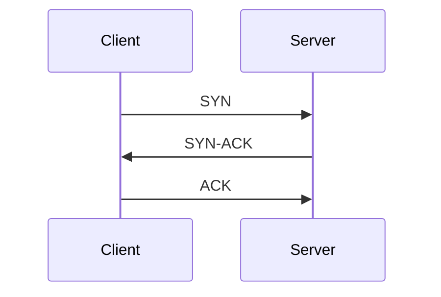

# TCP与UDP对比

在计算机网络中，**传输层**负责为应用程序提供端到端的通信服务。其中，**TCP（传输控制协议）**和**UDP（用户数据报协议）**是最常用的两种传输层协议。它们各有特点，适用于不同的场景。本文将详细对比这两种协议，帮助你理解它们的区别和应用。

---

## 1. 什么是TCP和UDP？

### TCP（传输控制协议）
TCP是一种面向连接的、可靠的传输协议。它通过三次握手建立连接，确保数据能够准确无误地传输到目标设备。如果数据在传输过程中丢失或损坏，TCP会自动重传数据。

### UDP（用户数据报协议）
UDP是一种无连接的、不可靠的传输协议。它不保证数据的可靠传输，也不进行数据重传。UDP的优势在于传输速度快、开销小，适合对实时性要求较高的场景。

---

## 2. TCP与UDP的主要区别

以下是TCP和UDP的主要区别：

| 特性                | TCP                          | UDP                          |
|---------------------|------------------------------|------------------------------|
| **连接方式**        | 面向连接（需要三次握手）     | 无连接                       |
| **可靠性**          | 可靠（数据不丢失、不重复）   | 不可靠（可能丢失或重复）     |
| **传输速度**        | 较慢（需要确认和重传）       | 较快（无确认和重传）         |
| **数据顺序**        | 保证数据顺序                 | 不保证数据顺序               |
| **头部开销**        | 较大（20字节）               | 较小（8字节）                |
| **适用场景**        | 文件传输、网页浏览、电子邮件 | 视频流、在线游戏、DNS查询    |

---

## 3. TCP与UDP的工作原理

### TCP的工作原理
TCP通过以下机制确保数据的可靠传输：
1. **三次握手**：建立连接时，客户端和服务器之间需要进行三次通信。
2. **数据确认**：接收方收到数据后会发送确认消息。
3. **重传机制**：如果发送方未收到确认消息，会重新发送数据。
4. **流量控制**：通过滑动窗口机制控制数据传输速率。
5. **拥塞控制**：根据网络状况动态调整数据传输速率。



### UDP的工作原理
UDP直接将数据打包成数据报发送，不建立连接，也不进行数据确认和重传。它的工作流程非常简单：
1. 发送方将数据打包成数据报。
2. 数据报通过网络传输到接收方。
3. 接收方直接处理数据报。

---

## 4. 实际应用场景

### TCP的应用场景
- **文件传输**：如FTP协议，需要确保文件的完整性。
- **网页浏览**：如HTTP/HTTPS协议，需要可靠的数据传输。
- **电子邮件**：如SMTP协议，确保邮件内容不丢失。

### UDP的应用场景
- **视频流媒体**：如直播、视频会议，对实时性要求高。
- **在线游戏**：需要快速传输玩家操作数据。
- **DNS查询**：快速解析域名，无需建立连接。

---

## 5. 代码示例

### TCP示例（Python）
以下是一个简单的TCP客户端和服务器的Python示例：

```python
# TCP服务器
import socket

server_socket = socket.socket(socket.AF_INET, socket.SOCK_STREAM)
server_socket.bind(('127.0.0.1', 12345))
server_socket.listen(1)

print("等待客户端连接...")
client_socket, addr = server_socket.accept()
print(f"连接来自: {addr}")

data = client_socket.recv(1024)
print(f"收到数据: {data.decode()}")
client_socket.send(b"Hello from server!")
client_socket.close()
```

```python
# TCP客户端
import socket

client_socket = socket.socket(socket.AF_INET, socket.SOCK_STREAM)
client_socket.connect(('127.0.0.1', 12345))

client_socket.send(b"Hello from client!")
data = client_socket.recv(1024)
print(f"收到数据: {data.decode()}")
client_socket.close()
```

### UDP示例（Python）
以下是一个简单的UDP客户端和服务器的Python示例：

```python
# UDP服务器
import socket

server_socket = socket.socket(socket.AF_INET, socket.SOCK_DGRAM)
server_socket.bind(('127.0.0.1', 12345))

print("等待数据...")
data, addr = server_socket.recvfrom(1024)
print(f"收到来自 {addr} 的数据: {data.decode()}")
server_socket.sendto(b"Hello from server!", addr)
```

```python
# UDP客户端
import socket

client_socket = socket.socket(socket.AF_INET, socket.SOCK_DGRAM)
client_socket.sendto(b"Hello from client!", ('127.0.0.1', 12345))

data, addr = client_socket.recvfrom(1024)
print(f"收到数据: {data.decode()}")
client_socket.close()
```

---

## 6. 总结

- **TCP**适用于需要可靠传输的场景，如文件传输、网页浏览等。
- **UDP**适用于对实时性要求高的场景，如视频流、在线游戏等。
- 选择TCP还是UDP取决于具体的应用需求。

---

## 7. 附加资源与练习

### 附加资源
- [TCP/IP协议详解](https://example.com/tcp-ip)
- [UDP协议详解](https://example.com/udp)

### 练习
1. 编写一个TCP聊天程序，支持多客户端连接。
2. 使用UDP实现一个简单的文件传输工具。
3. 比较TCP和UDP在不同网络环境下的性能差异。

:::tip
如果你对TCP和UDP的底层实现感兴趣，可以深入学习它们的协议头和传输机制。
:::