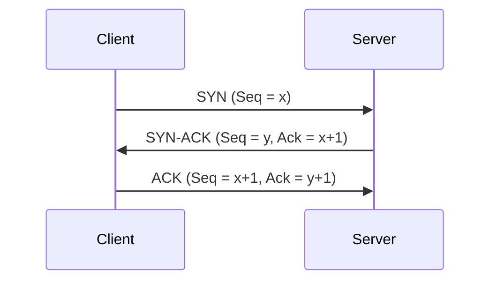
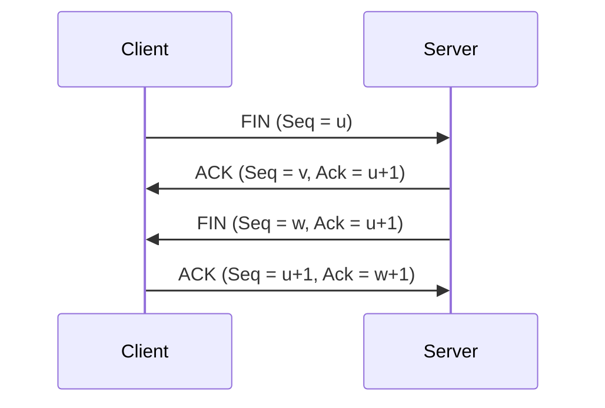

## 介绍

TCP（传输控制协议）是互联网中最常用的协议之一，它负责在网络上可靠地传输数据。为了确保通信的可靠性，TCP在建立连接和断开连接时分别使用了**三次握手**和**四次挥手**的机制。本文将详细介绍这两个过程，并通过实际案例帮助你理解它们的工作原理。

---

## TCP三次握手

### 什么是三次握手？

三次握手是TCP协议在建立连接时使用的机制。它确保客户端和服务器双方都准备好进行通信，并且双方都知道对方的初始序列号（Sequence Number）。这个过程分为三个步骤：

1. **SYN**：客户端向服务器发送一个SYN（同步）包，请求建立连接。
2. **SYN-ACK**：服务器收到SYN包后，回复一个SYN-ACK（同步-确认）包，表示同意建立连接。
3. **ACK**：客户端收到SYN-ACK包后，再发送一个ACK（确认）包，确认连接已建立。

### 三次握手的详细过程

1. **第一步：客户端发送SYN包**  
   客户端选择一个初始序列号（Seq = x），并发送一个SYN包给服务器。此时客户端进入`SYN_SENT`状态。

2. **第二步：服务器回复SYN-ACK包**  
   服务器收到SYN包后，选择一个初始序列号（Seq = y），并发送一个SYN-ACK包给客户端。ACK值为`x+1`，表示服务器已经收到了客户端的SYN包。此时服务器进入`SYN_RECEIVED`状态。

3. **第三步：客户端发送ACK包**  
   客户端收到SYN-ACK包后，发送一个ACK包给服务器。ACK值为`y+1`，表示客户端已经收到了服务器的SYN-ACK包。此时连接正式建立，双方进入`ESTABLISHED`状态。

### 为什么需要三次握手？

三次握手的主要目的是确保双方都能正常收发数据，并防止因网络延迟导致的错误连接。如果没有三次握手，可能会因为旧的SYN包在网络中滞留而导致服务器误认为客户端请求建立连接。

---

## TCP四次挥手

### 什么是四次挥手？

四次挥手是TCP协议在断开连接时使用的机制。它确保双方都能正常关闭连接，并且所有数据都已传输完毕。这个过程分为四个步骤：

1. **FIN**：客户端或服务器发送一个FIN（结束）包，表示希望关闭连接。
2. **ACK**：接收方回复一个ACK包，确认收到FIN包。
3. **FIN**：接收方发送一个FIN包，表示自己也准备关闭连接。
4. **ACK**：发送方回复一个ACK包，确认收到FIN包。

### 四次挥手的详细过程

1. **第一步：客户端发送FIN包**  
   客户端发送一个FIN包给服务器，表示自己已经完成数据发送，并希望关闭连接。此时客户端进入`FIN_WAIT_1`状态。

2. **第二步：服务器回复ACK包**  
   服务器收到FIN包后，发送一个ACK包给客户端，表示已经收到FIN包。此时服务器进入`CLOSE_WAIT`状态，客户端进入`FIN_WAIT_2`状态。

3. **第三步：服务器发送FIN包**  
   服务器完成数据发送后，发送一个FIN包给客户端，表示自己也准备关闭连接。此时服务器进入`LAST_ACK`状态。

4. **第四步：客户端回复ACK包**  
   客户端收到FIN包后，发送一个ACK包给服务器，确认收到FIN包。此时客户端进入`TIME_WAIT`状态，等待一段时间后关闭连接。服务器收到ACK包后，关闭连接。

### 为什么需要四次挥手？

四次挥手的主要目的是确保双方都能正常关闭连接，并且所有数据都已传输完毕。如果没有四次挥手，可能会导致一方已经关闭连接，而另一方还在发送数据，从而造成数据丢失。

---

## 实际案例

### 案例1：Web服务器与浏览器的通信

当你在浏览器中访问一个网站时，浏览器会通过TCP协议与Web服务器建立连接。以下是具体步骤：

1. **三次握手**：浏览器发送SYN包，服务器回复SYN-ACK包，浏览器发送ACK包，连接建立。
2. **数据传输**：浏览器发送HTTP请求，服务器返回HTTP响应。
3. **四次挥手**：浏览器发送FIN包，服务器回复ACK包，服务器发送FIN包，浏览器回复ACK包，连接关闭。

### 案例2：文件传输

当你使用FTP（文件传输协议）下载文件时，客户端和服务器之间也会通过TCP协议进行通信。以下是具体步骤：

1. **三次握手**：客户端发送SYN包，服务器回复SYN-ACK包，客户端发送ACK包，连接建立。
2. **数据传输**：客户端发送文件请求，服务器返回文件数据。
3. **四次挥手**：客户端发送FIN包，服务器回复ACK包，服务器发送FIN包，客户端回复ACK包，连接关闭。

---

## 总结

TCP的三次握手和四次挥手是确保网络通信可靠性的重要机制。通过三次握手，客户端和服务器可以确认彼此的初始序列号并建立连接；通过四次挥手，双方可以安全地关闭连接并确保所有数据都已传输完毕。

---

## 附加资源与练习

- **练习1**：使用Wireshark抓包工具，观察TCP三次握手和四次挥手的过程。
- **练习2**：编写一个简单的TCP客户端和服务器程序，模拟三次握手和四次挥手的过程。
- **资源推荐**：
  - 《TCP/IP详解 卷1：协议》
  - [RFC 793 - Transmission Control Protocol](https://tools.ietf.org/html/rfc793)

:::tip
如果你对TCP协议的其他特性感兴趣，可以继续学习滑动窗口、拥塞控制等内容。
:::