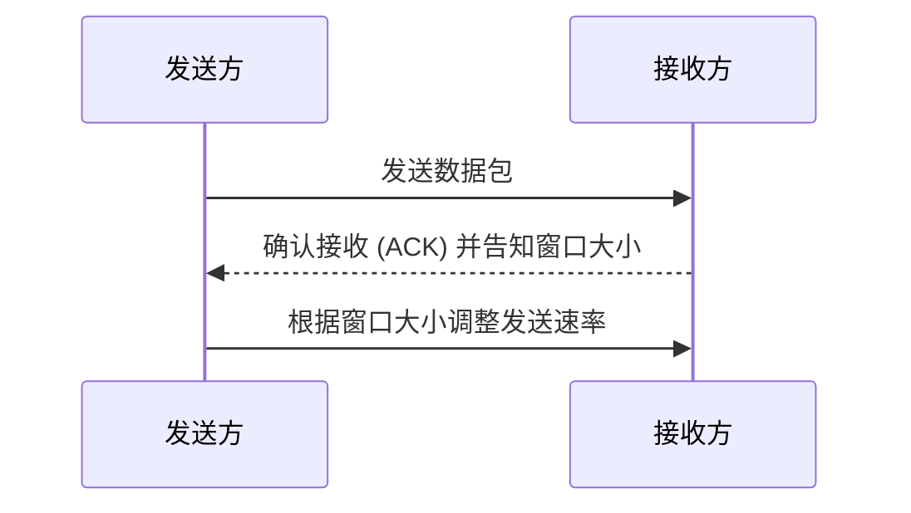
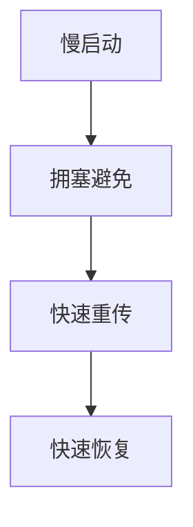

# TCP流量控制与拥塞控制

TCP（传输控制协议）是互联网中最常用的传输层协议之一。它通过流量控制和拥塞控制机制来确保数据在网络中的可靠传输。本文将详细介绍这两种机制的工作原理及其在实际中的应用。

## 1. 流量控制

### 1.1 什么是流量控制？

流量控制是TCP协议中的一种机制，用于防止发送方发送数据过快，导致接收方无法及时处理。接收方通过告知发送方自己的接收窗口大小（`rwnd`）来控制发送方的发送速率。

### 1.2 滑动窗口机制

TCP使用滑动窗口机制来实现流量控制。滑动窗口的大小由接收方的接收缓冲区大小决定。发送方根据接收方的窗口大小动态调整发送数据的速率。

### 1.3 实际案例

假设接收方的接收缓冲区大小为100字节，发送方每次发送50字节的数据。接收方在接收到数据后，会发送一个确认包（ACK），并告知发送方当前的窗口大小为50字节。发送方根据这个信息调整发送速率，确保不会超出接收方的处理能力。

## 2. 拥塞控制

### 2.1 什么是拥塞控制？

拥塞控制是TCP协议中的另一种机制，用于防止网络中的拥塞。当网络中的路由器或链路负载过高时，可能会导致数据包丢失或延迟增加。拥塞控制通过动态调整发送方的发送速率来避免这种情况。

### 2.2 拥塞窗口

拥塞窗口（`cwnd`）是发送方用于控制发送速率的另一个窗口。发送方根据网络的拥塞情况动态调整`cwnd`的大小。拥塞控制算法主要包括慢启动、拥塞避免、快速重传和快速恢复。

### 2.3 慢启动与拥塞避免

- **慢启动**：发送方开始时以较小的`cwnd`发送数据，每收到一个ACK，`cwnd`就增加一个MSS（最大段大小）。这个过程会持续到`cwnd`达到一个阈值（`ssthresh`）。
  
- **拥塞避免**：当`cwnd`达到`ssthresh`后，发送方进入拥塞避免阶段，`cwnd`的增长速度减缓，每收到一个ACK，`cwnd`增加1/MSS。

### 2.4 快速重传与快速恢复

- **快速重传**：当发送方连续收到三个重复的ACK时，它会立即重传丢失的数据包，而不必等待超时。
  
- **快速恢复**：在快速重传后，发送方将`ssthresh`设置为当前`cwnd`的一半，并将`cwnd`设置为`ssthresh`加上3个MSS，然后进入拥塞避免阶段。

### 2.5 实际案例

假设发送方在慢启动阶段以`cwnd=1`开始发送数据，每收到一个ACK，`cwnd`增加1。当`cwnd`达到`ssthresh=16`时，发送方进入拥塞避免阶段，`cwnd`的增长速度减缓。如果发送方检测到网络拥塞（如收到三个重复的ACK），它会立即重传丢失的数据包，并调整`cwnd`和`ssthresh`。

## 3. 总结

TCP的流量控制和拥塞控制机制是确保网络传输可靠性和效率的关键。流量控制通过滑动窗口机制防止发送方发送数据过快，而拥塞控制通过动态调整拥塞窗口来避免网络拥塞。理解这些机制对于优化网络应用的性能至关重要。

## 4. 附加资源与练习

- **附加资源**：
  - [RFC 5681 - TCP Congestion Control](https://tools.ietf.org/html/rfc5681)
  - [TCP/IP Illustrated, Volume 1: The Protocols by W. Richard Stevens](https://www.amazon.com/TCP-Illustrated-Protocols-Addison-Wesley-Professional/dp/0201633469)

- **练习**：
  1. 使用Wireshark捕获TCP流量，观察滑动窗口和拥塞窗口的变化。
  2. 编写一个简单的TCP客户端和服务器程序，模拟流量控制和拥塞控制的过程。

:::tip
**提示**：在实际开发中，理解TCP的流量控制和拥塞控制机制可以帮助你优化网络应用的性能，特别是在高并发或高延迟的网络环境中。
:::