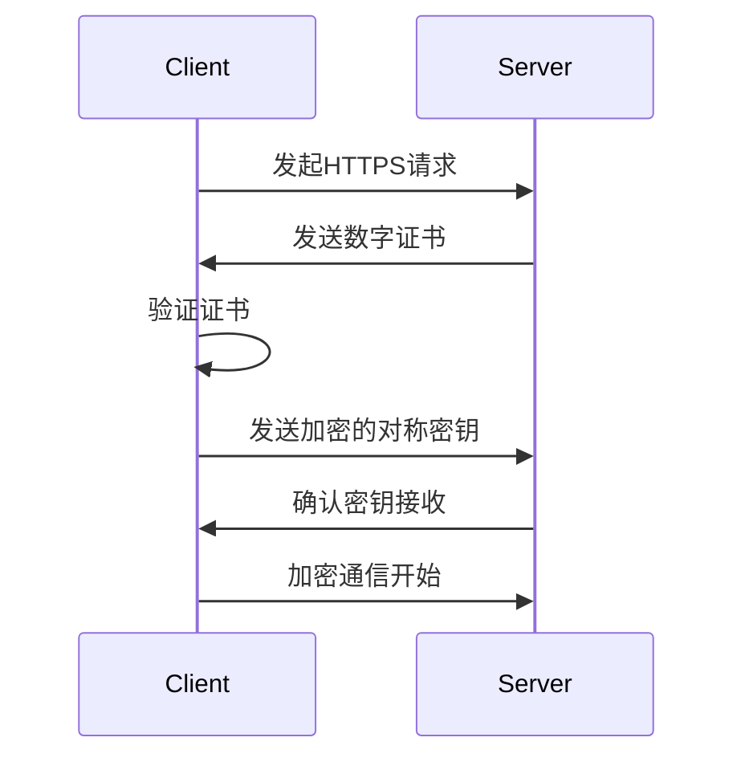

# HTTPS原理

HTTPS（HyperText Transfer Protocol Secure）是HTTP的安全版本，用于在客户端和服务器之间安全地传输数据。它通过加密通信内容来防止数据被窃听或篡改。本文将逐步讲解HTTPS的工作原理，帮助你理解它是如何保护网络通信的。

## 1. 什么是HTTPS？

HTTPS是HTTP协议的加密版本，它在HTTP的基础上添加了SSL/TLS协议，用于加密数据传输。SSL（Secure Sockets Layer）和TLS（Transport Layer Security）是加密协议，它们为网络通信提供了安全性。

:::note
HTTPS的主要目的是确保数据在传输过程中的**机密性**、**完整性**和**身份验证**。
:::

## 2. HTTPS的核心组件

### 2.1 加密

HTTPS使用对称加密和非对称加密相结合的方式来保护数据。

- **对称加密**：使用相同的密钥进行加密和解密。优点是速度快，适合加密大量数据。
- **非对称加密**：使用一对密钥（公钥和私钥）。公钥用于加密，私钥用于解密。优点是安全性高，但速度较慢。

### 2.2 数字证书

数字证书用于验证服务器的身份。它由受信任的证书颁发机构（CA）签发，包含服务器的公钥和其他信息。

### 2.3 SSL/TLS握手

SSL/TLS握手是客户端和服务器之间建立安全连接的过程。它包括密钥交换、身份验证和加密算法的协商。

## 3. HTTPS的工作流程

### 3.1 客户端发起请求

当你在浏览器中输入一个HTTPS网址时，浏览器会向服务器发起请求，要求建立安全连接。

### 3.2 服务器响应并发送证书

服务器会响应客户端的请求，并发送其数字证书。证书中包含了服务器的公钥。

### 3.3 客户端验证证书

客户端会验证证书的有效性，包括检查证书是否由受信任的CA签发，以及证书是否过期。

### 3.4 密钥交换

客户端生成一个随机的对称密钥，并使用服务器的公钥加密后发送给服务器。服务器使用私钥解密，得到对称密钥。

### 3.5 加密通信

客户端和服务器使用对称密钥加密和解密数据，确保通信内容的安全性。



## 4. 实际应用场景

### 4.1 网上银行

网上银行使用HTTPS来保护用户的登录信息和交易数据，防止黑客窃取敏感信息。

### 4.2 电子商务

电子商务网站使用HTTPS来保护用户的个人信息和支付数据，确保交易的安全性。

### 4.3 社交媒体

社交媒体平台使用HTTPS来保护用户的隐私，防止数据被窃听或篡改。

## 5. 总结

HTTPS通过加密和身份验证机制，确保了网络通信的安全性。它广泛应用于需要保护敏感数据的场景，如网上银行、电子商务和社交媒体。

:::tip
为了确保你的网站安全，建议始终使用HTTPS，并定期更新SSL/TLS证书。
:::

## 6. 附加资源

- [Mozilla Developer Network: HTTPS](https://developer.mozilla.org/en-US/docs/Web/HTTP/Overview)
- [SSL/TLS Explained](https://www.cloudflare.com/learning/ssl/what-is-ssl/)
- [Let's Encrypt](https://letsencrypt.org/) - 免费的SSL/TLS证书颁发机构

## 7. 练习

1. 使用浏览器开发者工具，查看一个HTTPS网站的证书信息。
2. 尝试使用Let's Encrypt为你的网站配置HTTPS。
3. 编写一个简单的Python脚本，使用`requests`库访问一个HTTPS网站，并验证证书的有效性。

```python
import requests

response = requests.get('https://example.com')
print(response.status_code)
```

通过以上内容，你应该对HTTPS的工作原理有了全面的了解。继续深入学习，你将能够更好地理解和应用这一重要的网络安全技术。