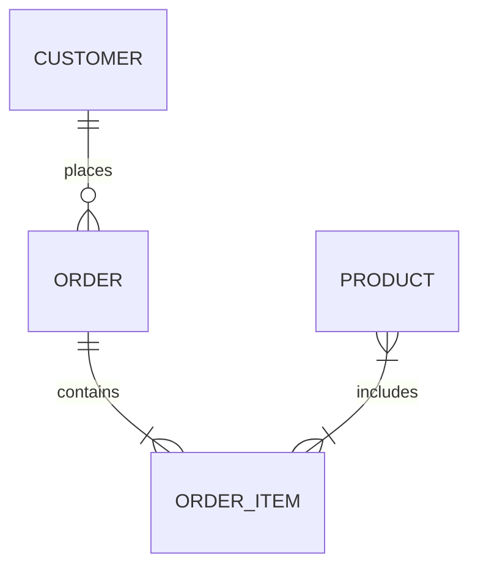
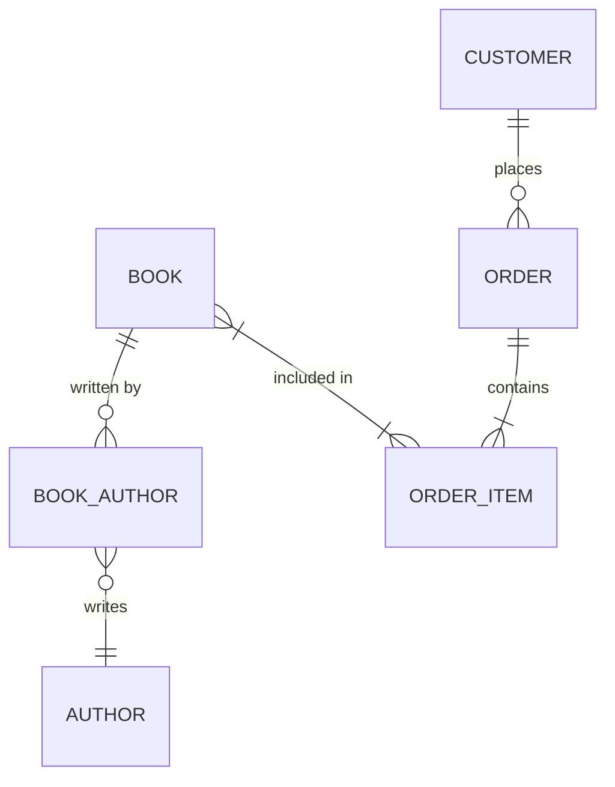

# 数据库设计实践

数据库设计是构建高效、可靠数据库系统的关键步骤。无论是开发一个小型应用还是大型企业系统，良好的数据库设计都能显著提升系统的性能和可维护性。本文将逐步讲解数据库设计的基本概念、设计步骤，并通过实际案例展示如何将这些概念应用到真实场景中。

## 什么是数据库设计？

数据库设计是指根据业务需求，设计数据库的结构、表、关系以及约束条件的过程。一个好的数据库设计不仅能满足当前需求，还能为未来的扩展和维护提供便利。

### 数据库设计的目标
1. **数据完整性**：确保数据的准确性和一致性。
2. **性能优化**：通过合理的设计提升查询和操作的效率。
3. **可扩展性**：设计应支持未来的业务增长和变化。
4. **安全性**：保护数据免受未授权访问和篡改。

## 数据库设计的步骤

数据库设计通常分为以下几个步骤：

### 1. 需求分析
在设计数据库之前，首先要明确业务需求。这包括：
- 确定系统需要存储哪些数据。
- 了解数据的来源和用途。
- 分析数据的访问模式和频率。

:::tip
需求分析是数据库设计的基础，确保与业务团队充分沟通，避免遗漏关键需求。
:::

### 2. 概念设计
概念设计是将业务需求转化为数据库模型的初步设计。通常使用**实体-关系图（ER图）**来表示数据之间的关系。



在上面的ER图中：
- `CUSTOMER` 和 `ORDER` 之间存在一对多关系。
- `ORDER` 和 `ORDER_ITEM` 之间存在一对多关系。
- `PRODUCT` 和 `ORDER_ITEM` 之间存在多对多关系。

### 3. 逻辑设计
逻辑设计是将概念设计转化为具体的数据库模式。这一步骤包括：
- 定义表结构。
- 确定主键和外键。
- 设计索引以提高查询性能。

例如，以下是一个简单的订单管理系统的表结构设计：

```sql
CREATE TABLE Customer (
    CustomerID INT PRIMARY KEY,
    Name VARCHAR(100),
    Email VARCHAR(100)
);

CREATE TABLE Product (
    ProductID INT PRIMARY KEY,
    Name VARCHAR(100),
    Price DECIMAL(10, 2)
);

CREATE TABLE Order (
    OrderID INT PRIMARY KEY,
    CustomerID INT,
    OrderDate DATE,
    FOREIGN KEY (CustomerID) REFERENCES Customer(CustomerID)
);

CREATE TABLE OrderItem (
    OrderItemID INT PRIMARY KEY,
    OrderID INT,
    ProductID INT,
    Quantity INT,
    FOREIGN KEY (OrderID) REFERENCES Order(OrderID),
    FOREIGN KEY (ProductID) REFERENCES Product(ProductID)
);
```

### 4. 物理设计
物理设计关注数据库的存储和性能优化。包括：
- 选择适当的存储引擎。
- 分区和分片策略。
- 优化查询性能的索引设计。

:::caution
物理设计需要根据具体的数据库管理系统（如MySQL、PostgreSQL等）进行调整，不同系统的优化策略可能有所不同。
:::

## 实际案例：在线书店数据库设计

假设我们要为一个在线书店设计数据库。以下是设计步骤：

### 1. 需求分析
- 书店需要存储书籍信息、作者信息、客户信息和订单信息。
- 客户可以下订单，订单包含多本书籍。
- 每本书可以有多个作者。

### 2. 概念设计


### 3. 逻辑设计
```sql
CREATE TABLE Author (
    AuthorID INT PRIMARY KEY,
    Name VARCHAR(100)
);

CREATE TABLE Book (
    BookID INT PRIMARY KEY,
    Title VARCHAR(200),
    Price DECIMAL(10, 2)
);

CREATE TABLE BookAuthor (
    BookID INT,
    AuthorID INT,
    PRIMARY KEY (BookID, AuthorID),
    FOREIGN KEY (BookID) REFERENCES Book(BookID),
    FOREIGN KEY (AuthorID) REFERENCES Author(AuthorID)
);

CREATE TABLE Customer (
    CustomerID INT PRIMARY KEY,
    Name VARCHAR(100),
    Email VARCHAR(100)
);

CREATE TABLE Order (
    OrderID INT PRIMARY KEY,
    CustomerID INT,
    OrderDate DATE,
    FOREIGN KEY (CustomerID) REFERENCES Customer(CustomerID)
);

CREATE TABLE OrderItem (
    OrderItemID INT PRIMARY KEY,
    OrderID INT,
    BookID INT,
    Quantity INT,
    FOREIGN KEY (OrderID) REFERENCES Order(OrderID),
    FOREIGN KEY (BookID) REFERENCES Book(BookID)
);
```

### 4. 物理设计
- 选择InnoDB作为存储引擎，支持事务和外键约束。
- 为`OrderDate`字段创建索引，以加快按日期查询订单的速度。

## 总结

数据库设计是一个系统化的过程，涉及需求分析、概念设计、逻辑设计和物理设计等多个步骤。通过合理的设计，可以确保数据库的高效性、可扩展性和安全性。本文通过一个在线书店的案例，展示了如何将数据库设计的理论应用到实际场景中。

## 附加资源与练习

- **练习**：尝试为一个图书馆管理系统设计数据库，包括书籍、借阅者、借阅记录等表。
- **资源**：
  - [数据库设计基础](https://example.com/database-design-basics)
  - [ER图绘制工具](https://example.com/er-diagram-tool)
  - [SQL优化指南](https://example.com/sql-optimization-guide)

:::note
数据库设计是一个不断迭代的过程，随着业务需求的变化，设计也需要不断调整和优化。
:::