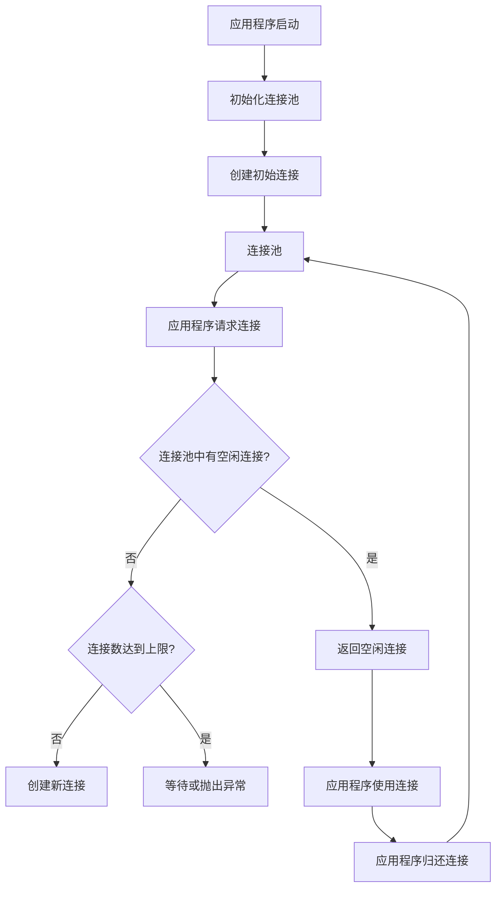

# 数据库连接池

## 介绍

在开发数据库驱动的应用程序时，频繁地创建和关闭数据库连接会导致性能问题。每次建立连接都需要进行网络通信、身份验证和资源分配，这些操作会消耗大量时间和系统资源。为了解决这个问题，数据库连接池应运而生。

**数据库连接池**是一种管理数据库连接的技术，它通过预先创建并维护一组数据库连接，供应用程序在需要时复用。这样可以避免频繁创建和关闭连接的开销，从而提高应用程序的性能和响应速度。

## 数据库连接池的工作原理

数据库连接池的核心思想是**连接复用**。当应用程序需要与数据库交互时，它从连接池中获取一个空闲的连接，使用完毕后将连接归还给连接池，而不是直接关闭连接。连接池会管理这些连接的生命周期，确保它们始终处于可用状态。

以下是数据库连接池的基本工作流程：

1. **初始化连接池**：在应用程序启动时，连接池会预先创建一定数量的数据库连接，并将它们放入池中。
2. **获取连接**：当应用程序需要与数据库交互时，它从连接池中请求一个连接。如果池中有空闲连接，则直接返回；如果没有空闲连接且连接数未达到上限，则创建新的连接。
3. **使用连接**：应用程序使用获取到的连接执行数据库操作。
4. **归还连接**：操作完成后，应用程序将连接归还给连接池，而不是关闭它。
5. **管理连接**：连接池会定期检查连接的状态，关闭长时间未使用的连接，或重新创建失效的连接。



## 代码示例

以下是一个使用 Python 和 `psycopg2` 库实现简单数据库连接池的示例：

```python
import psycopg2
from psycopg2 import pool

# 初始化连接池
connection_pool = psycopg2.pool.SimpleConnectionPool(
    minconn=1,
    maxconn=5,
    host="localhost",
    database="mydatabase",
    user="myuser",
    password="mypassword"
)

# 从连接池中获取连接
connection = connection_pool.getconn()

# 使用连接执行查询
cursor = connection.cursor()
cursor.execute("SELECT * FROM mytable")
results = cursor.fetchall()
print(results)

# 归还连接
connection_pool.putconn(connection)
```

### 输入与输出

- **输入**：应用程序启动并初始化连接池，然后从连接池中获取连接并执行查询。
- **输出**：查询结果被打印到控制台，连接被归还给连接池。

## 实际应用场景

数据库连接池在以下场景中非常有用：

1. **Web 应用程序**：在高并发的 Web 应用程序中，每个请求都可能需要与数据库交互。使用连接池可以避免频繁创建和关闭连接，从而提高性能。
2. **微服务架构**：在微服务架构中，多个服务可能需要同时访问数据库。连接池可以确保每个服务都能高效地获取数据库连接。
3. **批处理任务**：在执行批处理任务时，可能需要多次与数据库交互。连接池可以减少连接创建的开销，加快任务执行速度。

## 总结

数据库连接池是一种优化数据库连接管理的技术，它通过复用连接来减少创建和关闭连接的开销，从而提高应用程序的性能。理解并正确使用连接池对于开发高效的数据库驱动应用程序至关重要。

## 附加资源与练习

- **资源**：
  - [PostgreSQL 官方文档](https://www.postgresql.org/docs/)
  - [psycopg2 文档](https://www.psycopg.org/docs/)
- **练习**：
  1. 尝试修改上面的代码示例，增加连接池的最大连接数，并观察应用程序的行为变化。
  2. 编写一个简单的 Web 应用程序，使用数据库连接池来处理用户请求。

:::tip
在实际开发中，建议使用成熟的连接池库（如 `HikariCP`、`c3p0` 或 `Druid`），而不是手动实现连接池。这些库经过了广泛的测试和优化，能够提供更好的性能和稳定性。
:::