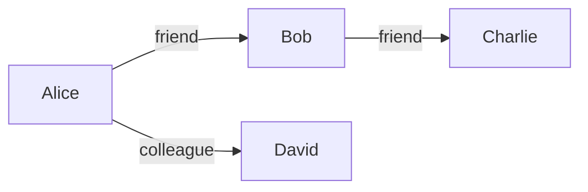

## 什么是NoSQL？

NoSQL（Not Only SQL）是一种非关系型数据库管理系统，用于存储和检索非结构化或半结构化数据。与传统的关系型数据库（如MySQL、PostgreSQL）不同，NoSQL数据库通常具有更高的可扩展性和灵活性，适用于处理大规模数据集和高并发场景。

NoSQL数据库的设计目标是解决关系型数据库在处理大数据、分布式系统和实时应用时的局限性。它们通常采用分布式架构，支持水平扩展，并且不需要固定的表结构。

## NoSQL数据库的分类

NoSQL数据库可以根据其数据模型分为以下几类：

### 1. 键值存储（Key-Value Store）
键值存储是最简单的NoSQL数据库类型。它将数据存储为键值对，其中键是唯一的标识符，值可以是任意类型的数据（如字符串、JSON、二进制数据等）。

**特点：**
- 高性能：通过键直接访问数据，查询速度非常快。
- 简单：数据模型简单，易于实现。

**适用场景：**
- 缓存系统（如Redis）
- 会话存储
- 配置管理

**示例：**
```json
{
  "user:123": {
    "name": "Alice",
    "age": 30
  },
  "user:456": {
    "name": "Bob",
    "age": 25
  }
}
```

### 2. 文档存储（Document Store）
文档存储将数据存储为文档（通常是JSON或XML格式）。每个文档可以包含不同的字段，适合存储半结构化数据。

**特点：**
- 灵活：文档结构可以动态变化。
- 支持嵌套数据：文档可以包含子文档或数组。

**适用场景：**
- 内容管理系统（CMS）
- 电子商务网站
- 实时分析

**示例：**
```json
{
  "_id": "123",
  "name": "Alice",
  "age": 30,
  "address": {
    "city": "New York",
    "zip": "10001"
  }
}
```

### 3. 列族存储（Column-Family Store）
列族存储将数据存储为列族（Column Families），每个列族包含多个列。这种模型适合存储大规模稀疏数据。

**特点：**
- 高效存储：适合存储稀疏数据。
- 高扩展性：支持分布式存储。

**适用场景：**
- 大数据分析
- 日志存储
- 时间序列数据

**示例：**
```plaintext
Row Key: user123
Column Family: profile
  name: Alice
  age: 30
Column Family: address
  city: New York
  zip: 10001
```

### 4. 图数据库（Graph Database）
图数据库使用图结构存储数据，节点表示实体，边表示实体之间的关系。适合处理复杂的关系网络。

**特点：**
- 高效查询：适合查询复杂的关系。
- 灵活：支持动态添加节点和边。

**适用场景：**
- 社交网络
- 推荐系统
- 知识图谱

**示例：**


## NoSQL数据库的实际应用

### 案例1：缓存系统
Redis是一种流行的键值存储数据库，广泛用于缓存系统。例如，一个电子商务网站可以使用Redis缓存热门商品信息，以减少数据库查询压力。

```python
import redis

# 连接到Redis
r = redis.Redis(host='localhost', port=6379, db=0)

# 设置缓存
r.set('product:123', '{"name": "Laptop", "price": 999}')

# 获取缓存
product = r.get('product:123')
print(product)  # 输出: b'{"name": "Laptop", "price": 999}'
```

### 案例2：内容管理系统
MongoDB是一种流行的文档存储数据库，适合用于内容管理系统。例如，一个博客平台可以使用MongoDB存储文章、评论和用户信息。

```javascript
// 插入一篇新文章
db.articles.insertOne({
  title: Introduction to NoSQL,
  author: "Alice",
  content: "NoSQL databases are...",
  tags: ["database", "NoSQL"]
});

// 查询所有文章
db.articles.find({});
```

## 总结

NoSQL数据库提供了一种灵活、高效的方式来存储和检索非结构化或半结构化数据。根据不同的数据模型，NoSQL数据库可以分为键值存储、文档存储、列族存储和图数据库。每种类型都有其独特的优势和适用场景。

:::tip
选择合适的NoSQL数据库类型取决于你的应用需求。如果你需要高性能的缓存系统，键值存储可能是最佳选择；如果你需要处理复杂的关系网络，图数据库可能更适合。
:::

## 附加资源与练习

- **资源：**
  - [NoSQL Databases Explained](https://www.mongodb.com/nosql-explained)
  - [Redis Documentation](https://redis.io/documentation)
  - [MongoDB University](https://university.mongodb.com/)

- **练习：**
  1. 使用Redis实现一个简单的缓存系统。
  2. 使用MongoDB创建一个博客平台的数据模型。
  3. 使用图数据库（如Neo4j）构建一个简单的社交网络。

通过实践这些练习，你将更好地理解NoSQL数据库的概念和应用场景。