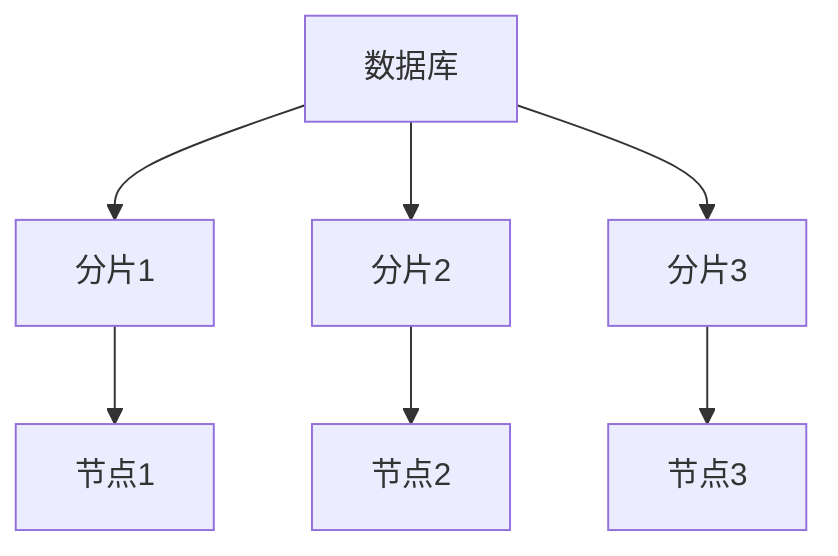
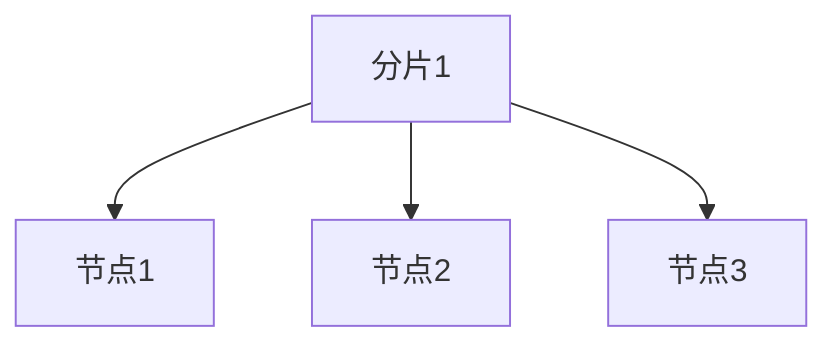

# 分布式数据库

## 介绍

分布式数据库是一种将数据存储在多个物理位置的数据库系统。与传统的集中式数据库不同，分布式数据库通过将数据分布在多个节点上，提供了更高的可扩展性、容错性和性能。这种数据库系统特别适合处理大规模数据和高并发请求的场景。

在分布式数据库中，数据通常被分割成多个部分，每个部分存储在不同的节点上。这些节点可以位于同一数据中心，也可以分布在全球各地。通过这种方式，分布式数据库能够更好地应对单点故障，并在数据量增加时轻松扩展。

## 分布式数据库的工作原理

### 数据分片

数据分片（Sharding）是分布式数据库中的一种常见技术。它将数据分割成多个片段（Shard），每个片段存储在不同的节点上。分片可以基于某种规则进行，例如基于用户ID、地理位置或时间戳。



### 数据复制

为了提高数据的可用性和容错性，分布式数据库通常会使用数据复制（Replication）技术。每个数据分片可以有多个副本，存储在不同的节点上。这样，即使某个节点发生故障，系统仍然可以从其他节点获取数据。



### 一致性模型

在分布式数据库中，一致性模型（Consistency Model）是一个重要的概念。常见的一致性模型包括：

- **强一致性（Strong Consistency）**：所有节点在任何时刻都看到相同的数据。
- **最终一致性（Eventual Consistency）**：数据最终会达到一致状态，但在某些时刻可能会存在不一致。

:::note
CAP 定理指出，在分布式系统中，一致性（Consistency）、可用性（Availability）和分区容错性（Partition Tolerance）三者不可兼得。分布式数据库通常需要在三者之间做出权衡。
:::

## 实际案例

### 案例1：全球电商平台

假设我们有一个全球电商平台，用户遍布世界各地。为了提高访问速度和容错性，我们可以将用户数据按地理位置进行分片，并将每个分片的副本存储在不同地区的节点上。这样，用户可以从离他们最近的节点获取数据，减少延迟。

### 案例2：社交媒体平台

社交媒体平台通常需要处理大量的用户生成内容（UGC）。为了应对高并发请求，平台可以将用户数据分片存储，并使用数据复制技术确保数据的高可用性。例如，用户A的帖子可以存储在多个节点上，即使某个节点发生故障，用户仍然可以访问这些内容。

## 代码示例

以下是一个简单的分布式数据库查询示例，假设我们使用 MongoDB 作为分布式数据库：

```javascript
// 连接到分布式数据库
const { MongoClient } = require('mongodb');
const uri = "mongodb://node1:27017,node2:27017,node3:27017/?replicaSet=myReplicaSet";
const client = new MongoClient(uri);

async function run() {
    try {
        await client.connect();
        const database = client.db('myDatabase');
        const collection = database.collection('myCollection');

        // 插入数据
        await collection.insertOne({ name: "Alice", age: 25 });

        // 查询数据
        const query = { name: "Alice" };
        const result = await collection.findOne(query);
        console.log(result);
    } finally {
        await client.close();
    }
}

run().catch(console.dir);
```

**输出：**
```json
{ "_id": "60c72b2f9b1d8e1a4c8b4567", "name": "Alice", "age": 25 }
```

## 总结

分布式数据库通过将数据分布在多个节点上，提供了更高的可扩展性、容错性和性能。它们特别适合处理大规模数据和高并发请求的场景。通过数据分片、数据复制和一致性模型等技术，分布式数据库能够在复杂的网络环境中高效运行。

## 附加资源

- [MongoDB 官方文档](https://docs.mongodb.com/)
- [Cassandra 官方文档](https://cassandra.apache.org/doc/latest/)
- [CAP 定理详解](https://en.wikipedia.org/wiki/CAP_theorem)

## 练习

1. 尝试在本地搭建一个简单的分布式数据库环境，使用 MongoDB 或 Cassandra。
2. 编写一个程序，模拟数据分片和数据复制的场景，并观察系统的行为。
3. 研究 CAP 定理，并思考在实际应用中如何权衡一致性、可用性和分区容错性。
