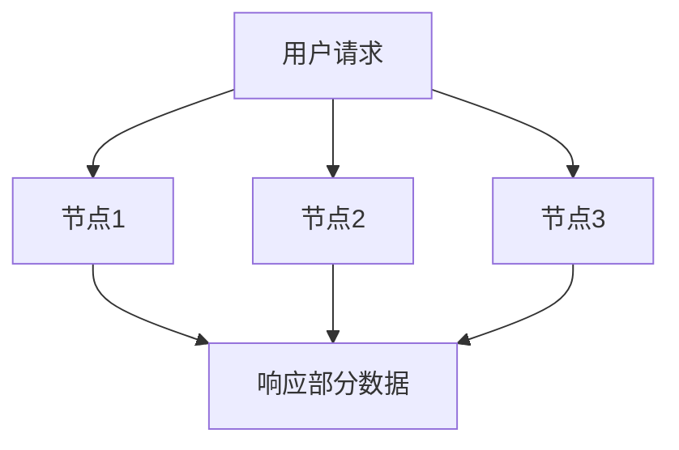
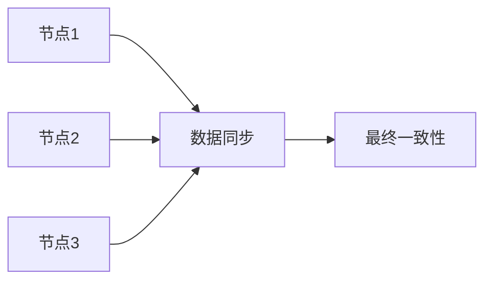

# BASE理论

在NoSQL数据库中，**BASE理论**是一个非常重要的概念。它与传统关系型数据库中的**ACID**特性形成鲜明对比，为分布式系统提供了更高的可用性和灵活性。本文将详细介绍BASE理论的核心概念、实际应用场景，并通过示例帮助你更好地理解。

## 什么是BASE理论？

**BASE**是**Basically Available**（基本可用）、**Soft state**（软状态）和**Eventually consistent**（最终一致性）的缩写。它是NoSQL数据库设计中的一个核心原则，旨在解决分布式系统中的一致性和可用性问题。

- **Basically Available**：系统在大多数时间内是可用的，即使部分组件出现故障。
- **Soft state**：系统的状态可能会随着时间的推移而变化，即使没有外部输入。
- **Eventually consistent**：系统最终会达到一致状态，但在某些时间段内可能会存在不一致。

:::tip
BASE理论的核心思想是**牺牲强一致性**，以换取**更高的可用性和分区容错性**。
:::

## BASE与ACID的区别

在传统的关系型数据库中，**ACID**（原子性、一致性、隔离性、持久性）是保证数据完整性的核心原则。然而，在分布式系统中，ACID的强一致性要求可能会导致性能瓶颈和可用性问题。

| 特性         | ACID                          | BASE                          |
|--------------|-------------------------------|-------------------------------|
| **一致性**   | 强一致性                      | 最终一致性                    |
| **可用性**   | 低（为了保证一致性）          | 高                            |
| **分区容错性** | 低                            | 高                            |

:::caution
ACID和BASE并不是对立的，而是适用于不同的场景。ACID适合需要强一致性的场景（如银行交易），而BASE适合需要高可用性和分区容错性的场景（如社交网络）。
:::

## BASE理论的核心概念

### 1. 基本可用（Basically Available）

在分布式系统中，**基本可用**意味着系统在出现故障时仍然能够提供部分功能。例如，当一个节点宕机时，系统仍然可以响应请求，但可能会返回部分数据或降级服务。



### 2. 软状态（Soft State）

**软状态**指的是系统中的数据状态可能会随着时间的推移而变化，即使没有外部输入。这种状态的不确定性允许系统在分布式环境中更灵活地处理数据。

:::note
软状态并不意味着数据是错误的，而是表示数据的状态可能会暂时不一致。
:::

### 3. 最终一致性（Eventually Consistent）

**最终一致性**是BASE理论的核心。它表示系统在经过一段时间后，所有节点的数据会达到一致状态。在此期间，不同节点可能会返回不同的数据。



## 实际应用场景

### 1. 社交网络

在社交网络中，用户发布的内容可能会被分发到多个服务器。由于网络延迟或服务器故障，不同用户可能会在不同的时间看到相同的内容。然而，系统最终会确保所有用户看到一致的内容。

### 2. 电商库存管理

在电商平台中，库存信息可能会分布在多个数据中心。当用户下单时，系统可能会暂时显示不一致的库存信息，但最终会通过同步机制确保库存数据的一致性。

## 代码示例

以下是一个简单的Python示例，模拟最终一致性的场景：

```python
class Inventory:
    def __init__(self):
        self.stock = 100

    def update_stock(self, quantity):
        self.stock -= quantity

# 模拟分布式系统中的两个节点
node1 = Inventory()
node2 = Inventory()

# 用户下单，减少库存
node1.update_stock(10)
print(f"Node 1 Stock: {node1.stock}")  # 输出: Node 1 Stock: 90

# 由于同步延迟，Node 2的库存尚未更新
print(f"Node 2 Stock: {node2.stock}")  # 输出: Node 2 Stock: 100

# 模拟同步过程
node2.stock = node1.stock
print(f"Node 2 Stock after sync: {node2.stock}")  # 输出: Node 2 Stock after sync: 90
```

## 总结

BASE理论为分布式系统提供了一种灵活的设计思路，通过牺牲强一致性来换取更高的可用性和分区容错性。它在NoSQL数据库中得到了广泛应用，特别是在需要处理大规模数据的场景中。

:::warning
虽然BASE理论提供了更高的可用性，但在某些需要强一致性的场景中（如金融交易），ACID仍然是更好的选择。
:::

## 附加资源

- [CAP定理](https://en.wikipedia.org/wiki/CAP_theorem)：了解分布式系统中的一致性、可用性和分区容错性之间的权衡。
- [NoSQL数据库指南](https://www.mongodb.com/nosql-explained)：深入学习NoSQL数据库的设计原则和应用场景。

## 练习

1. 尝试在本地环境中模拟一个分布式系统，观察最终一致性的实现过程。
2. 思考在哪些场景中，BASE理论比ACID更适合？为什么？

希望本文能帮助你更好地理解BASE理论及其在NoSQL数据库中的应用！如果你有任何问题，欢迎在评论区留言。