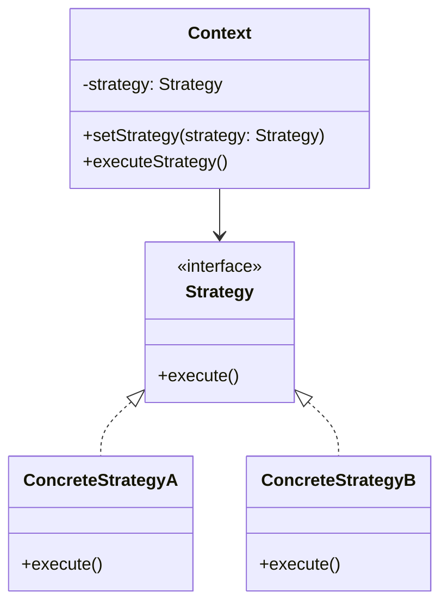

## 介绍

策略模式（Strategy Pattern）是一种行为设计模式，它允许你在运行时选择算法的具体实现。通过将算法封装在独立的类中，策略模式使得算法可以独立于使用它的客户端而变化。这种模式非常适合处理需要在不同情况下使用不同算法的场景。

策略模式的核心思想是将算法的定义与使用分离，从而使得算法可以独立于客户端进行扩展和修改。

## 策略模式的结构

策略模式通常包含以下几个角色：

1. **策略接口（Strategy Interface）**：定义所有支持的算法的公共接口。
2. **具体策略类（Concrete Strategies）**：实现策略接口的具体算法。
3. **上下文类（Context）**：持有一个策略对象的引用，并通过策略接口与具体策略进行交互。



## 代码示例

下面是一个简单的策略模式的代码示例，展示了如何使用策略模式来实现不同的排序算法。

```python
# 策略接口
class SortStrategy:
    def sort(self, data):
        pass

# 具体策略类：快速排序
class QuickSortStrategy(SortStrategy):
    def sort(self, data):
        print("Sorting using Quick Sort")
        # 实现快速排序算法
        return sorted(data)

# 具体策略类：归并排序
class MergeSortStrategy(SortStrategy):
    def sort(self, data):
        print("Sorting using Merge Sort")
        # 实现归并排序算法
        return sorted(data)

# 上下文类
class Sorter:
    def __init__(self, strategy: SortStrategy):
        self._strategy = strategy

    def set_strategy(self, strategy: SortStrategy):
        self._strategy = strategy

    def sort_data(self, data):
        return self._strategy.sort(data)

# 客户端代码
data = [3, 1, 4, 1, 5, 9, 2, 6, 5, 3, 5]

sorter = Sorter(QuickSortStrategy())
print(sorter.sort_data(data))  # 使用快速排序

sorter.set_strategy(MergeSortStrategy())
print(sorter.sort_data(data))  # 使用归并排序
```

**输出：**
```
Sorting using Quick Sort
[1, 1, 2, 3, 3, 4, 5, 5, 5, 6, 9]
Sorting using Merge Sort
[1, 1, 2, 3, 3, 4, 5, 5, 5, 6, 9]
```

:::note
在上面的示例中，`Sorter` 类持有一个 `SortStrategy` 对象的引用，并通过 `sort_data` 方法调用具体的排序算法。通过这种方式，我们可以在运行时动态地切换排序算法。
:::

## 实际应用场景

策略模式在实际开发中有广泛的应用，以下是一些常见的场景：

1. **支付系统**：在支付系统中，不同的支付方式（如信用卡、支付宝、微信支付）可以视为不同的策略。通过策略模式，可以轻松地添加新的支付方式，而不需要修改现有的代码。

2. **游戏开发**：在游戏中，角色的行为（如攻击、防御、逃跑）可以视为不同的策略。通过策略模式，可以在运行时根据游戏状态动态地改变角色的行为。

3. **数据压缩**：在数据压缩工具中，不同的压缩算法（如 ZIP、RAR、7z）可以视为不同的策略。通过策略模式，用户可以根据需要选择不同的压缩算法。

## 总结

策略模式是一种强大的设计模式，它通过将算法封装在独立的类中，使得算法可以独立于客户端进行扩展和修改。这种模式非常适合处理需要在不同情况下使用不同算法的场景。

通过策略模式，你可以轻松地添加新的算法，而不需要修改现有的代码。这不仅提高了代码的可维护性，还使得代码更加灵活和可扩展。

## 附加资源与练习

- **练习**：尝试实现一个简单的计算器程序，使用策略模式来支持不同的数学运算（如加法、减法、乘法、除法）。
- **进一步阅读**：你可以阅读《设计模式：可复用面向对象软件的基础》一书，深入了解策略模式以及其他设计模式。

:::tip
在实际开发中，策略模式通常与其他设计模式（如工厂模式）结合使用，以进一步提高代码的灵活性和可维护性。
:::