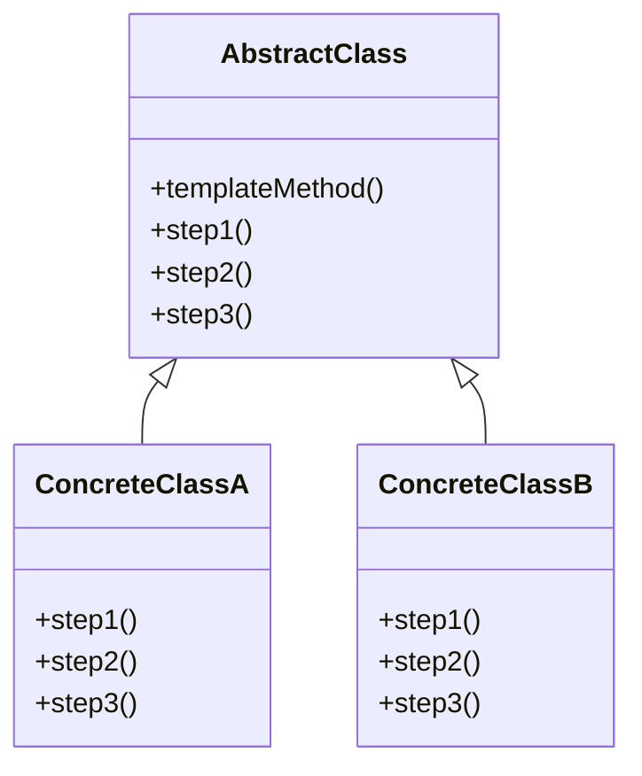

## 介绍

模板方法模式（Template Method Pattern）是一种行为设计模式，它定义了一个算法的框架，并将一些步骤的实现延迟到子类中。通过这种方式，模板方法模式允许子类在不改变算法结构的情况下重写算法的特定步骤。

这种模式的核心思想是将算法的通用部分放在父类中，而将可变的部分留给子类去实现。这样可以避免代码重复，同时保持算法的结构一致。

## 模板方法模式的结构

模板方法模式通常由一个抽象类和一个或多个具体子类组成。抽象类定义了算法的框架，而具体子类则实现算法的具体步骤。



在上面的类图中，`AbstractClass` 是一个抽象类，它定义了算法的框架 `templateMethod()`，并声明了一些抽象方法 `step1()`、`step2()` 和 `step3()`。`ConcreteClassA` 和 `ConcreteClassB` 是具体子类，它们实现了这些抽象方法。

## 代码示例

让我们通过一个简单的例子来理解模板方法模式。假设我们正在开发一个游戏，游戏中有两种角色：战士和法师。每个角色都有不同的攻击方式，但他们的战斗流程是相同的：准备战斗、攻击、结束战斗。

```python
from abc import ABC, abstractmethod

# 抽象类
class Character(ABC):
    def fight(self):
        self.prepare_for_battle()
        self.attack()
        self.end_battle()

    @abstractmethod
    def prepare_for_battle(self):
        pass

    @abstractmethod
    def attack(self):
        pass

    @abstractmethod
    def end_battle(self):
        pass

# 具体子类：战士
class Warrior(Character):
    def prepare_for_battle(self):
        print("Warrior is putting on armor.")

    def attack(self):
        print("Warrior swings a sword.")

    def end_battle(self):
        print("Warrior raises the victory flag.")

# 具体子类：法师
class Mage(Character):
    def prepare_for_battle(self):
        print("Mage is preparing spells.")

    def attack(self):
        print("Mage casts a fireball.")

    def end_battle(self):
        print("Mage meditates to recover mana.")

# 客户端代码
warrior = Warrior()
mage = Mage()

warrior.fight()
mage.fight()
```

**输出：**

```
Warrior is putting on armor.
Warrior swings a sword.
Warrior raises the victory flag.
Mage is preparing spells.
Mage casts a fireball.
Mage meditates to recover mana.
```

在这个例子中，`Character` 类定义了战斗的流程 `fight()`，而具体的战斗步骤则由子类 `Warrior` 和 `Mage` 实现。这样，我们可以在不改变战斗流程的情况下，轻松地添加新的角色类型。

## 实际应用场景

模板方法模式在许多实际应用中都非常有用，特别是在以下场景中：

1. **框架设计**：在框架设计中，模板方法模式可以用来定义框架的核心流程，而将具体的实现细节留给框架的使用者去实现。
2. **算法复用**：当多个算法有相似的步骤时，可以使用模板方法模式来避免代码重复。
3. **钩子方法**：模板方法模式还可以通过“钩子方法”来提供额外的灵活性，允许子类在算法的某些步骤中插入自定义行为。

## 总结

模板方法模式是一种强大的设计模式，它通过将算法的框架定义在父类中，并将具体步骤的实现延迟到子类中，来实现代码的复用和扩展。这种模式特别适用于那些有固定流程但具体步骤可能变化的场景。

:::tip
**提示**：在使用模板方法模式时，确保算法的框架是稳定的，避免频繁修改父类中的模板方法。
:::

## 附加资源与练习

- **练习**：尝试为上述游戏添加一个新的角色类型，例如弓箭手，并实现其战斗步骤。
- **进一步阅读**：阅读《设计模式：可复用面向对象软件的基础》一书，了解更多关于模板方法模式和其他设计模式的详细信息。

通过学习和实践模板方法模式，你将能够更好地设计可复用和可扩展的代码结构。