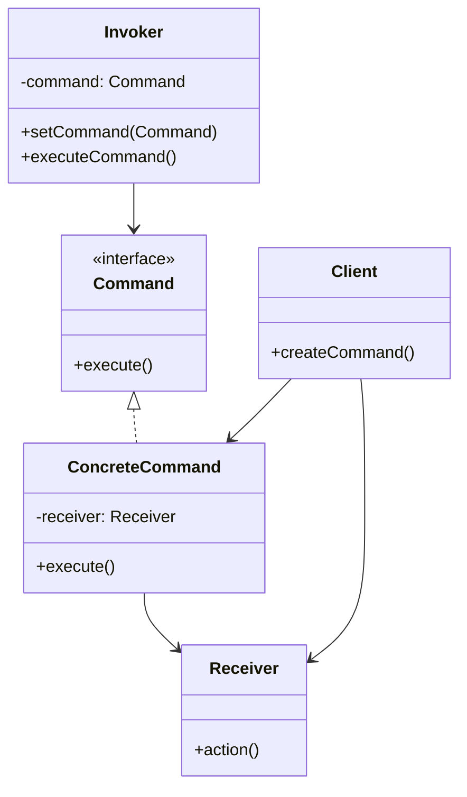

## 介绍

命令模式（Command Pattern）是一种行为设计模式，它将请求封装为对象，从而使您可以用不同的请求对客户进行参数化，并支持请求的排队、记录日志以及撤销操作。这种模式的核心思想是将“请求”与“执行请求”解耦，使得请求的发送者和接收者之间没有直接的依赖关系。

命令模式通常用于以下场景：
- 需要将操作请求与执行操作的对象解耦。
- 需要支持撤销操作。
- 需要将操作记录到日志中，以便后续恢复或重放。
- 需要支持事务操作。

## 命令模式的结构

命令模式通常包含以下几个角色：
1. **Command（命令接口）**：定义执行操作的接口。
2. **ConcreteCommand（具体命令）**：实现命令接口，包含接收者对象，并调用接收者的方法来完成具体的操作。
3. **Receiver（接收者）**：知道如何执行与请求相关的操作。
4. **Invoker（调用者）**：持有命令对象，并在某个时间点调用命令对象的执行方法。
5. **Client（客户端）**：创建命令对象并设置其接收者。



## 代码示例

下面是一个简单的命令模式示例，模拟了一个遥控器控制电灯的场景。

```python
# 接收者：电灯
class Light:
    def on(self):
        print("电灯已打开")

    def off(self):
        print("电灯已关闭")

# 命令接口
class Command:
    def execute(self):
        pass

# 具体命令：打开电灯
class LightOnCommand(Command):
    def __init__(self, light):
        self.light = light

    def execute(self):
        self.light.on()

# 具体命令：关闭电灯
class LightOffCommand(Command):
    def __init__(self, light):
        self.light = light

    def execute(self):
        self.light.off()

# 调用者：遥控器
class RemoteControl:
    def __init__(self):
        self.command = None

    def set_command(self, command):
        self.command = command

    def press_button(self):
        self.command.execute()

# 客户端代码
if __name__ == "__main__":
    light = Light()
    light_on = LightOnCommand(light)
    light_off = LightOffCommand(light)

    remote = RemoteControl()

    remote.set_command(light_on)
    remote.press_button()  # 输出：电灯已打开

    remote.set_command(light_off)
    remote.press_button()  # 输出：电灯已关闭
```

:::note
在这个示例中，`Light` 是接收者，`LightOnCommand` 和 `LightOffCommand` 是具体命令，`RemoteControl` 是调用者。通过命令模式，遥控器不需要知道电灯的具体实现，只需要调用命令对象的 `execute` 方法即可。
:::

## 实际应用场景

命令模式在实际开发中有广泛的应用，以下是一些常见的场景：

1. **GUI 按钮和菜单项**：在图形用户界面中，按钮和菜单项通常使用命令模式来处理用户点击事件。每个按钮或菜单项可以绑定一个命令对象，当用户点击时，调用命令对象的 `execute` 方法。

2. **事务管理**：在数据库操作中，命令模式可以用于实现事务管理。每个操作（如插入、更新、删除）可以封装为一个命令对象，事务管理器可以按顺序执行这些命令，并在需要时回滚。

3. **撤销/重做功能**：在文本编辑器或图形编辑器中，命令模式可以用于实现撤销和重做功能。每个编辑操作可以封装为一个命令对象，编辑器可以维护一个命令历史列表，以便在需要时撤销或重做操作。

## 总结

命令模式通过将请求封装为对象，使得请求的发送者和接收者之间解耦，从而支持请求的排队、记录日志以及撤销操作。这种模式非常适合需要将操作请求与执行操作的对象解耦的场景，如 GUI 按钮、事务管理和撤销/重做功能。

:::tip
如果你想进一步学习命令模式，可以尝试以下练习：
1. 扩展上面的遥控器示例，支持多个电灯的控制。
2. 实现一个简单的文本编辑器，支持撤销和重做功能。
3. 研究如何在数据库事务管理中使用命令模式。
:::

希望这篇内容能帮助你更好地理解命令模式！如果你有任何问题或需要进一步的帮助，请随时联系我们。