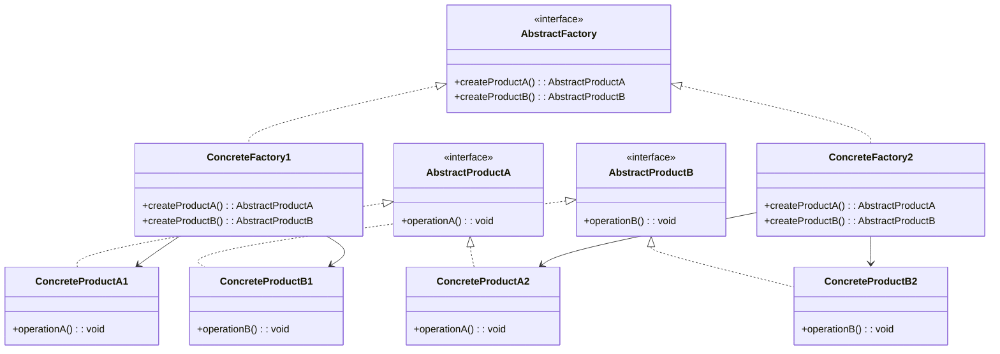

## 介绍

抽象工厂模式（Abstract Factory Pattern）是一种创建型设计模式，它允许你创建一组相关或相互依赖的对象，而无需指定它们的具体类。抽象工厂模式的核心思想是将对象的创建过程抽象化，使得客户端代码与具体类的实现解耦。

与工厂方法模式不同，抽象工厂模式关注的是**一系列相关或相互依赖的对象**的创建，而不仅仅是单个对象。它通常用于需要创建多个产品族（即一组相关的产品）的场景。

## 抽象工厂模式的结构

抽象工厂模式通常包含以下几个角色：

1. **抽象工厂（Abstract Factory）**：定义创建一系列产品对象的接口。
2. **具体工厂（Concrete Factory）**：实现抽象工厂的接口，负责创建具体的产品对象。
3. **抽象产品（Abstract Product）**：定义产品对象的接口。
4. **具体产品（Concrete Product）**：实现抽象产品的接口，是具体工厂创建的对象。

我们可以用以下类图来表示抽象工厂模式的结构：



## 代码示例

让我们通过一个简单的例子来理解抽象工厂模式。假设我们正在开发一个跨平台的 UI 库，需要为不同的操作系统（如 Windows 和 macOS）创建按钮和文本框。

### 1. 定义抽象产品

首先，我们定义两个抽象产品：`Button` 和 `TextBox`。

```typescript
interface Button {
    render(): void;
}

interface TextBox {
    render(): void;
}
```

### 2. 定义具体产品

接下来，我们为 Windows 和 macOS 分别实现具体的产品类。

```typescript
class WindowsButton implements Button {
    render() {
        console.log("Render a button in Windows style.");
    }
}

class MacOSButton implements Button {
    render() {
        console.log("Render a button in macOS style.");
    }
}

class WindowsTextBox implements TextBox {
    render() {
        console.log("Render a text box in Windows style.");
    }
}

class MacOSTextBox implements TextBox {
    render() {
        console.log("Render a text box in macOS style.");
    }
}
```

### 3. 定义抽象工厂

然后，我们定义一个抽象工厂接口，用于创建按钮和文本框。

```typescript
interface UIFactory {
    createButton(): Button;
    createTextBox(): TextBox;
}
```

### 4. 定义具体工厂

我们为 Windows 和 macOS 分别实现具体的工厂类。

```typescript
class WindowsUIFactory implements UIFactory {
    createButton(): Button {
        return new WindowsButton();
    }

    createTextBox(): TextBox {
        return new WindowsTextBox();
    }
}

class MacOSUIFactory implements UIFactory {
    createButton(): Button {
        return new MacOSButton();
    }

    createTextBox(): TextBox {
        return new MacOSTextBox();
    }
}
```

### 5. 客户端代码

最后，客户端代码可以根据当前的操作系统选择合适的工厂来创建 UI 组件。

```typescript
function renderUI(factory: UIFactory) {
    const button = factory.createButton();
    const textBox = factory.createTextBox();

    button.render();
    textBox.render();
}

// 根据操作系统选择工厂
const os = "Windows"; // 假设当前操作系统是 Windows
let factory: UIFactory;

if (os === "Windows") {
    factory = new WindowsUIFactory();
} else if (os === "macOS") {
    factory = new MacOSUIFactory();
} else {
    throw new Error("Unsupported operating system.");
}

renderUI(factory);
```

### 输出

如果当前操作系统是 Windows，输出将是：

```
Render a button in Windows style.
Render a text box in Windows style.
```

如果当前操作系统是 macOS，输出将是：

```
Render a button in macOS style.
Render a text box in macOS style.
```

## 实际应用场景

抽象工厂模式在以下场景中非常有用：

1. **跨平台 UI 库**：如上面的例子所示，抽象工厂模式可以用于创建不同操作系统下的 UI 组件。
2. **数据库访问**：如果你需要支持多种数据库（如 MySQL、PostgreSQL），可以使用抽象工厂模式来创建与数据库相关的对象（如连接、查询等）。
3. **游戏开发**：在游戏中，可能需要为不同的角色或场景创建一系列相关的对象（如武器、装备、敌人等），抽象工厂模式可以帮助你轻松管理这些对象的创建。

## 总结

抽象工厂模式通过提供一个创建一系列相关或相互依赖对象的接口，使得客户端代码与具体类的实现解耦。它特别适用于需要创建多个产品族的场景，如跨平台 UI 库、数据库访问和游戏开发等。

通过本文的学习，你应该已经掌握了抽象工厂模式的基本概念、结构和实现方法。接下来，你可以尝试在自己的项目中应用抽象工厂模式，或者通过以下练习进一步巩固你的理解。

## 练习

1. 扩展上面的例子，添加一个新的操作系统（如 Linux），并实现相应的工厂和产品类。
2. 思考在什么情况下抽象工厂模式可能不适合使用？你能想到哪些替代方案？

## 附加资源

- [Design Patterns: Elements of Reusable Object-Oriented Software](https://www.amazon.com/Design-Patterns-Elements-Reusable-Object-Oriented/dp/0201633612) - 经典的设计模式书籍，深入讲解了抽象工厂模式和其他设计模式。
- [Refactoring Guru - Abstract Factory](https://refactoring.guru/design-patterns/abstract-factory) - 一个关于抽象工厂模式的详细教程，包含更多的示例和解释。
